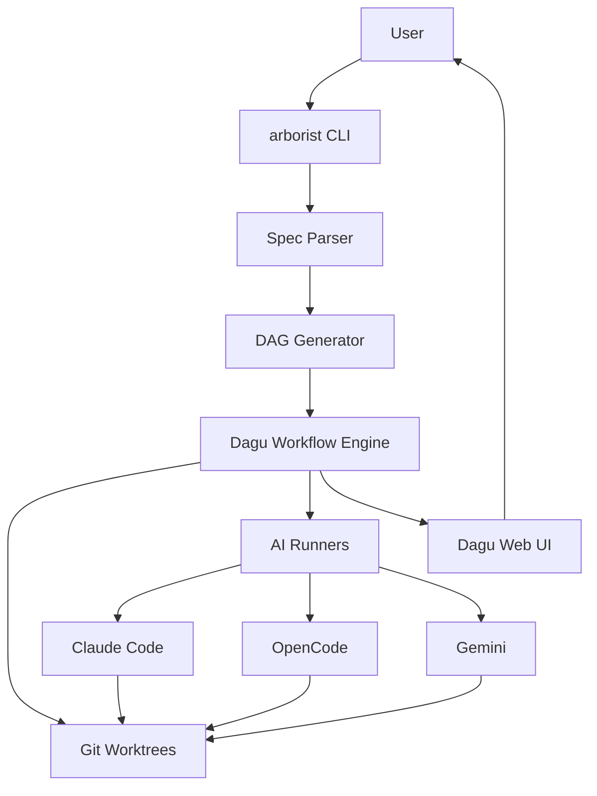

# Introduction

Agent Arborist is an automated task tree executor that orchestrates complex software development workflows using AI. It transforms task specifications into executable Directed Acyclic Graphs (DAGs) managed by Dagu, leveraging AI runners like Claude Code, OpenCode, and Gemini.

## What is Agent Arborist?

Agent Arborist is a command-line tool that:

- **Decomposes complex projects** into manageable tasks specified in Markdown
- **Generates executable workflows** as DAGs for Dagu
- **Executes tasks with AI** using multiple AI runners (Claude, OpenCode, Gemini)
- **Isolates changes** using Git worktrees for each task
- **Manages dependencies** between tasks automatically
- **Provides visualization** of task trees and execution progress

## Key Concepts

### Task Specifications
A **spec** is a Markdown file that defines a series of tasks to complete. Each task has:
- An ID (e.g., T001, T002)
- A title and description
- Dependencies on other tasks
- Optional grouping into phases

**Example spec format:**
```markdown
# Tasks: Calculator Project

## Phase 1: Setup

- [ ] T001 Create directory structure
- [ ] T002 Initialize project files

## Phase 2: Core

- [ ] T003 Implement add() function
- [ ] T004 Implement subtract() function
```

### DAGs and Dagu
A **DAG** (Directed Acyclic Graph) represents tasks and their dependencies. Agent Arborist generates Dagu YAML files that Dagu executes. Dagu handles:
- Dependency resolution
- Parallel execution where possible
- Status tracking
- Web UI for monitoring

### Git Worktrees
Each task executes in its own **Git worktree**, which provides:
- Complete isolation of changes
- Easy rollback if a task fails
- Clean commit history
- Parallel development without conflicts

### AI Runners
Arborist supports multiple AI runners:
- **Claude Code** - Anthropic's Claude tool (default)
- **OpenCode** - Open-source AI coding assistant
- **Gemini** - Google's Gemini AI

Runners can be configured globally, per-step, or per-task.

## Use Cases

### 1. Building New Features
Break down a complex feature into smaller, verifiable tasks:

```markdown
# Tasks: Add User Authentication

## Phase 1: Database
- [ ] T001 Create users table migration
- [ ] T002 Create User model

## Phase 2: Backend
- [ ] T003 Implement authentication endpoint
- [ ] T004 Add JWT token generation

## Phase 3: Frontend
- [ ] T005 Create login form
- [ ] T006 Add session management
```

### 2. Refactoring Large Codebases
Safely refactor code by verifying each change:

```markdown
# Tasks: Refactor to Use Dependency Injection

## Phase 1: Setup
- [ ] T001 Create dependency injection container
- [ ] T002 Set up service interfaces

## Phase 2: Migrate Services
- [ ] T003 Migrate UserService
- [ ] T004 Migrate OrderService
```

### 3. Educational Projects
Learn by building complex projects step-by-step:

```markdown
# Tasks: Build a Blog API

## Phase 1: Basic CRUD
- [ ] T001 Create Post model
- [ ] T002 Implement CRUD endpoints

## Phase 2: Features
- [ ] T003 Add comment system
- [ ] T004 Implement search
```

## Benefits

### Systematic Approach
- **Structured decomposition** - Break complex work into clear steps
- **Dependency management** - Automatically handle task ordering
- **Progress tracking** - See exactly what's done and what's left

### Isolation and Safety
- **Git-based isolation** - Each task in its own worktree
- **Easy rollback** - Failed tasks don't affect others
- **Clean history** - One commit per task with meaningful messages

### AI-Powered
- **Multiple AI options** - Choose the best AI for each task
- **Configurable runners** - Different models for different steps
- **Consistent execution** - Same AI behavior across all tasks

### Observability
- **Dagu Web UI** - Monitor execution in real-time
- **Tree visualization** - See task relationships visually
- **Status tracking** - Know exactly which tasks are running, done, or failed

## System Architecture



**Components:**
1. **arborist CLI** - User-facing command interface
2. **Spec Parser** - Reads and validates task specifications
3. **DAG Generator** - Creates Dagu YAML files
4. **Dagu Workflow Engine** - Executes the DAG
5. **Git Worktrees** - Isolated workspaces for each task
6. **AI Runners** - Execute tasks with AI assistance
7. **Dagu Web UI** - Real-time execution monitoring

## Next Steps

- [Quick Start Guide](./02-quick-start.md) - Install and run your first spec
- [Architecture Overview](./03-architecture.md) - Deep dive into system design
- [Specs and Tasks](../02-core-concepts/01-specs-and-tasks.md) - Learn to write specs

## Code References

- Main CLI entry point: [`src/agent_arborist/cli.py`](../../src/agent_arborist/cli.py)
- Spec detection: [`src/agent_arborist/spec.py`](../../src/agent_arborist/spec.py)
- DAG building: [`src/agent_arborist/dag_builder.py`](../../src/agent_arborist/dag_builder.py)