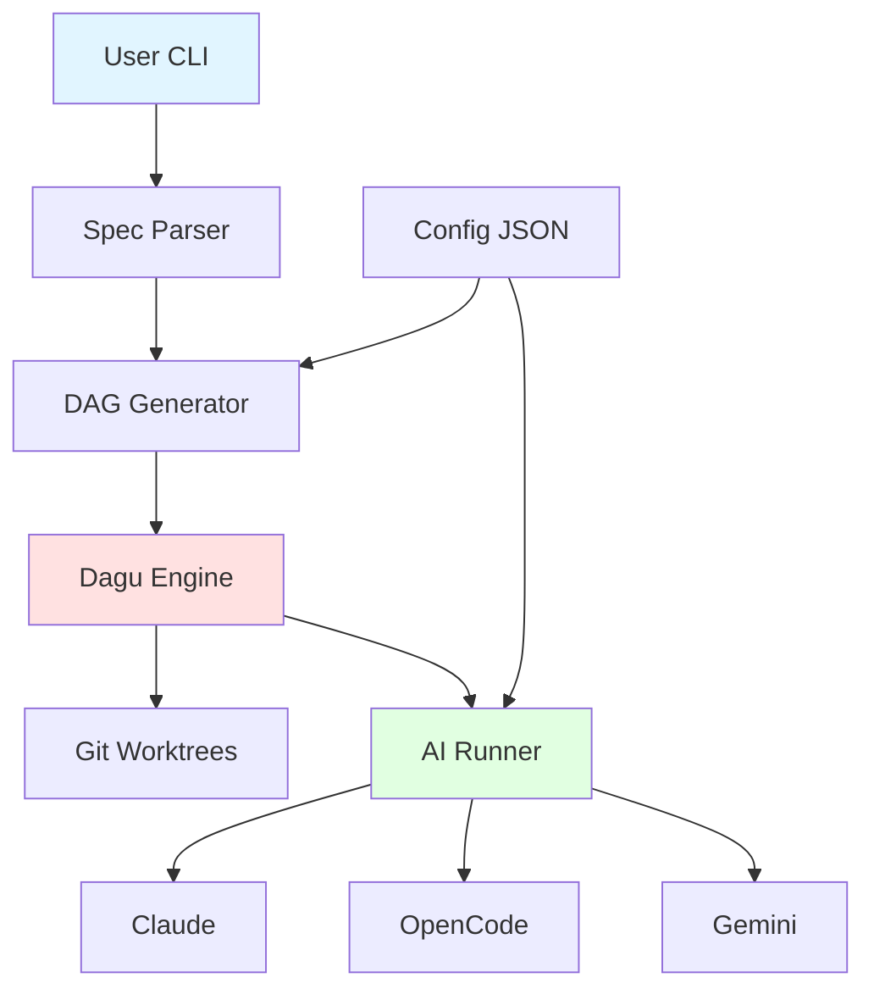

# Introduction

Agent Arborist is a CLI tool for orchestrating AI-driven task execution using directed acyclic graphs (DAGs) managed by Dagu.

## What is Agent Arborist?

Agent Arborist is a task tree executor that:
- **Reads markdown task specs** from `.arborist/specs/`
- **Generates DAGU DAGs** for workflow orchestration
- **Executes tasks with AI** using runners: claude, opencode, gemini
- **Isolates changes** in Git worktrees
- **Tracks progress** with task state management

## Key Concepts

### Task Specifications

A **spec** is a markdown file defining tasks. Each task has:
- An ID (e.g., T001, T002)
- A description
- Optional parallel flag `[P]`
- Optional phase grouping

**Example spec:**
```markdown
# Tasks: Calculator Project

**Project**: Simple calculator app
**Total Tasks**: 2

## Phase 1: Core

- [ ] T001 Create add() function
- [ ] T002 Create subtract() function

## Dependencies

T001 → T002
```

### Directory Structure

```
project/
├── .arborist/
│   ├── config.json           # Project configuration
│   ├── manifests/            # Branch manifests (spec_id.json)
│   ├── dagu/                 # Generated DAGU YAML files
│   ├── worktrees/            # Git worktrees (spec_id/task_id/)
│   ├── task-state/           # Task state (spec_id.json)
│   └── prompts/              # Hook prompt files
├── specs/
│   └── 001-calculator/       # = spec_id
│       └── tasks.md
└── src/
```

### AI Runners

Agent Arborist supports three runners:
- **claude** - Anthropic Claude (default)
- **opencode** - OpenCode AI
- **gemini** - Google Gemini

Configure runners in JSON config files.

## CLI Commands

`arborist` provides these command groups:

| Command | Purpose |
|---------|---------|
| `init` | Initialize `.arborist/` directory |
| `version` | Show version info |
| `doctor` | System diagnostics |
| `config` | Configuration management |
| `hooks` | Hook configuration and testing |
| `task` | Task operations (run, commit, test) |
| `spec` | Spec operations (dag-build, branch-create) |
| `dag` | DAG operations (run, status, restart) |

## Architecture



## Next Steps

- [Quick Start](./02-quick-start.md) - Install and run your first spec
- [Core Concepts](../02-core-concepts/README.md) - Understand specs, DAGs, worktrees