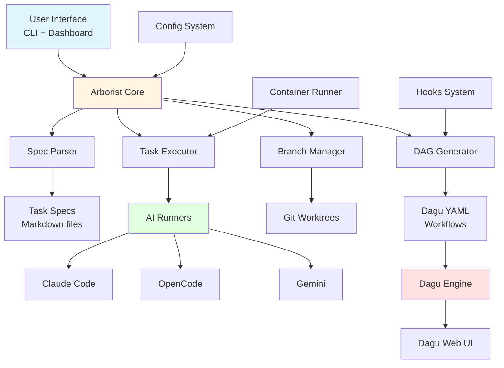
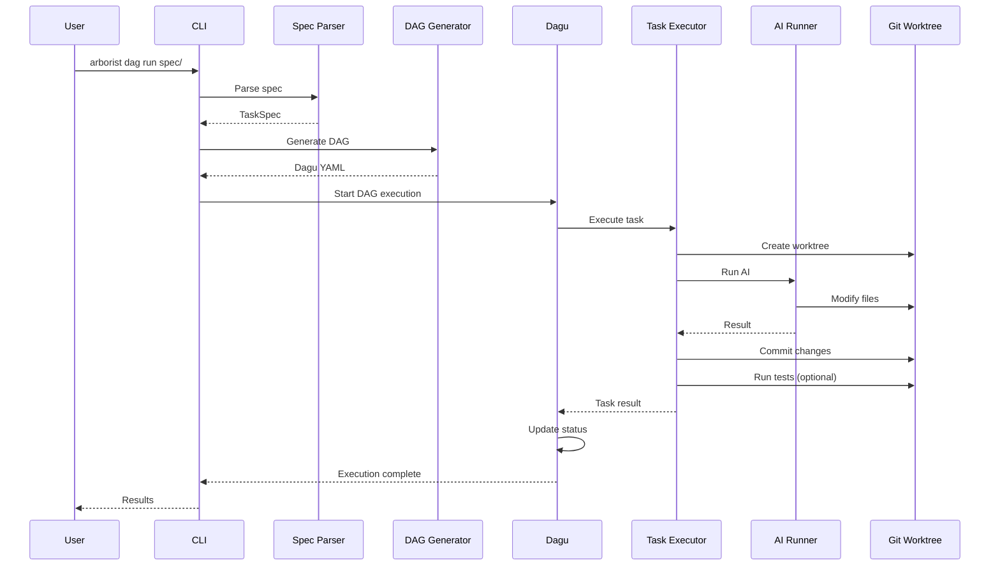
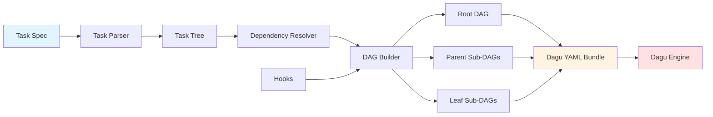
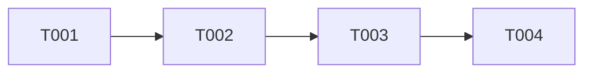
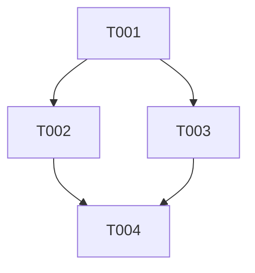
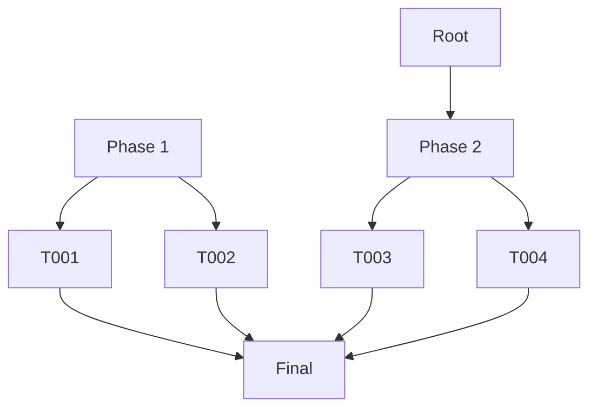

# Architecture Overview

Agent Arborist is designed as a host-based system with optional container support, orchestrating AI-powered task execution through Dagu workflow engine.

## High-Level Architecture



## Components

### 1. User Interface

#### CLI (Command Line Interface)
- **Location**: [`src/agent_arborist/cli.py`](../../src/agent_arborist/cli.py)
- **Purpose**: Primary interface for all operations
- **Features**:
  - Spec management commands
  - Task execution commands
  - DAG operations
  - Visualization commands
  - Configuration commands

#### Dashboard
- **Location**: [`src/agent_arborist/viz/`](../../src/agent_arborist/viz/)
- **Purpose**: Visual monitoring and exploration
- **Features**:
  - Tree visualization of tasks
  - Execution metrics
  - Hook outputs
  - Dependency exploration

### 2. Arborist Core

#### Spec Parser
- **Location**: [`src/agent_arborist/task_spec.py`](../../src/agent_arborist/task_spec.py)
- **Purpose**: Parse and validate task specifications
- **Input**: Markdown task files
- **Output**: Structured `TaskSpec` objects

```python
# Example: TaskSpec structure
class Task:
    id: str              # "T001"
    title: str           # "Create directory structure"
    description: str     # Detailed description
    phase: str | None    # "setup"
    subtree: str | None  # "phase1/setup"
    dependencies: list   # ["T001", "T002"]
    parallel: bool       # Can run in parallel
```

#### DAG Generator
- **Location**: [`src/agent_arborist/dag_builder.py`](../../src/agent_arborist/dag_builder.py)
- **Purpose**: Convert TaskSpecs to Dagu YAML
- **Process**:
  1. Parse spec into task tree
  2. Resolve dependencies
  3. Generate root DAG
  4. Generate sub-DAGs for each task
  5. Inject hooks if enabled

#### Branch Manager
- **Location**: [`src/agent_arborist/git_tasks.py`](../../src/agent_arborist/git_tasks.py)
- **Purpose**: Manage Git branches and worktrees
- **Operations**:
  - Create feature branches
  - Create worktrees
  - Sync worktrees from parent
  - Merge to parent
  - Cleanup old worktrees

#### Task Executor
- **Location**: [`src/agent_arborist/runner.py`](../../src/agent_arborist/runner.py)
- **Purpose**: Execute tasks with AI runners
- **Process**:
  1. Create worktree
  2. Sync from parent
  3. Run AI in worktree
  4. Commit changes
  5. Run tests (if configured)
  6. Merge to parent
  7. Cleanup worktree

### 3. AI Runners

#### Claude Code Runner
- **Location**: [`src/agent_arborist/runner.py:ClaudeRunner`](../../src/agent_arborist/runner.py)
- **Command**: `claude`
- **Features**:
  - File system access
  - Command execution
  - Interactive sessions
  - Multiple models (Claude 3.5 Sonnet, Opus, Haiku)

#### OpenCode Runner
- **Location**: [`src/agent_arborist/runner.py:OpenCodeRunner`](../../src/agent_arborist/runner.py)
- **Command**: `opencode`
- **Features**:
  - Open-source alternative
  - Model selection
  - File operations

#### Gemini Runner
- **Location**: [`src/agent_arborist/runner.py:GeminiRunner`](../../src/agent_arborist/runner.py)
- **Command**: API-based
- **Features**:
  - Google AI models
  - Multi-modal support
  - Fast inference

### 4. Dagu Integration

#### Dagu Engine
- **Purpose**: Execute DAG workflows
- **Features**:
  - Dependency resolution
  - Parallel execution
  - Status tracking
  - Retry logic
  - Error handling

#### Dagu Web UI
- **Purpose**: Monitor execution in real-time
- **Features**:
  - Live status updates
  - Log viewing
  - Dependency visualization
  - Historical runs

### 5. Supporting Systems

#### Configuration System
- **Location**: [`src/agent_arborist/config.py`](../../src/agent_arborist/config.py)
- **Purpose**: Multi-level configuration management
- **Hierarchy**:
  1. Hardcoded defaults
  2. Global config (`~/.arborist_config.json`)
  3. Project config (`.arborist/config.json`)
  4. Environment variables
  5. CLI flags

```python
# Config precedence (highest to lowest)
VALID_RUNNERS = ("claude", "opencode", "gemini")
VALID_OUTPUT_FORMATS = ("json", "text")
VALID_CONTAINER_MODES = ("auto", "enabled", "disabled")
```

#### Hooks System
- **Location**: [`src/agent_arborist/hooks/`](../../src/agent_arborist/hooks/)
- **Purpose**: Inject custom steps into DAGs
- **Hook Points**:
  - `pre_root` - Before root DAG execution
  - `post_roots` - After root DAG setup
  - `pre_task` - Before each task
  - `post_task` - After each task
  - `final` - After all tasks complete

```python
VALID_HOOK_POINTS = ("pre_root", "post_roots", "pre_task", "post_task", "final")
```

#### Container Runner
- **Location**: [`src/agent_arborist/container_runner.py`](../../src/agent_arborist/container_runner.py)
- **Purpose**: Wraps commands for devcontainer execution
- **Modes**:
  - `auto` - Use container if devcontainer present
  - `enabled` - Require container
  - `disabled` Never use container

## Data Flow

### Spec Execution Flow



### Workflow Generation Flow



## Directory Structure

```
project-root/
├── .arborist/                   # Arborist home directory
│   ├── config.json             # Project configuration
│   ├── manifests/              # Branch manifests
│   ├── dagu/                   # Generated DAG files
│   ├── worktrees/              # Git worktrees
│   ├── task-state/             # Task execution state
│   ├── prompts/                # Hook prompt files
│   └── logs/                   # Execution logs
│
├── specs/                       # Task specifications
│   ├── 001-hello-world/
│   │   └── tasks.md
│   └── 002-new-feature/
│       └── tasks.md
│
├── src/                         # Your project code
└── README.md
```

## Host vs Container Execution

### Host-Based Architecture (Default)

```
┌─────────────────────────────────────┐
│ Host Machine                        │
├─────────────────────────────────────┤
│ Arborist Core                       │
│ ├── Spec Parser                     │
│ ├── DAG Generator                   │
│ └── Task Executor                   │
│     └── AI Runner (runs on host)    │
├─────────────────────────────────────┤
│ Dagu Engine (runs on host)          │
└─────────────────────────────────────┘
         ↓
┌─────────────────────────────────────┐
│ Git Repository (on host)            │
│ └── Worktrees                       │
└─────────────────────────────────────┘
```

### Container Execution (Optional)

```
┌─────────────────────────────────────┐
│ Host Machine                        │
├─────────────────────────────────────┤
│ Arborist Core                           │
│ ├── Spec Parser                         │
│ ├── DAG Generator                       │
│ └── Task Executor                       │
│     └── Container Runner               │
├─────────────────────────────────────┤
│ Dagu Engine (runs on host)            │
└─────────────────────────────────────┘
         ↓
┌─────────────────────────────────────┐
│ Devcontainer (Docker)                │
├─────────────────────────────────────┤
│ AI Runner (runs in container)        │
│ ├── File system access               │
│ ├── Command execution                │
│ └── Project modifications            │
└─────────────────────────────────────┘
         ↓
┌─────────────────────────────────────┐
│ Git Repository (mounted in container)│
│ └── Worktrees                        │
└─────────────────────────────────────┘
```

**Key Points:**
- Arborist and Dagu always run on the host
- AI runners can run on host or in devcontainer
- Worktrees are always Git-managed on the host
- Container is detected automatically based on `.devcontainer/` presence

## Execution Models

### Sequential Execution



Tasks run one after another. Each task must complete before the next starts.

### Parallel Execution



Tasks without dependencies run in parallel. T002 and T003 can run simultaneously.

### Hierarchical Execution



Phases contain subtasks. Subtasks within a phase can run in parallel.

## State Management

### Task State

```python
# Location: src/agent_arborist/task_state.py
class TaskNode:
    task_id: str          # "T001"
    status: str           # "pending" | "running" | "complete" | "failed"
    description: str      # Task description
    parent_id: str | None # Parent task ID
    children: list        # Child task IDs
    branch: str | None    # Git branch name
    worktree: str | None  # Worktree path
    error: str | None     # Error message if failed
```

### Branch Manifest

```python
# Location: src/agent_arborist/branch_manifest.py
class BranchManifest:
    spec_id: str                        # "001-calculator"
    tasks: dict[str, TaskBranchInfo]    # Task ID to branch mapping

class TaskBranchInfo:
    task_id: str                        # "T001"
    branch: str                         # "feature/001-calculator/T001"
    parent_branch: str                  # "main"
    subtree: str | None                 # "phase1/setup"
```

### Step Results

```python
# Location: src/agent_arborist/step_results.py
class StepResult:
    success: bool
    skipped: bool
    skip_reason: str | None
    error: str | None

class RunResult(StepResult):
    files_changed: int
    commit_message: str
    runner: str
    model: str
    duration_seconds: float
```

## Next Steps

- [Specs and Tasks](../02-core-concepts/01-specs-and-tasks.md) - Learn to write effective task specifications
- [DAGs and Dagu](../02-core-concepts/02-dags-and-dagu.md) - Understand how DAGs are generated
- [Configuration System](../03-configuration/01-configuration-system.md) - Customize Arborist behavior

## Code References

- Main CLI: [`src/agent_arborist/cli.py`](../../src/agent_arborist/cli.py)
- Task spec parser: [`src/agent_arborist/task_spec.py`](../../src/agent_arborist/task_spec.py)
- DAG builder: [`src/agent_arborist/dag_builder.py`](../../src/agent_arborist/dag_builder.py)
- Configuration: [`src/agent_arborist/config.py`](../../src/agent_arborist/config.py)
- Git operations: [`src/agent_arborist/git_tasks.py`](../../src/agent_arborist/git_tasks.py)
- Task state: [`src/agent_arborist/task_state.py`](../../src/agent_arborist/task_state.py)
- Branch manifest: [`src/agent_arborist/branch_manifest.py`](../../src/agent_arborist/branch_manifest.py)
- Runner system: [`src/agent_arborist/runner.py`](../../src/agent_arborist/runner.py)