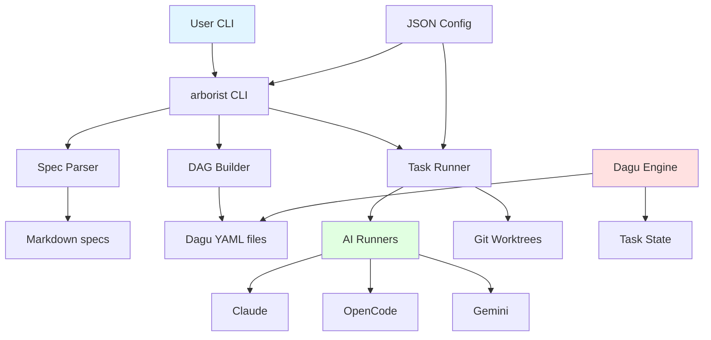
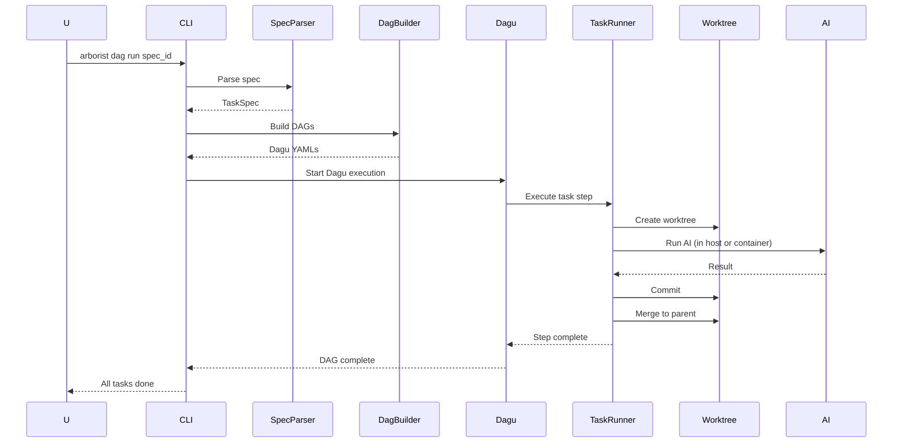

# Architecture

How Agent Arborist orchestrates task execution.

## System Architecture



## Components

### 1. CLI (`src/agent_arborist/cli.py`)

Click-based CLI with command groups:
- `init` - Initialize project
- `version` - Version info
- `doctor` - Diagnostics
- `config` - Configuration
- `hooks` - Hooks system
- `task` - Task operations
- `spec` - Spec operations
- `dag` - DAG operations

### 2. Spec Parser (`src/agent_arborist/task_spec.py`)

Parses markdown task specs:
- Extracts tasks with IDs (T001, T002, ...)
- Parses phases (## Phase N: Name)
- Parses dependencies (T001 → T002)
- Supports parallel tasks ([P])

### 3. DAG Builder (`src/agent_arborist/dag_builder.py`)

converts specs to Dagu YAML:
- Root DAG for orchestration
- Sub-DAGs for each task
- Injects hooks if configured
- Sets environment variables (ARBORIST_MANIFEST)

### 4. Branch Manifest (`src/agent_arborist/branch_manifest.py`)

Maps tasks to Git branches:
- Branch naming: `feature/{spec_id}/{task_id}`
- Parent branch tracking
- Subtree support (if specified)

### 5. Task State (`src/agent_arborist/task_state.py`)

Tracks execution progress:
- Status: pending, running, complete, failed
- Branch and worktree paths
- Error messages

### 6. Task Runner (`src/agent_arborist/runner.py`)

Executes tasks with AI:
- Claude, OpenCode, Gemini runners
- Pre-sync, run, commit, post-merge, cleanup steps
- Worktree management
- Conflict handling
- Optional devcontainer support

## Data Flow



## Directory Layout

```
project/
├── .arborist/
│   ├── config.json           # Project config
│   ├── manifests/
│   │   └── 001-my-feature.json   # Branch manifest
│   ├── dagu/
│   │   └── 001-my-feature/
│   │       ├── root.yaml         # Root DAG
│   │       ├── T001-setup.yaml   # Task sub-DAGs
│   │       └── T002-core.yaml
│   ├── worktrees/
│   │   └── 001-my-feature/
│   │       ├── T001/             # Git worktree for T001
│   │       └── T002/             # Git worktree for T002
│   ├── task-state/
│   │   └── 001-my-feature.json   # Task state
│   ├── prompts/                  # Hook prompts
│   └── logs/                     # Execution logs
├── specs/
│   └── 001-my-feature/
│       └── tasks.md
└── src/
```

## Environment Variables

From `src/agent_arborist/cli.py`:
- `ARBORIST_MANIFEST` - Path to branch manifest
- `ARBORIST_RUNNER` - Default runner (claude, opencode, gemini)
- `ARBORIST_MODEL` - Default model
- `DAGU_HOME` - Dagu directory

## Configuration System

Configuration precedence (highest to lowest):
1. CLI flags
2. Environment variables
3. Project config (`.arborist/config.json`)
4. Global config (`~/.arborist_config.json`)
5. Code defaults

See also: [`src/agent_arborist/config.py`](../../src/agent_arborist/config.py)

## Next Steps

- [Specs and Tasks](../02-core-concepts/01-specs-and-tasks.md) - Writing task specs
- [Configuration](../03-configuration/README.md) - Configuring Arborist