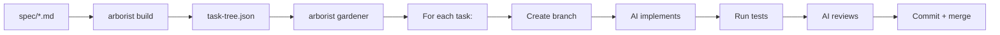

# Introduction

Agent Arborist is a **git-native task tree orchestrator**. It breaks complex development work into a tree of tasks, then executes them sequentially using AI coding agents — with each task isolated on its own git branch, tested, reviewed, and merged back automatically.

## Why Arborist?

Large coding tasks are hard to hand to a single AI prompt. They have dependencies, ordering constraints, and need verification at each step. Arborist solves this by:

- **Decomposing** a markdown specification into a hierarchical task tree
- **Ordering** tasks via topological sort so dependencies are satisfied
- **Isolating** each task on a git branch
- **Executing** each task through an implement → test → review pipeline
- **Tracking** all state in git itself (commit trailers) — no external database

## Key Concepts

### Task Spec
A markdown file (or directory of files) describing what needs to be built. Arborist sends this to an AI planner which extracts the task hierarchy.

### Task Tree
A JSON file (`task-tree.json`) containing the full hierarchy of tasks — parent groups and leaf tasks — with dependency edges and a computed execution order.

### Task Node
A single entry in the tree. **Parent nodes** are organizational groupings (phases, stories). **Leaf nodes** are executable work items.

### Execution Pipeline
Each leaf task goes through: **implement** (AI writes code) → **test** (run your test command) → **review** (AI reviews the diff). If any step fails, Arborist retries with feedback from the failure.

### Runner
An AI coding agent CLI — Claude Code, Gemini CLI, or OpenCode. Runners receive prompts and make file changes in the working directory.

### Git Trailers
Structured metadata appended to commit messages (`Arborist-Step: implement`, `Arborist-Result: pass`). This is how Arborist tracks task state without any external storage.

## Architecture Overview

Everything happens in a single git repository. No containers, no daemons, no orchestration servers — just git branches and AI runners.
