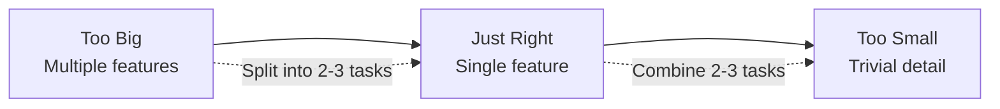
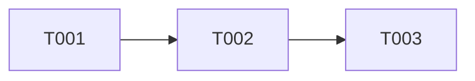
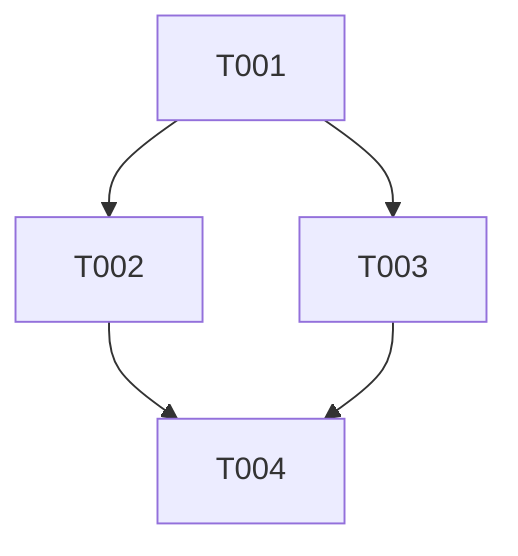
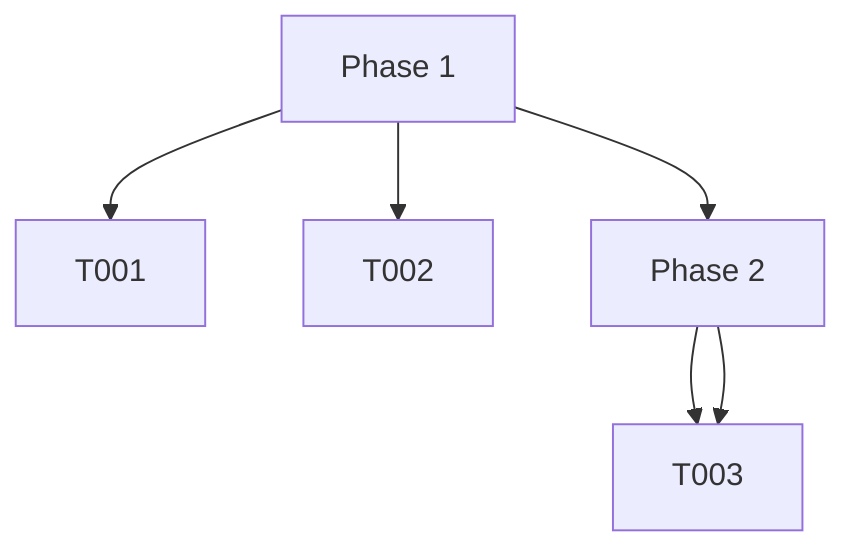

# Specs and Tasks

Specs (specifications) and tasks are the core building blocks of Agent Arborist. A spec defines what needs to be done, and tasks are the individual steps to achieve those goals.

## Understanding Specs

A **spec** (short for specification) is a Markdown file that describes a complete software development task or feature. Specs live in the `specs/` directory and define all the work needed to complete an objective.

### Spec Structure

```markdown
# Tasks: [Feature Name]

**Project**: [Project Description]
**Total Tasks**: [Number]

## Phase 1: [Phase Name]

- [ ] T001 [Task title]
- [ ] T002 [Task title with [P] marker]

## Phase 2: [Phase Name]

- [ ] T003 [Task title]

## Dependencies

[T001] → [T002] → [T003]
```

### Spec Components

#### Title Section
- **Required**: Always starts with `# Tasks:`
- **Optional fields**:
  - `**Project**`: Brief project description
  - `**Total Tasks**`: Number of tasks (for reference)

#### Phases
- **Purpose**: Group related tasks together
- **Format**: `## Phase X: [Name]`
- **Benefits**:
  - Logical organization
  - Dependency management (phases can depend on other phases)
  - Checkpointing

#### Tasks
- **Format**: `- [ ] TXXX [Title]`
- **Task ID**: Three-digit number (T001, T002, etc.)
- **Optional markers**:
  - `[P]` - Parallel tasks (can run simultaneously)
- **Dependencies**: Implied by task IDs (higher numbers depend on lower)

#### Dependencies Section
- **Purpose**: Explicitly define task relationships
- **Format**: Arrow notation (`T001 → T002`)
- **Supported patterns**:
  - Linear: `T001 → T002 → T003`
  - Parallel: `T001 → T002, T003 → T004`
  - Phase-based: `Phase 1 → Phase 2`

## Understanding Tasks

A **task** is a single unit of work that can be completed independently. Tasks are the leaves in your execution tree.

### Task Format

```markdown
- [ ] T001 [Task Title]
```

**Components:**
- Marker: `- [ ]` (Markdown checkbox, for future checkbox support)
- Task ID: `T001`, `T002`, etc.
- Title: Brief description of what needs to be done

### Task Naming Conventions

Task IDs are three-digit numbers, but you can also use more descriptive approaches:

```markdown
- [ ] 001-create-structure Create directory structure
- [ ] 002-setup-config Initialize configuration
```

**Best practices:**
- Keep task IDs sequential
- Use descriptive titles
- Aim for tasks that take 15-30 minutes for AI to complete
- Break complex tasks into smaller units

### Task Size Guidelines



**Good task size:**
- ✅ "Create user model with authentication fields"
- ✅ "Implement POST /users endpoint"
- ✅ "Add input validation to login form"

**Too big:**
- ❌ "Implement entire authentication system"
- ❌ "Build user management with roles, permissions, and audit logs"

**Too small:**
- ❌ "Create users.py file"
- ❌ "Add import for User model"

## Dependency Management

Dependencies define the order in which tasks must execute. Agent Arborist automatically resolves dependencies and creates appropriate DAG structures.

### Types of Dependencies

#### Sequential Dependencies
```markdown
## Dependencies
T001 → T002 → T003
```

Tasks run in order. Each must complete before the next starts.



#### Parallel Dependencies
```markdown
## Dependencies
T001 → T002, T003 → T004
```

T002 and T003 can run in parallel after T001 completes. T004 waits for both.



#### Phase Dependencies
```markdown
## Phase 1: Setup
- [ ] T001 Create structure
- [ ] T002 Initialize config

## Phase 2: Core
- [ ] T003 Implement feature

## Dependencies
Phase 1 → Phase 2
```

All tasks in Phase 2 wait for all tasks in Phase 1.



### Writing Dependencies

#### Basic Syntax
```markdown
## Dependencies
T001 → T002 → T003 → T004
```

#### Multiple Dependencies
```markdown
## Dependencies
T001, T002 → T003
T003 → T004, T005
```

#### With Comments
```markdown
## Dependencies
# Setup must complete first
T001 → T002 → T003

# Core features depend on setup
T004:
  depends:
    - T001
    - T002
```

**Note**: The last format (colon indentation) is not yet supported in the current parser. Use arrow notation.

### Common Dependency Patterns

#### Independent Setup Tasks
```markdown
## Phase 1: Setup
- [ ] T001 Create project structure
- [ ] T002 [P] Initialize git
- [ ] T003 [P] Create README

## Dependencies
# No dependencies - all setup tasks can run in parallel
# Tasks with [P] marker suggest parallelism
```

#### Linear Feature Build
```markdown
## Dependencies
T001 → T002 → T003 → T004 → T005
```

#### Feature with Tests
```markdown
## Phase 1: Implementation
- [ ] T001 Implement function
- [ ] T002 Add tests

## Phase 2: Refinement
- [ ] T003 Add documentation
- [ ] T004 Add examples

## Dependencies
T001 → T002 → T003 → T004
```

## Examples

### Example 1: Simple Calculator

```markdown
# Tasks: CLI Calculator

**Project**: Simple command-line calculator
**Total Tasks**: 6

## Phase 1: Setup

- [ ] T001 Create project structure: src/, tests/
- [ ] T002 Create pyproject.toml

## Phase 2: Core Operations

- [ ] T003 Create add() function
- [ ] T004 Create subtract() function
- [ ] T005 Create multiply() function
- [ ] T006 Create divide() function

## Dependencies

T001 → T002 → T003 → T004 → T005 → T006
```

### Example 2: Web Application with Parallel Tasks

```markdown
# Tasks: Blog API

**Project**: RESTful blog API
**Total Tasks**: 8

## Phase 1: Database

- [ ] T001 Create users table
- [ ] T002 Create posts table

## Phase 2: Backend

- [ ] T003 Implement user endpoints
- [ ] T004 Implement post endpoints
- [ ] T005 Add authentication

## Phase 3: Testing

- [ ] T006 Add user tests
- [ ] T007 Add post tests
- [ ] T008 Add integration tests

## Dependencies

# Database first
T001 → T003
T002 → T004

# Authentication needed for posts
T003 → T005
T005 → T004

# Tests after implementation
T003 → T006
T004 → T007
T003, T004, T005 → T008
```

### Example 3: Multi-Phase Feature

```markdown
# Tasks: User Authentication

**Project**: Complete authentication system
**Total Tasks**: 10

## Phase 1: Database

- [ ] T001 Create users migration
- [ ] T002 Create User model

## Phase 2: Backend API

- [ ] T003 Create login endpoint
- [ ] T004 Create register endpoint
- [ ] T005 Create logout endpoint

## Phase 3: JWT Implementation

- [ ] T006 Create JWT service
- [ ] T007 Add JWT middleware

## Phase 4: Frontend

- [ ] T008 Create login form
- [ ] T009 Create register form
- [ ] T010 Add session management

## Dependencies

Phase 1 → Phase 2 → Phase 3 → Phase 4

T001 → T002 → T003
T003 → T004 → T005

T005 → T006 → T007

T004 → T008
T005 → T009
T007 → T010
```

## Spec Validation

When you run `arborist spec dag-build`, Arborist validates your spec:

```bash
$ arborist spec dag-build spec/
Validating spec...
✓ Task IDs are sequential
✓ All dependencies reference existing tasks
✓ No circular dependencies detected
✓ DAG structure is valid
```

### Common Validation Errors

#### Missing Dependencies
```markdown
## Dependencies
T001 → T002 → T999  # T999 doesn't exist
```

**Error**: `Reference to non-existent task T999`

#### Circular Dependencies
```markdown
## Dependencies
T001 → T002 → T001  # Circular!
```

**Error**: `Circular dependency detected: T001 → T002 → T001`

#### Non-Sequential IDs
```markdown
- [ ] T001 Create file
- [ ] T005 Create config  # Skip T002, T003, T004
```

**Warning**: `Non-sequential task IDs detected (missing T002, T003, T004)`

## Best Practices

### 1. Start with a Hierarchy
```markdown
# High-level spec

## Phase 1: Foundation
## Phase 2: Core Features
## Phase 3: Polish
```

### 2. Break Down Complex Tasks
```markdown
# Bad
- [ ] T001 Implement entire authentication system

# Good
- [ ] T001 Create database schema
- [ ] T002 Implement login endpoint
- [ ] T003 Implement register endpoint
- [ ] T004 Add JWT handling
```

### 3. Use Parallelism Where Appropriate
```markdown
## Phase 1: Setup
- [ ] T001 Create project structure
- [ ] T002 [P] Initialize git
- [ ] T003 [P] Create README
- [ ] T004 [P] Add .gitignore
```

Tasks marked with `[P]` suggest they can run in parallel.

### 4. Include Dependencies Explicitly
```markdown
## Dependencies
# Even if implied by phase order, be explicit
T001 → T002 → T003
Phase 1 → Phase 2
```

### 5. Keep Tasks Atomic
- Each task should be independently verifiable
- Avoid "add A and B" in one task
- Split into "add A" and "add B"

### 6. Use Descriptive Titles
```markdown
# Bad
- [ ] T001 Do the thing

# Good
- [ ] T001 Create user authentication model with email and password fields
```

## Next Steps

- [DAGs and Dagu](./02-dags-and-dagu.md) - Learn how specs are converted to executable DAGs
- [Writing Your First Spec](../01-getting-started/02-quick-start.md#your-first-spec) - Practical guide

## Code References

- Task spec parser: [`src/agent_arborist/task_spec.py`](../../src/agent_arborist/task_spec.py)
- Task tree builder: [`src/agent_arborist/task_state.py:build_task_tree_from_spec()`](../../src/agent_arborist/task_state.py)
- DAG generator: [`src/agent_arborist/dag_builder.py`](../../src/agent_arborist/dag_builder.py)