# DAGs and Dagu

DAGs (Directed Acyclic Graphs) are the executable representation of your task specifications. Agent Arborist converts task specs into Dagu YAML files, which Dagu then executes.

## What is a DAG?

A **DAG** (Directed Acyclic Graph) is a directed graph with no directed cycles. In the context of Agent Arborist:

- **Nodes** represent tasks or steps
- **Edges** represent dependencies
- **Direction** shows execution order
- **No cycles** ensures tasks eventually complete

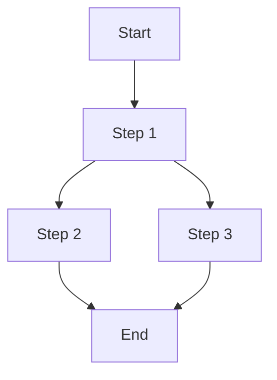

## Dagu Integration

**Dagu** is the workflow engine that executes Arborist-generated DAGs. It provides:

- Dependency resolution
- Parallel execution
- Status tracking
- Retry logic
- Web UI for monitoring

### Why Dagu?

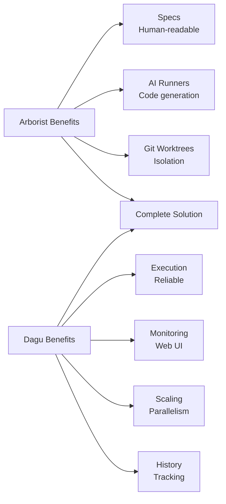

## DAG Structure

Agent Arborist generates **multi-document DAGs** with the following structure:

### 1. Root DAG
Contains:
- Branch setup
- Linear calls to task sub-DAGs
- Final cleanup

### 2. Parent Sub-DAGs
For tasks with children (rare in current implementation):
- Pre-sync worktree
- Calls to child sub-DAGs
- Post-mege
- Cleanup

### 3. Leaf Sub-DAGs
For individual tasks:
- Pre-sync
- Run (AI execution)
- Commit verification
- Test execution
- Post-merge
- Cleanup

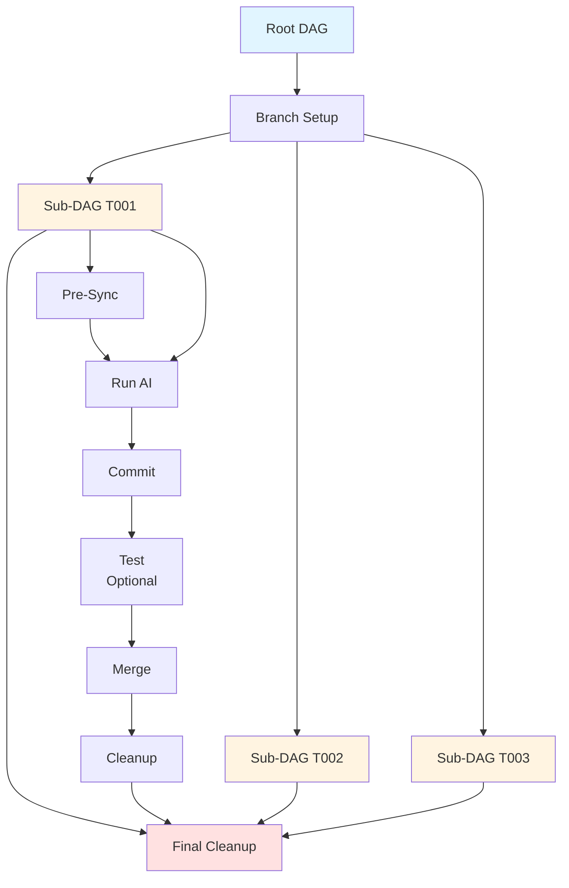

## DAG Generation Workflow

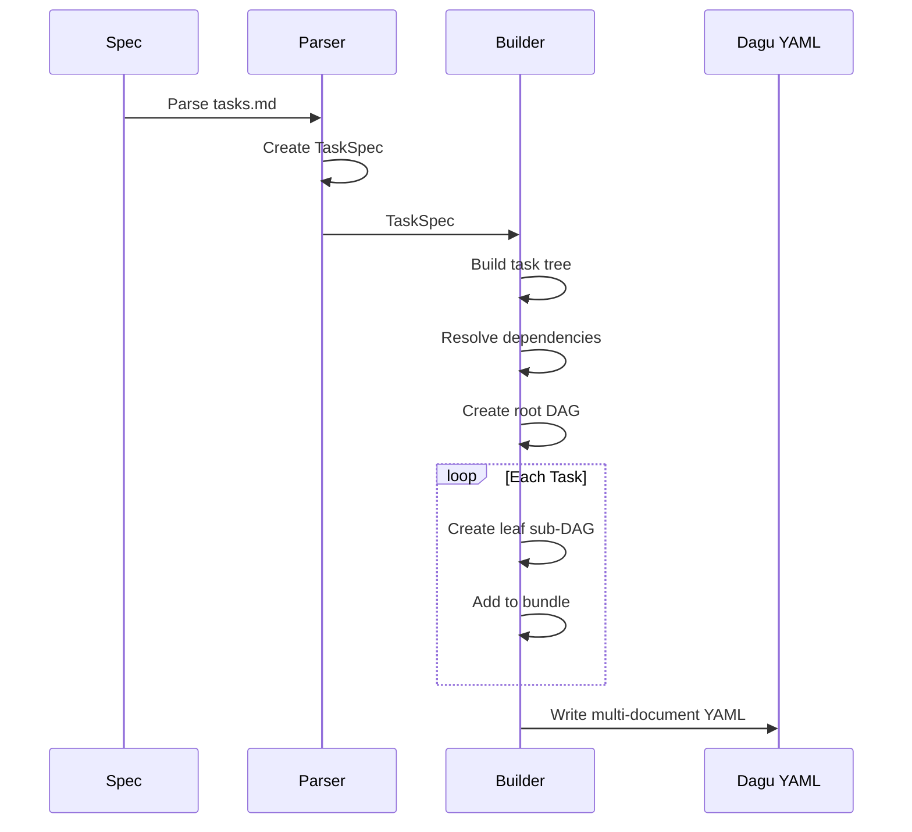

## YAML Format

### Root DAG Structure

```yaml
# Root DAG for spec 001-hello-world

name: 001-hello-world
description: Simple hello world program
env:
  - ARBORIST_SPEC=001-hello-world
  - ARBORIST_MANIFEST=/path/to/.arborist/manifests/001-hello-world.json

steps:
  - name: branch-setup
    description: Create all feature branches
    command: arborist spec branch-create-all specs/001-hello-world

  # Linear calls to task sub-DAGs
  - name: execute-T001
    call: T001
    depends:
      - branch-setup

  - name: execute-T002
    call: T002
    depends:
      - execute-T001

  - name: final-cleanup
    description: Final cleanup
    command: arborist task cleanup --spec 001-hello-world
    depends:
      - execute-T002
```

### Leaf Sub-DAG Structure

```yaml
# Sub-DAG for task T001

name: T001
description: Create project directory structure
env:
  - ARBORIST_SPEC=001-hello-world
  - ARBORIST_TASK=T001
  - ARBORIST_MANIFEST=/path/to/.arborist/manifests/001-hello-world.json

steps:
  - name: pre-sync
    description: Create worktree and sync from parent
    command: arborist task pre-sync T001
    output:
      name: pre_sync_result

  - name: run
    description: Execute task with AI
    command: arborist task run T001
    depends:
      - pre-sync
    timeout: 1800
    output:
      name: run_result

  - name: commit
    description: Verify or create commit
    command: arborist task commit T001
    depends:
      - run

  - name: test
    description: Run tests (if configured)
    command: arborist task test T001
    depends:
      - commit
    continueOn:
      failure: true

  - name: post-merge
    description: Merge to parent branch
    command: arborist task post-merge T001
    depends:
      - test

  - name: cleanup
    description: Cleanup worktree
    command: arborist task cleanup T001
    depends:
      - post-merge
```

## Dependency Resolution

### Linear Dependencies

**Spec:**
```markdown
T001 → T002 → T003
```

**Generated DAG:**
```yaml
# Root DAG
steps:
  - name: execute-T001
    call: T001

  - name: execute-T002
    call: T002
    depends:
      - execute-T001

  - name: execute-T003
    call: T003
    depends:
      - execute-T002
```

**Execution Flow:**
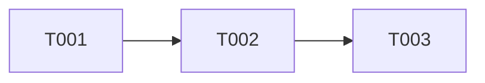

### Parallel Dependencies

**Spec:**
```markdown
T001 → T002, T003 → T004
```

**Generated DAG:**
```yaml
# Root DAG
steps:
  - name: execute-T001
    call: T001

  # T002 and T003 can run in parallel
  - name: execute-T002
    call: T002
    depends:
      - execute-T001

  - name: execute-T003
    call: T003
    depends:
      - execute-T001

  - name: execute-T004
    call: T004
    depends:  # Wait for BOTH T002 AND T003
      - execute-T002
      - execute-T003
```

**Execution Flow:**
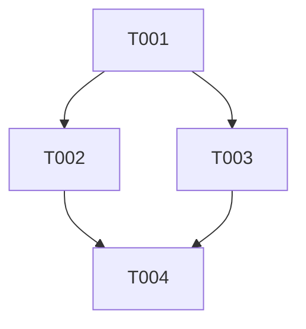

### Phase Dependencies

**Spec:**
```markdown
## Phase 1: Setup
- [ ] T001 Create structure
- [ ] T002 Initialize config

## Phase 2: Core
- [ ] T003 Implement feature

Phase 1 → Phase 2
```

**Generated DAG:**
```yaml
# Root DAG
steps:
  - name: execute-T001
    call: T001

  - name: execute-T002
    call: T002

  - name: execute-T003
    call: T003
    depends:  # Wait for entire Phase 1
      - execute-T001
      - execute-T002
```

**Execution Flow:**
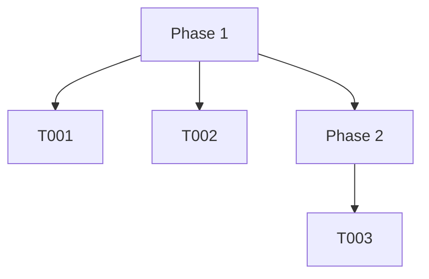

## Execution Model

### Sequential Execution

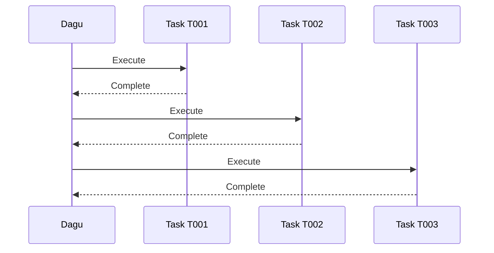

**When:** Linear dependencies with no parallelism

### Parallel Execution

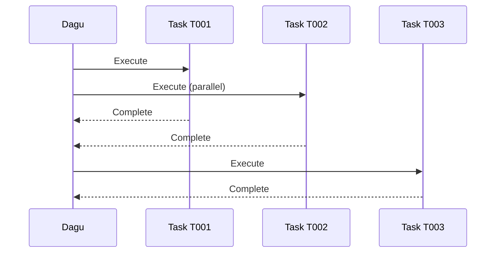

**When:** Tasks have independent dependencies

### Hierarchical Execution with Sub-DAGs

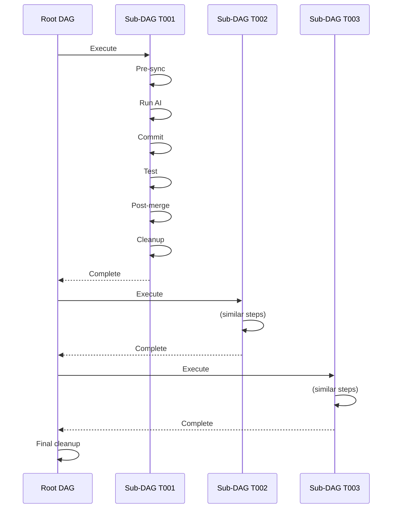

## Dagu Features Used

### 1. Sub-DAGs (call)
```yaml
- name: execute-T001
  call: T001  # Call another DAG
```

### 2. Dependencies
```yaml
- name: execute-T002
  depends:
    - execute-T001
```

### 3. Environment Variables
```yaml
env:
  - ARBORIST_SPEC=001-hello-world
```

### 4. Output Capture
```yaml
output:
  name: run_result
```

### 5. Continue on Failure
```yaml
continueOn:
  failure: true
```

### 6. Timeouts
```yaml
timeout: 1800  # seconds
```

## Monitoring Execution

### Dagu Web UI

Start the Dagu server:

```bash
dagu server
```

Navigate to `http://localhost:8080`

**Features:**
- Live status updates
- Task dependency visualization
- Log viewing
- Historical runs
- Metrics and timing

### Arborist Dashboard

```bash
arborist dashboard
```

**Features:**
- Task tree visualization
- Execution metrics
- Hook outputs
- Progress tracking

### Command Line

```bash
# Get status of all tasks
arborist dag run specs/001-hello-world

# View DAG structure
arborist viz tree specs/001-hello-world --format ascii

# Visualize dependencies
arborist viz tree specs/001-hello-world --format mermaid
```

## Step-by-Step DAG Execution

For a single task (T001), the execution flow is:

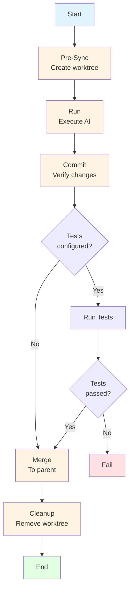

## Example: Complete DAG

Let's look at a complete example for a 3-task project.

### Spec (specs/003-calculator/tasks.md)

```markdown
# Tasks: Simple Calculator

**Project**: Command-line calculator
**Total Tasks**: 3

## Phase 1: Core

- [ ] T001 Create project structure
- [ ] T002 Implement add() function
- [ ] T003 Implement subtract() function

## Dependencies

T001 → T002 → T003
```

### Generated Root DAG

```yaml
name: 003-calculator
description: Command-line calculator
env:
  - ARBORIST_SPEC=003-calculator
  - ARBORIST_MANIFEST=/project/.arborist/manifests/003-calculator.json

steps:
  - name: branch-setup
    description: Create all feature branches
    command: arborist spec branch-create-all specs/003-calculator
    output: RESULT_branch_setup

  - name: execute-T001
    description: Execute task T001
    call: T001
    depends:
      - branch-setup

  - name: execute-T002
    description: Execute task T002
    call: T002
    depends:
      - execute-T001

  - name: execute-T003
    description: Execute task T003
    call: T003
    depends:
      - execute-T002

  - name: final-cleanup
    description: Final cleanup
    command: arborist task cleanup --spec 003-calculator
    depends:
      - execute-T003
```

### Generated Sub-DAG T001

```yaml
name: T001
description: Create project structure
env:
  - ARBORIST_SPEC=003-calculator
  - ARBORIST_TASK=T001
  - ARBORIST_MANIFEST=/project/.arborist/manifests/003-calculator.json

steps:
  - name: pre-sync
    command: arborist task pre-sync T001
    output: RESULT_pre_sync

  - name: run
    command: arborist task run T001
    depends:
      - pre-sync
    timeout: 1800
    output: RESULT_run

  - name: commit
    command: arborist task commit T001
    depends:
      - run
    output: RESULT_commit

  - name: test
    command: arborist task test T001
    depends:
      - commit
    continueOn:
      failure: true
    output: RESULT_test

  - name: post-merge
    command: arborist task post-merge T001
    depends:
      - test
    output: RESULT_post_merge

  - name: cleanup
    command: arborist task cleanup T001
    depends:
      - post-merge
```

## Best Practices

### 1. Keep Sub-DAGs Simple
- Each sub-DAG should represent one logical task
- Avoid complex conditional logic within sub-DAGs
- Let Dagu handle dependency management

### 2. Use Appropriate Timeouts
```yaml
# Short task: ~5 minutes
timeout: 300

# Regular task: ~30 minutes
timeout: 1800

# Long task: ~1 hour
timeout: 3600
```

### 3. Handle Failures Gracefully
```yaml
# Tests can fail without stopping the DAG
- name: test
  continueOn:
    failure: true

# Critical failures should stop execution
- name: run
  # No continueOn -默认停止 on failure
```

### 4. Capture Useful Outputs
```yaml
output:
  name: run_result
```

Allows other steps to access result data.

### 5. Use Environment Variables
```yaml
env:
  - ARBORIST_SPEC=my-spec
  - ARBORIST_TASK=T001
```

Provides context to steps without hardcoding paths.

## Troubleshooting

### DAG Not Executing

**Check:**
1. Dagu server is running
2. DAG file exists in correct location
3. Dependencies are satisfied

```bash
# Verify DAG exists
ls .arborist/dagu/

# Validate DAG syntax
dagu dry .arborist/dagu/my-spec.yaml
```

### Task Stuck in "Running"

**Check:**
1. Worktree exists:
   ```bash
   ls .arborist/worktrees/
   ```

2. AI runner is responding:
   ```bash
   claude --version
   ```

3. Check Dagu logs:
   ```bash
   dagu logs my-spec
   ```

### Dependency Issues

**Symptom:** Tasks not executing in expected order

**Check:**
1. Dependency syntax is correct
2. No circular dependencies
3. Task IDs match dependencies

```bash
# Visualize dependencies
arborist viz tree specs/my-spec --format mermaid
```

## Next Steps

- [Git and Worktrees](./03-git-and-worktrees.md) - Learn how tasks are isolated
- [AI Runners](./04-ai-runners.md) - Understand AI execution options
- [Spec Commands](../04-using-the-cli/02-spec-commands.md) - Learn to generate and run DAGs

## Code References

- DAG builder: [`src/agent_arborist/dag_builder.py`](../../src/agent_arborist/dag_builder.py)
- Task spec parser: [`src/agent_arborist/task_spec.py`](../../src/agent_arborist/task_spec.py)
- Branch manifest: [`src/agent_arborist/branch_manifest.py`](../../src/agent_arborist/branch_manifest.py)
- Dagu integration: [`src/agent_arborist/dag_generator.py`](../../src/agent_arborist/dag_generator.py)