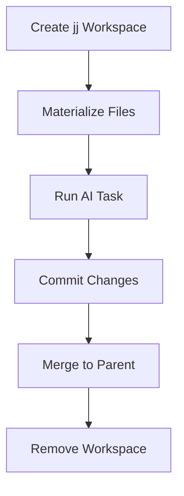

# Workspaces and Isolation

Arborist uses jj (Jujutsu) workspaces to isolate task execution.

## Workspace Location

Workspaces are stored outside the repository to avoid conflicts:

```
~/.arborist/workspaces/
└── my-project/           # Repository name
    └── 001-my-feature/   # Spec ID
        ├── T001/         # Task workspace
        └── T002/         # Task workspace
```

Configure with `ARBORIST_WORKSPACE_DIR` environment variable.

## Workspace Naming

Each task gets a dedicated jj workspace:

```
{spec_id}_a_{task_id}
```

Example: `001-calculator_a_T001`

## Workspace Lifecycle



## Commands

```bash
# List workspaces
jj workspace list

# Manual workspace operations
jj workspace add ~/.arborist/workspaces/repo/spec/T001 --name spec_a_T001
jj workspace forget spec_a_T001
```

## Isolation and Safety

- Changes isolated to workspace
- Failed tasks don't affect main branch
- Easy rollback per task
- Atomic merge operations with jj
- Parallel execution without conflicts
