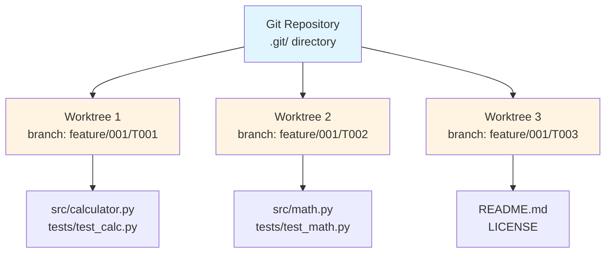
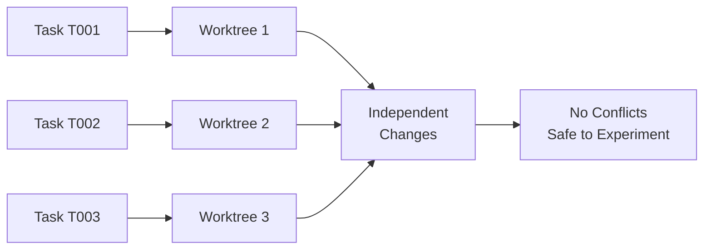
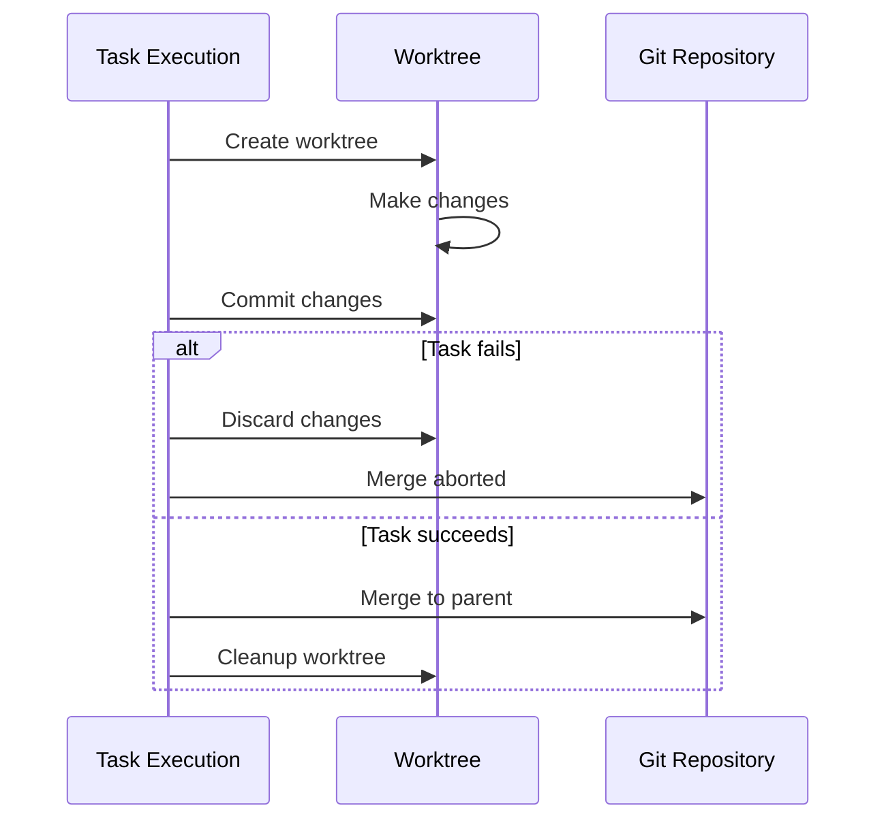
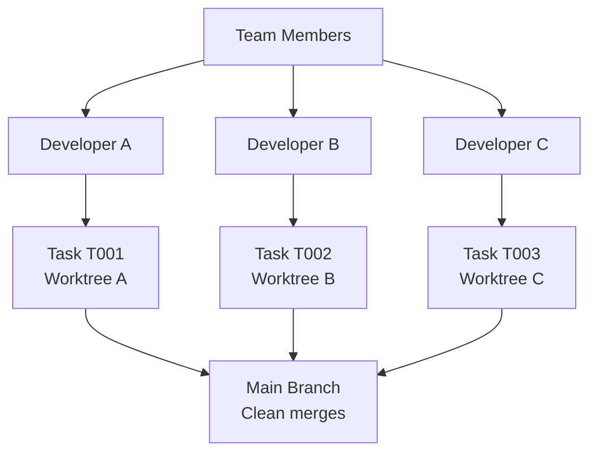
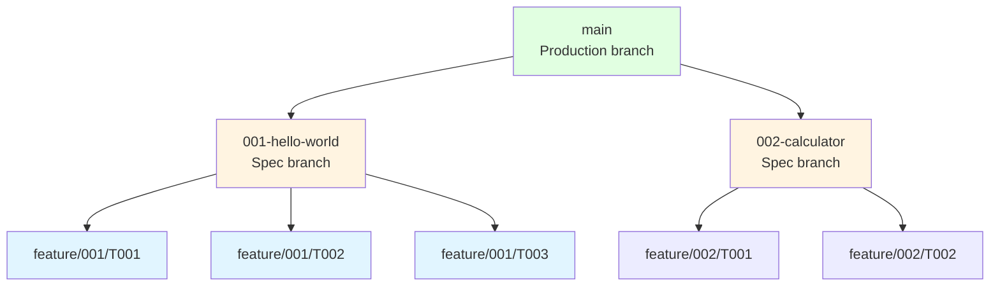
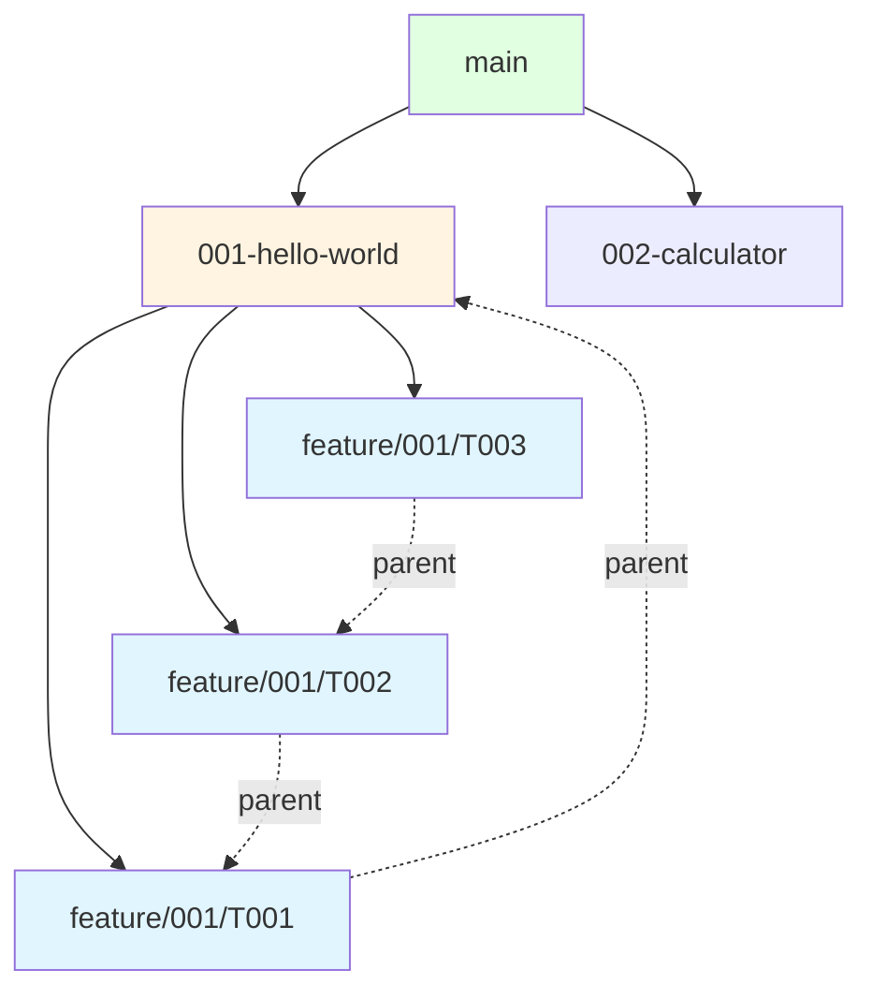
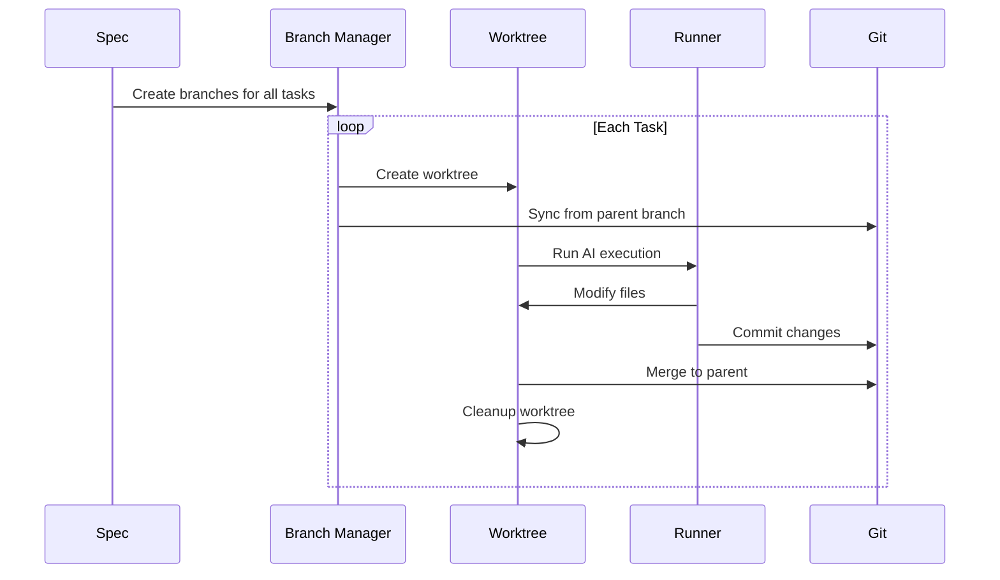
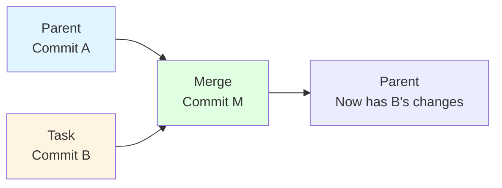

# Git and Worktrees

Agent Arborist uses Git worktrees to provide complete isolation for each task. This ensures that changes from one task don't interfere with others, and makes it easy to rollback if something goes wrong.

## What are Git Worktrees?

A **Git worktree** is a separate working directory linked to the same repository. Each worktree has:

- Its own working directory
- Its own branch checked out
- Shared Git history and objects with the main repository



## Benefits of Worktrees

### 1. Complete Isolation


### 2. Easy Rollback


### 3. Parallel Development


## Branch Strategy

Agent Arborist uses a hierarchical branch naming strategy:



### Branch Naming Convention

```
feature/{spec_id}/{task_id}
```

**Examples:**
- `feature/001-hello-world/T001`
- `feature/002-calculator/T005`
- `feature/003-blog/T012`

### Parent-Child Relationships



Each task branch has a parent:
- First task: Parent is the spec branch
- Subsequent tasks: Parent is the previous task (after merge)

## Worktree Lifecycle



### Step 1: Branch Creation

```bash
# Create all branches for a spec
arborist spec branch-create-all specs/001-hello-world

# Creates:
# - feature/001-hello-world (spec branch)
# - feature/001-hello-world/T001
# - feature/001-hello-world/T002
# - feature/001-hello-world/T003
```

**Branch Manifest** (`.arborist/manifests/001-hello-world.json`):

```json
{
  "spec_id": "001-hello-world",
  "tasks": {
    "T001": {
      "task_id": "T001",
      "branch": "feature/001-hello-world/T001",
      "parent_branch": "feature/001-hello-world",
      "subtree": "phase1/setup"
    },
    "T002": {
      "task_id": "T002",
      "branch": "feature/001-hello-world/T002",
      "parent_branch": "feature/001-hello-world/T001",
      "subtree": "phase1/setup"
    }
  }
}
```

### Step 2: Worktree Creation

```bash
# Arborist creates worktree for T001
git worktree add .arborist/worktrees/001-hello-world-T001 feature/001-hello-world/T001

# Sync worktree from parent
cd .arborist/worktrees/001-hello-world-T001
git pull origin feature/001-hello-world
```

### Step 3: Task Execution

```bash
# AI runs in the worktree
cd .arborist/worktrees/001-hello-world-T001
claude "Implement task T001: Create project structure"

# AI makes changes:
# - src/ directory
# - tests/ directory
# - README.md
```

### Step 4: Commit

```bash
cd .arborist/worktrees/001-hello-world-T001
git add .
git commit -m "task(T001): Create project structure

- Create src/ and tests/ directories
- Add basic README

(generated by claude/sonnet on branch feature/001-hello-world/T001)"
```

### Step 5: Merge

```bash
# Merge T001 to parent branch (spec branch)
git checkout feature/001-hello-world
git merge feature/001-hello-world/T001

# T002 will now sync from feature/001-hello-world (includes T001 changes)
```

### Step 6: Cleanup

```bash
# Remove worktree
git worktree remove .arborist/worktrees/001-hello-world-T001

# Optional: Delete branch
git branch -d feature/001-hello-world/T001
```

## Worktree Directory Structure

```
project-root/
├── .arborist/
│   ├── worktrees/                    # All worktrees
│   │   ├── 001-hello-world-T001/     # Worktree for T001
│   │   │   ├── src/
│   │   │   ├── tests/
│   │   │   └── .git                  # Worktree git link
│   │   ├── 001-hello-world-T002/
│   │   └── 001-hello-world-T003/
│   │
│   ├── manifests/                    # Branch manifests
│   │   └── 001-hello-world.json
│   │
│   └── task-state/                   # Execution state
│       └── 001-hello-world.json
│
├── src/                              # Main working copy
└── README.md
```

## Branch Manifest

The branch manifest tracks all branches and their relationships.

**Location:** `.arborist/manifests/{spec_id}.json`

```json
{
  "spec_id": "001-hello-world",
  "created_at": "2024-01-15T10:30:00Z",
  "tasks": {
    "T001": {
      "task_id": "T001",
      "branch": "feature/001-hello-world/T001",
      "parent_branch": "feature/001-hello-world",
      "subtree": "phase1/setup",
      "created_at": "2024-01-15T10:30:05Z"
    },
    "T002": {
      "task_id": "T002",
      "branch": "feature/001-hello-world/T002",
      "parent_branch": "feature/001-hello-world/T001",
      "subtree": "phase1/setup",
      "created_at": "2024-01-15T10:30:06Z"
    },
    "T003": {
      "task_id": "T003",
      "branch": "feature/001-hello-world/T003",
      "parent_branch": "feature/001-hello-world/T002",
      "subtree": "phase2/core",
      "created_at": "2024-01-15T10:30:07Z"
    }
  }
}
```

**Code Reference:** [`src/agent_arborist/branch_manifest.py`](../../src/agent_arborist/branch_manifest.py)

## Merge Strategy

### Default: Create Merge Commit



```bash
# Default merge strategy
git checkout parent-branch
git merge feature/001/T001

# Creates a new merge commit
```

### Alternative: Rebase (not default)

```bash
# Rebase strategy (not used by default)
git checkout feature/001/T001
git rebase parent-branch

# Linear history, no merge commits
```

```mermaid
graph LR
    A[Parent<br/>Commit A] --> B[Task<br/>Commit B<br/>(rebased on A)]

    B --> C[Fast-forward<br/>update parent]

    style A fill:#e1f5ff
    style B fill:#fff4e1
    style C fill:#e1ffe1
```

## Commit Format

### AI-Generated Commits

The AI is instructed to use a specific commit format:

```bash
task(T001): Brief one-line summary

- Bullet point about change
- Another bullet point
- Detail about implementation

(generated by claude/sonnet on branch feature/001-hello-world/T001)
```

**Components:**
1. Prefix: `task({task_id}):`
2. One-line summary
3. Bulleted details (optional)
4. Footer with runner/model/branch info

### Fallback Commits

If AI doesn't commit properly, Arborist creates a fallback:

```bash
task(T001): [fallback] Create project structure
```

## Managing Worktrees Manually

### List Worktrees

```bash
# List all worktrees
git worktree list

# Output:
# /path/to/project                main
# /path/to/project/.arborist/worktrees/001-T001  feature/001/T001
# /path/to/project/.arborist/worktrees/001-T002  feature/001/T002
```

### Remove Worktree

```bash
# Remove worktree but keep branch
git worktree remove .arborist/worktrees/001-T001

# Remove worktree and delete branch
git worktree remove -f .arborist/worktrees/001-T001
```

### Manually Create Worktree

```bash
# Create worktree from branch
git worktree add my-worktree feature/my-branch

# Create worktree and new branch
git worktree add -b my-new-branch my-worktree main
```

## Best Practices

### 1. Use Spec Branches Always
```bash
# Good: Create spec branch first
git checkout -b feature/001-my-spec main

# Bad: Skip spec branch
git checkout -b feature/001/T001 main  # No spec branch context
```

### 2. Clean Up Old Worktrees
```bash
# Remove worktrees older than 7 days
arborist task cleanup --older-than 7d

# Or manually
find .arborist/worktrees/ -maxdepth 1 -type d -mtime +7 -exec rm -rf {} \;
```

### 3. Keep Commits Atomic
```bash
# Good: One commit per task
task(T001): Create user model

# Bad: Multiple commits for one task
task(T001): Add User class
task(T001): Implement __init__
task(T001): Add validation methods
```

### 4. Use Descriptive Branch Names
```bash
# Good: Clear hierarchy
feature/001-hello-world/T001

# Bad: Generic names
task-T001
fix-bug
```

### 5. Sync Failing Tasks Carefully
```bash
# If sync fails (merge conflicts), resolve manually:
cd .arborist/worktrees/001-T002
git status
git mergetool  # Resolve conflicts
git add .
git commit
```

## Troubleshooting

### Worktree Already Exists

**Error:** `fatal: '<path>' already exists`

**Solution:**
```bash
# Remove existing worktree
git worktree remove .arborist/worktrees/001-T001

# Or force remove
git worktree remove -f .arborist/worktrees/001-T001
```

### Branch Already Checked Out

**Error:** `fatal: '<branch>' is already checked out`

**Solution:**
```bash
# Check where branch is checked out
git worktree list

# Check out branch in original location
git checkout original-branch
```

### Merge Conflicts

**Symptom:** Merge fails with conflicts

**Solution:**
```bash
# Manual resolution
cd .arborist/worktrees/001-T002
git status
# Resolve conflicts
git add .
git commit
```

### Worktree Path Issues

**Error:** Invalid worktree path

**Solution:**
```bash
# Check worktree paths are valid
git worktree list

# Fix broken links
git worktree prune
```

## Next Steps

- [AI Runners](./04-ai-runners.md) - Learn how AI executes tasks
- [Configuration System](../03-configuration/01-configuration-system.md) - Customize worktree behavior
- [Task Commands](../04-using-the-cli/03-task-commands.md) - Learn task management commands

## Code References

- Git operations: [`src/agent_arborist/git_tasks.py`](../../src/agent_arborist/git_tasks.py)
- Branch manifest: [`src/agent_arborist/branch_manifest.py`](../../src/agent_arborist/branch_manifest.py)
- Task state: [`src/agent_arborist/task_state.py`](../../src/agent_arborist/task_state.py)
- Worktree path: [`src/agent_arborist/git_tasks.py:get_worktree_path()`](../../src/agent_arborist/git_tasks.py)