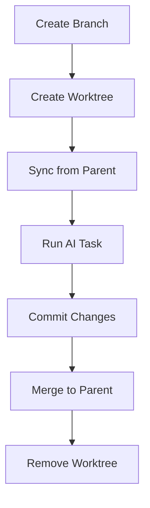

# Git and Worktrees

Git worktrees isolate task execution.

## Worktree Creation

Each task executes in its own worktree:

```
tree .arborist/worktrees/
└── 001-my-feature/
    ├── T001/    # Feature/001-my-feature/T001 branch
    └── T002/    # Feature/001-my-feature/T002 branch
```

## Branch Naming

From [`src/agent_arborist/git_tasks.py`](../../src/agent_arborist/git_tasks.py):

```
feature/{spec_id}/{task_id}
```

Example: `feature/001-calculator/T001`

## Worktree Lifecycle



## Commands

```bash
# Create all branches
arborist spec branch-create-all 001-feature

# Manual operations
git worktree add .arborist/worktrees/001-feature/T001 feature/001-feature/T001
git worktree remove .arborist/worktrees/001-feature/T001
git worktree list
```

Isolation and Safety
- Changes isolated to worktree
- Failed tasks don't affect main
- Easy rollback per task
- Clean commit history
