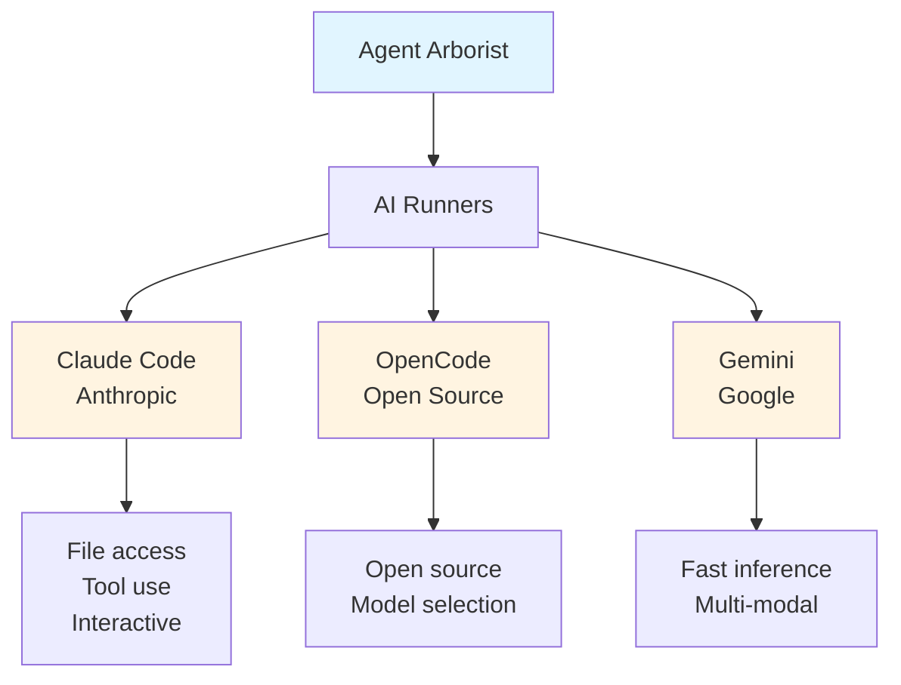
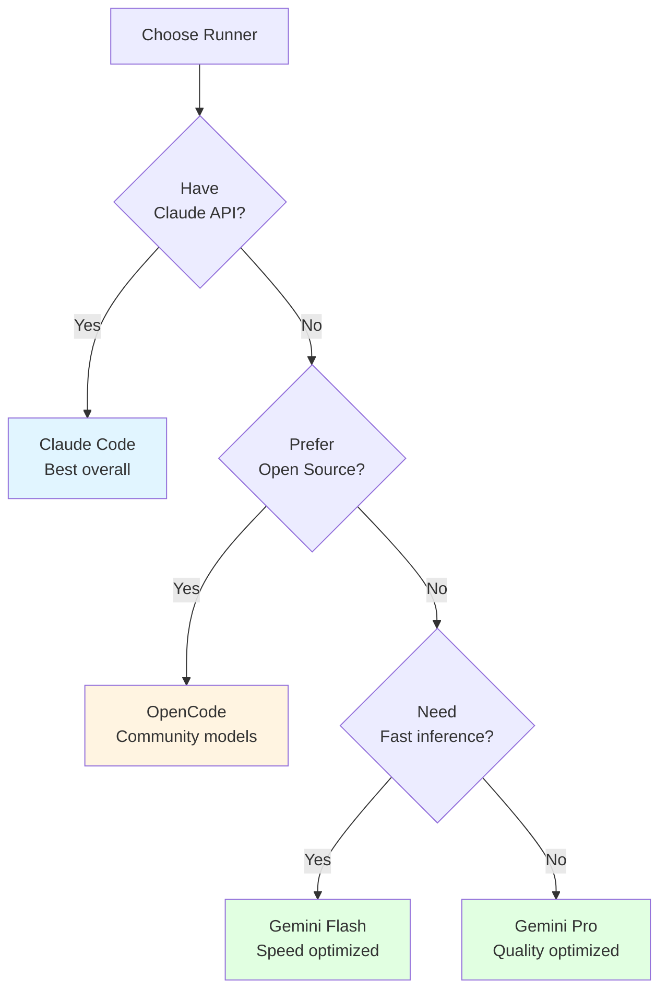
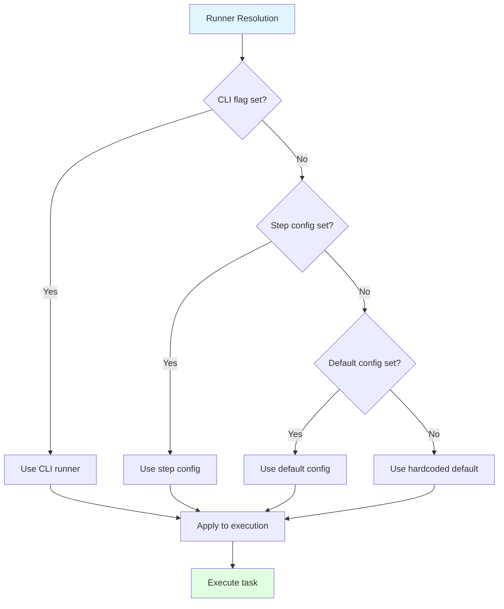
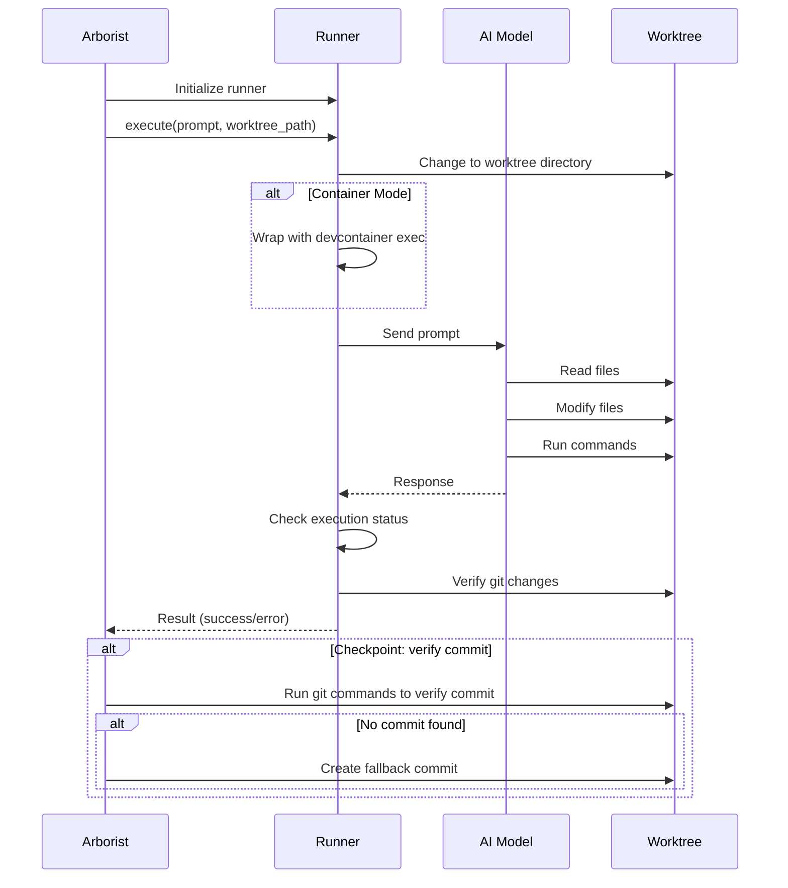

# AI Runners

AI runners are the systems that execute tasks using artificial intelligence. Agent Arborist supports multiple AI runners, allowing you to choose the best tool for your needs.

## Available Runners



## 1. Claude Code Runner

### Overview
Claude Code is Anthropic's command-line tool for interacting with Claude AI models.

### Capabilities
- **File System Access**: Read and write files directly
- **Command Execution**: Run shell commands
- **Interactive Sessions**: Maintain context across commands
- **Multiple Models**: Claude 3.5 Sonnet, Opus, Haiku

### Installation
```bash
# Install Claude CLI
npm install -g @anthropics/claude-cli

# Verify installation
claude --version

# Authenticate
claude auth login
```

### Configuration
```json
{
  "runners": {
    "claude": {
      "default_model": "sonnet",
      "models": {
        "sonnet": "claude-3-5-sonnet-20241022",
        "opus": "claude-3-opus-20240229",
        "haiku": "claude-3-5-haiku-20241022"
      },
      "timeout": 1800
    }
  }
}
```

**Code Reference:** Runner configuration is in [`src/agent_arborist/runner.py`](../../src/agent_arborist/runner.py)

### Models

| Alias | Model | Best For |
|-------|-------|----------|
| `sonnet` | `claude-3-5-sonnet-20241022` | Most tasks (balanced) |
| `opus` | `claude-3-opus-20240229` | Complex reasoning |
| `haiku` | `claude-3-5-haiku-20241022` | Fast, simple tasks |

**Valid runners:** See [`src/agent_arborist/config.py:VALID_RUNNERS`](../../src/agent_arborist/config.py#L25)

### Usage

```bash
# Use default model
arborist task run T001

# Specify model
arborist task run T001 --runner claude --model sonnet

# Environment variable
export ARBORIST_RUNNER=claude
export ARBORIST_MODEL=sonnet
arborist task run T001
```

### Example Execution

```bash
# Arborist runs:
claude --print << 'EOF'
Implement task T001: Create project structure

Create a directory structure with src/ and tests/ directories.
Add appropriate __init__.py files.
Stage ALL your changes with: git add -A
Create a SINGLE commit with this EXACT format:

git commit -m "task(T001): Create project structure

- Create src/ and tests/ directories
- Add __init__.py files

(generated by claude/sonnet on branch feature/001/T001)"
EOF
```

## 2. OpenCode Runner

### Overview
OpenCode is an open-source AI coding assistant.

### Capabilities
- **Open Source**: Community-developed
- **Model Selection**: Support for various open models
- **Lightweight**: Fast installation and execution

### Installation
```bash
# Install OpenCode (method varies by distribution)
# Example for some installations:
pip install opencode-cli

# Verify installation
opencode --version
```

### Configuration
```json
{
  "runners": {
    "opencode": {
      "default_model": "cerebras/llama-4-scout-17b",
      "models": {
        "scout": "cerebras/llama-4-scout-17b",
        "large": "meta-llama/Meta-Llama-3.1-70B-Instruct"
      },
      "timeout": 1800
    }
  }
}
```

### Models

| Alias | Model | Best For |
|-------|-------|----------|
| `scout` | `cerebras/llama-4-scout-17b` | General purpose |
| `large` | `meta-llama/Meta-Llama-3.1-70B-Instruct` | Complex tasks |

### Usage

```bash
# Use OpenCode runner
arborist task run T001 --runner opencode

# Specify model
arborist task run T001 --runner opencode --model scout
```

## 3. Gemini Runner

### Overview
Gemini is Google's AI model family, accessed via API.

### Capabilities
- **API-Based**: No CLI required
- **Multi-Modal**: Support for images, audio, video
- **Fast Inference**: Optimized for speed
- **Multiple Models**: Flash (fast), Pro (capable)

### Configuration
```json
{
  "runners": {
    "gemini": {
      "default_model": "gemini-2.5-flash",
      "models": {
        "flash": "gemini-2.5-flash",
        "pro": "gemini-2.5-pro",
        "ultra": "gemini-2.5-ultra"
      },
      "timeout": 1800,
      "api_key": "your-gemini-api-key"
    }
  }
}
```

**Environment Variable:**
```bash
export GOOGLE_API_KEY="your-api-key"
```

### Models

| Alias | Model | Best For |
|-------|-------|----------|
| `flash` | `gemini-2.5-flash` | Fast, frequent tasks |
| `pro` | `gemini-2.5-pro` | Complex, quality tasks |
| `ultra` | `gemini-2.5-ultra` | Advanced reasoning |

**Valid models:** See configuration in [`src/agent_arborist/config.py`](../../src/agent_arborist/config.py#L22)

### Usage

```bash
# Use Gemini runner
arborist task run T001 --runner gemini

# Specify model
arborist task run T001 --runner gemini --model flash
```

## Choosing a Runner

### Claude Code vs. OpenCode vs. Gemini



### Decision Matrix

| Factor | Claude Code | OpenCode | Gemini |
|--------|-------------|----------|--------|
| **Cost** | Pay-per-token | Free/Open | Pay-per-token |
| **Speed** | Medium | Variable | Fast |
| **Quality** | High | Variable | High |
| **File Access** | Native | Native | API-only |
| **Tool Use** | Native | Limited | API-only |
| **Best For** | General use | Cost-sensitive | Fast iteration |

### Use Cases

#### Use Claude Code When:
- ✅ You have Claude API access
- ✅ Need reliable file system access
- ✅ Want balanced performance and cost
- ✅ Need advanced tool use
- ✅ General software development tasks

#### Use OpenCode When:
- ✅ Want open-source alternative
- ✅ Cost is a primary concern
- ✅ Prefer community models
- ✅ Have hardware to run locally

#### Use Gemini When:
- ✅ Need fast inference
- ✅ Working with multi-modal data (images, etc.)
- ✅ Want Google's latest models
- ✅ Need real-time iteration

## Runner Selection Hierarchy



**Code Reference:** Configuration precedence in [`src/agent_arborist/config.py:get_config()`](../../src/agent_arborist/config.py#L960)

### Example: Configuration Precedence

```bash
# 1. Hardcoded default (lowest)
# runner = "claude"

# 2. Global config (~/.arborist_config.json)
# "defaults": { "runner": "claude" }

# 3. Project config (.arborist/config.json)
# "defaults": { "runner": "gemini" }

# 4. Step-specific config
# "steps": { "run": { "runner": "opencode" } }

# 5. Environment variable
export ARBORIST_RUNNER=claude

# 6. CLI flag (highest)
arborist task run T001 --runner gemini
# Final: gemini
```

## Model Selection

### Model Aliases

Model aliases provide shorthand for full model names.

```json
{
  "runners": {
    "claude": {
      "models": {
        "sonnet": "claude-3-5-sonnet-20241022",
        "opus": "claude-3-opus-20240229"
      }
    }
  }
}
```

**Usage:**
```bash
# Use alias
arborist task run T001 --model sonnet

# Arborist resolves to: claude-3-5-sonnet-20241022
```

**Code Reference:** Alias resolution in [`src/agent_arborist/config.py:resolve_model_alias()`](../../src/agent_arborist/config.py#L46)

### Step-Specific Models

Different task steps can use different models:

```json
{
  "steps": {
    "run": {
      "runner": "claude",
      "model": "sonnet"
    },
    "post-merge": {
      "runner": "gemini",
      "model": "flash"
    }
  }
}
```

## Timeouts

Each runner can have a default timeout:

```json
{
  "timeouts": {
    "task_run": 1800,        # 30 minutes for task execution
    "task_post_merge": 300   # 5 minutes for post-merge
  }
}
```

**Code Reference:** Timeout config in [`src/agent_arborist/config.py:TimeoutConfig`](../../src/agent_arborist/config.py#L129)

### Override Timeout

```bash
# Command line
arborist task run T001 --timeout 3600

# Environment variable
export ARBORIST_TIMEOUT_TASK_RUN=3600
```

## Execution Flow



## Error Handling

### Runner Not Available

**Error:** "claude not found in PATH"

**Solution:**
```bash
# Check if installed
which claude

# Install or add to PATH
export PATH="$PATH:/path/to/claude"
```

**Code Reference:** Runner detection in [`src/agent_arborist/runner.py`](../../src/agent_arborist/runner.py)

### Timeout Exceeded

**Error:** "Task execution timeout"

**Solutions:**
```bash
# 1. Increase timeout
arborist task run T001 --timeout 3600

# 2. Break task into smaller tasks

# 3. Use faster model
arborist task run T001 --model haiku
```

### API Key Missing

**Error:** "API key not configured"

**Solution:**
```bash
# Gemini
export GOOGLE_API_KEY="your-key"

# Or in config.json
{
  "runners": {
    "gemini": {
      "api_key": "your-key"
    }
  }
}
```

## Best Practices

### 1. Use Appropriate Models


```bash
# Simple: File creation, basic functions
arborist task run T001 --model haiku

# Standard: Feature implementation, business logic
arborist task run T002 --model sonnet

# Complex: Architecture, refactoring
arborist task run T003 --model opus
```

### 2. Set Reasonable Timeouts

```json
{
  "timeouts": {
    "task_run": 1800,      # 30 minutes for most tasks
    "task_post_merge": 60  # 1 minute for merge operations
  }
}
```

### 3. Monitor Runner Performance

```bash
# Track execution time
arborist viz tree specs/my-spec --format json

# Adjust based on results
```

### 4. Use Runner Fallbacks

```json
{
  "defaults": {
    "runner": "claude",      // Primary
    "fallback_runner": "gemini"  // Backup (not yet implemented)
  }
}
```

## Next Steps

- [Configuration System](../03-configuration/01-configuration-system.md) - Learn to configure runners
- [Task Commands](../04-using-the-cli/03-task-commands.md) - Execute tasks with AI
- [Container Support](../06-container-support/01-devcontainer-integration.md) - Run AI in containers

## Code References

- Runner interface: [`src/agent_arborist/runner.py`](../../src/agent_arborist/runner.py)
- Valid runners: [`src/agent_arborist/config.py:VALID_RUNNERS`](../../src/agent_arborist/config.py#L25)
- Configuration: [`src/agent_arborist/config.py`](../../src/agent_arborist/config.py)
- Task execution: [`src/agent_arborist/cli.py:task_run()`](../../src/agent_arborist/cli.py)