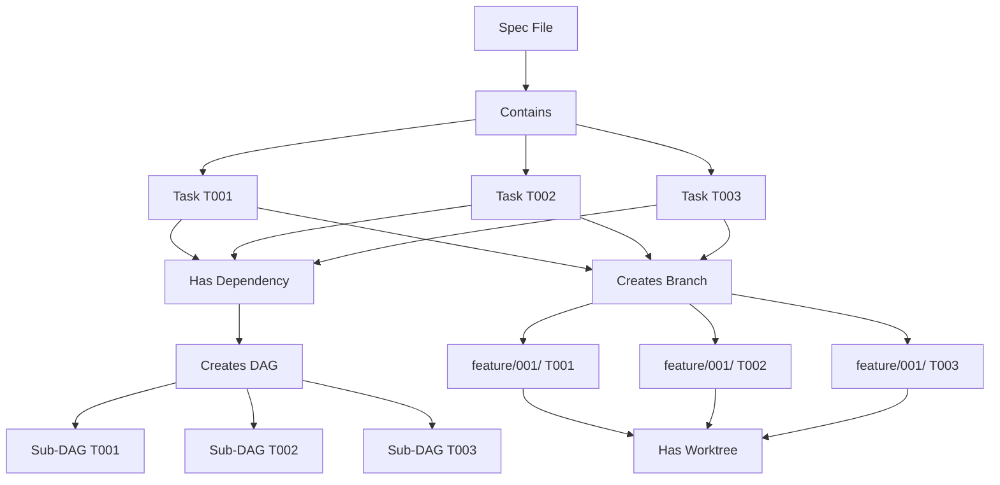

# Part 2: Core Concepts

This section explains the fundamental concepts you need to understand to use Agent Arborist effectively.

## Contents

- **[Specs and Tasks](./01-specs-and-tasks.md)** - How to define task specifications
- **[DAGs and Dagu](./02-dags-and-dagu.md)** - Workflow generation and execution
- **[Git and Worktrees](./03-git-and-worktrees.md)** - Branch-based task isolation
- **[AI Runners](./04-ai-runners.md)** - AI execution options

## Core Concepts Overview

Agent Arborist operates on these fundamental concepts:

1. **Specs** - Markdown files describing tasks in a declarative format
2. **Tasks** - Individual units of work with specific IDs and descriptions
3. **DAGs** - Directed Acyclic Graphs representing task dependencies
4. **Worktrees** - Git worktrees providing isolated workspaces
5. **AI Runners** - The AI systems that execute tasks

## The Execution Pipeline

## Key Relationships

## Next Steps

Start with [Specs and Tasks](./01-specs-and-tasks.md) to learn how to define your first task specification.