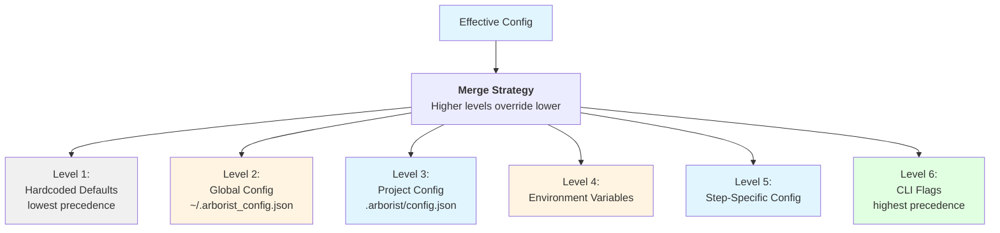
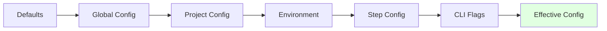
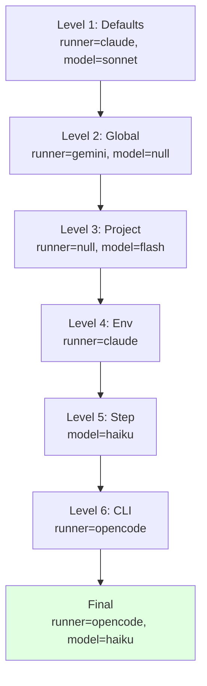

# Configuration System

Agent Arborist uses a hierarchical configuration system with multiple levels of precedence, allowing you to customize behavior at global, project, step, and runtime levels.

## Configuration Hierarchy



## Configuration Levels

### 1. Hardcoded Defaults (Level 1)

**Source:** Code defaults in Arborist

**Values:**
```python
# From src/agent_arborist/config.py
DEFAULT_RUNNER = "claude"
DEFAULT_MODEL = "sonnet"
```

**Example:**
```python
# If no other config specified
runner = "claude"
model = "sonnet"
output_format = "json"
container_mode = "auto"
```

**Code Reference:** [`src/agent_arborist/config.py`](../../src/agent_arborist/config.py#L31)

---

### 2. Global Configuration (Level 2)

**Location:** `~/.arborist_config.json`

**Purpose:** System-wide defaults for all projects

**Example:**
```json
{
  "version": "1",
  "defaults": {
    "runner": "gemini",
    "model": "flash",
    "output_format": "text"
  },
  "timeouts": {
    "task_run": 3600
  }
}
```

**Creation:**
```bash
# Create global config
arborist config init --global

# Edit manually
nano ~/.arborist_config.json
```

---

### 3. Project Configuration (Level 3)

**Location:** `.arborist/config.json` (in project root)

**Purpose:** Project-specific settings that override globals

**Example:**
```json
{
  "version": "1",
  "defaults": {
    "runner": "claude",
    "model": "sonnet",
    "container_mode": "enabled"
  },
  "timeouts": {
    "task_run": 1800,
    "task_post_merge": 600
  },
  "test": {
    "command": "pytest -v --cov=src",
    "timeout": 300
  },
  "paths": {
    "worktrees": ".worktrees",
    "dags": "dagu"
  }
}
```

**Creation:**
```bash
# Initialize Arborist (creates .arborist/ directory)
arborist init

# Create project config
arborist config init

# Edit manually
nano .arborist/config.json
```

**Code Reference:** Project config path in [`src/agent_arborist/config.py:get_project_config_path()`](../../src/agent_arborist/config.py#L739)

---

### 4. Environment Variables (Level 4)

**Purpose:** Runtime overrides without modifying files

**Available Variables:**

| Variable | Purpose | Default | Valid Values |
|----------|---------|---------|--------------|
| `ARBORIST_RUNNER` | AI runner to use | `claude` | `claude`, `opencode`, `gemini` |
| `ARBORIST_MODEL` | Model to use | (runner default) | `sonnet`, `opus`, `haiku`, etc. |
| `ARBORIST_OUTPUT_FORMAT` | Output format | `json` | `json`, `text` |
| `ARBORIST_CONTAINER_MODE` | Container execution | `auto` | `auto`, `enabled`, `disabled` |
| `ARBORIST_QUIET` | Suppress output | `false` | `true`, `false` |
| `ARBORIST_TIMEOUT_TASK_RUN` | Task run timeout | `1800` | (seconds) |
| `ARBORIST_TIMEOUT_POST_MERGE` | Post-merge timeout | `300` | (seconds) |
| `ARBORIST_TEST_COMMAND` | Test command | (auto-detect) | `pytest`, `npm test`, etc. |
| `ARBORIST_TEST_TIMEOUT` | Test timeout | (default) | (seconds) |

**Step-Specific Variables:**

| Variable | Purpose | Example |
|----------|---------|---------|
| `ARBORIST_STEP_RUN_RUNNER` | Runner for 'run' step | `claude` |
| `ARBORIST_STEP_RUN_MODEL` | Model for 'run' step | `sonnet` |
| `ARBORIST_STEP_POST_MERGE_RUNNER` | Runner for 'post-merge' step | `gemini` |

**Code Reference:** Environment variable handling in [`src/agent_arborist/config.py:apply_env_overrides()`](../../src/agent_arborist/config.py#L865)

---

### 5. Step-Specific Configuration (Level 5)

Location: In `.arborist/config.json` or `~/.arborist_config.json`

**Purpose:** Different settings for different task steps

**Example:**
```json
{
  "steps": {
    "run": {
      "runner": "claude",
      "model": "sonnet"
    },
    "post-merge": {
      "runner": "gemini",
      "model": "flash"
    }
  }
}
```

**Valid Steps:** See [`src/agent_arborist/config.py:VALID_STEPS`](../../src/agent_arborist/config.py#L28)

---

### 6. CLI Flags (Level 6)

**Purpose:** Highest precedence for temporary overrides

**Example:**
```bash
# Override runner
arborist task run T001 --runner gemini

# Override model
arborist task run T001 --model flash

# Override timeout
arborist task run T001 --timeout 3600

# Override container mode
arborist spec dag-build specs/my-project --container-mode enabled
```

**Code Reference:** CLI flag handling in [`src/agent_arborist/cli.py`](../../src/agent_arborist/cli.py)

---

## Configuration Merge Logic



### Merge Rules

1. **None values don't override**
   - Higher level with `null` doesn't replace lower level value
   - Allows partial configs to layer properly

2. **Step-specific resolution**
   - Runner and model resolve independently
   - Check step config, then defaults, then hardcoded

3. **Arrays and objects**
   - Arrays are replaced (not merged)
   - Objects are merged at field level

**Code Reference:** Merge logic in [`src/agent_arborist/config.py:merge_configs()`](../../src/agent_arborist/config.py#L776)

---

## Complete Configuration Example

Here's a comprehensive configuration showing all levels:

### Global Config (`~/.arborist_config.json`)

```json
{
  "version": "1",
  "_comment": "Global defaults for all projects",
  "defaults": {
    "runner": "gemini",
    "model": "flash",
    "output_format": "json",
    "container_mode": "auto",
    "quiet": false
  },
  "timeouts": {
    "task_run": 1800,
    "task_post_merge": 300,
    "test_command": 300
  },
  "runners": {
    "gemini": {
      "default_model": "gemini-2.5-flash",
      "models": {
        "flash": "gemini-2.5-flash",
        "pro": "gemini-2.5-pro"
      },
      "timeout": 1800
    }
  },
  "paths": {
    "worktrees": "worktrees",
    "dags": "dagu"
  }
}
```

### Project Config (`.arborist/config.json`)

```json
{
  "version": "1",
  "_comment": "Project-specific overrides",
  "defaults": {
    "runner": "claude",
    "model": "sonnet",
    "container_mode": "enabled"
  },
  "timeouts": {
    "task_run": 3600,
    "task_post_merge": 600
  },
  "steps": {
    "run": {
      "runner": "claude",
      "model": "sonnet"
    },
    "post-merge": {
      "runner": "gemini",
      "model": "flash"
    }
  },
  "test": {
    "command": "pytest -v --cov=src",
    "timeout": 300
  },
  "paths": {
    "worktrees": ".worktrees",
    "dags": "dagu"
  },
  "runners": {
    "claude": {
      "default_model": "claude-3-5-sonnet-20241022",
      "models": {
        "sonnet": "claude-3-5-sonnet-20241022",
        "opus": "claude-3-opus-20240229",
        "haiku": "claude-3-5-haiku-20241022"
      },
      "timeout": 3600
    }
  }
}
```

### Environment Variables

```bash
# Runtime override for specific task
export ARBORIST_RUNNER=opencode
export ARBORIST_MODEL=scout
export ARBORIST_TIMEOUT_TASK_RUN=2400
```

### CLI Flags

```bash
# Temporary override
arborist task run T001 \
  --runner claude \
  --model opus \
  --timeout 4800
```

### Final Effective Config

```json
{
  "runner": "claude",          // From CLI flag
  "model": "opus",             // From CLI flag
  "output_format": "json",     // From global
  "container_mode": "enabled", // From project
  "quiet": false,             // From global
  "task_run_timeout": 4800,   // From CLI flag
  "task_post_merge_timeout": 600 // From project
}
```

---

## Configuration Commands

### Show Configuration

```bash
# Show merged configuration
arborist config show
```

**Output:**
```json
{
  "version": "1",
  "defaults": {
    "runner": "claude",
    "model": "sonnet",
    "output_format": "json",
    "container_mode": "auto",
    "quiet": false
  },
  "timeouts": {
    "task_run": 1800,
    "task_post_merge": 300,
    "test_command": null
  },
  ...
}
```

**Code Reference:** Config display in [`src/agent_arborist/cli.py:config_show()`](../../src/agent_arborist/cli.py#L724)

---

### Initialize Configuration

```bash
# Create project config
arborist config init

# Create global config
arborist config init --global

# Force overwrite
arborist config init --force
```

**Code Reference:** Config initialization in [`src/agent_arborist/cli.py:config_init()`](../../src/agent_arborist/cli.py#L745)

---

### Validate Configuration

```bash
# Validate all config files
arborist config validate
```

**Output:**
```
Valid: Global config: /home/user/.arborist_config.json
Valid: Project config: /project/.arborist/config.json

✓ All config files are valid!
```

**Code Reference:** Config validation in [`src/agent_arborist/cli.py:config_validate()`](../../src/agent_arborist/cli.py#L790)

---

### Generate Template

```bash
# Generate config template
arborist config template > my-config-template.json
```

**Code Reference:** Template generation in [`src/agent_arborist/config.py:generate_config_template()`](../../src/agent_arborist/config.py#L1069)

---

## Configuration Schema

### Defaults Config

```typescript
interface DefaultsConfig {
  runner?: "claude" | "opencode" | "gemini" | null;
  model?: string | null;
  output_format?: "json" | "text";
  container_mode?: "auto" | "enabled" | "disabled";
  quiet?: boolean;
}
```

**Code Reference:** [`src/agent_arborist/config.py:DefaultsConfig`](../../src/agent_arborist/config.py#L66)

---

### Timeouts Config

```typescript
interface TimeoutsConfig {
  task_run: number;      // seconds
  task_post_merge: number; // seconds
  test_command?: number | null; // seconds
}
```

**Code Reference:** [`src/agent_arborist/config.py:TimeoutConfig`](../../src/agent_arborist/config.py#L129)

---

### Steps Config

```typescript
interface StepsConfig {
  [stepName: string]: {
    runner?: "claude" | "opencode" | "gemini" | null;
    model?: string | null;
  };
}

// Valid step names: "run", "post-merge"
```

**Code Reference:** [`src/agent_arborist/config.py:StepConfig`](../../src/agent_arborist/config.py#L183)

---

### Test Config

```typescript
interface TestConfig {
  command?: string | null;
  timeout?: number | null;
}
```

**Code Reference:** [`src/agent_arborist/config.py:TestingConfig`](../../src/agent_arborist/config.py#L259)

---

### Paths Config

```typescript
interface PathsConfig {
  worktrees: string;  // Relative to project root
  dags: string;       // Relative to .arborist/
}
```

**Code Reference:** [`src/agent_arborist/config.py:PathsConfig`](../../src/agent_arborist/config.py#L295)

---

### Runner Config

```typescript
interface RunnerConfig {
  default_model?: string | null;
  models: Record<string, string>;
  timeout?: number | null;
}
```

**Code Reference:** [`src/agent_arborist/config.py:RunnerConfig`](../../src/agent_arborist/config.py#L223)

---

## Common Configuration Patterns

### Pattern 1: Different Models for Different Steps

```json
{
  "steps": {
    "run": {
      "runner": "claude",
      "model": "sonnet"
    },
    "post-merge": {
      "runner": "gemini",
      "model": "flash"
    }
  }
}
```

**Use Case:** Use high-quality model for implementation, fast model for merge tasks.

---

### Pattern 2: Project-Specific Test Commands

```json
{
  "test": {
    "command": "pytest -v --cov=src --cov-report=html",
    "timeout": 300
  }
}
```

**Use Case:** Different projects have different test frameworks and coverage requirements.

---

### Pattern 3: Container Mode by Environment

```bash
# Dev environment
export ARBORIST_CONTAINER_MODE=auto

# CI environment (always use container)
export ARBORIST_CONTAINER_MODE=enabled
```

**Use Case:** Local development may not need containers, CI always does.

---

### Pattern 4: Long-Running Tasks

```json
{
  "timeouts": {
    "task_run": 7200,        // 2 hours for complex tasks
    "task_post_merge": 600   // 10 minutes for merge
  }
}
```

**Use Case:** Large refactoring or migration tasks.

---

## Configuration Precedence Example

Let's trace a concrete example through all levels:

### Level 1: Hardcoded Defaults
```python
runner = "claude"
model = "sonnet"
```

### Level 2: Global Config
```json
{
  "defaults": {
    "runner": "gemini",
    "model": null  // Don't override model
  }
}
```
**Result:** runner="gemini", model="sonnet"

### Level 3: Project Config
```json
{
  "defaults": {
    "runner": null,  // Don't override
    "model": "flash"
  }
}
```
**Result:** runner="gemini", model="flash"

### Level 4: Environment Variables
```bash
export ARBORIST_RUNNER=claude
# ARBORIST_MODEL not set
```
**Result:** runner="claude", model="flash"

### Level 5: Step Config
```json
{
  "steps": {
    "run": {
      "runner": null,
      "model": "haiku"
    }
  }
}
```
**Result:** runner="claude", model="haiku"

### Level 6: CLI Flags
```bash
arborist task run T001 --runner opencode
```
**Final Result:** runner="opencode", model="haiku"



---

## Best Practices

### 1. Keep Global Config Simple

```json
{
  "defaults": {
    "runner": "claude",
    "model": "sonnet"
  },
  "timeouts": {
    "task_run": 1800
  }
}
```

**Why:** Simple defaults work for most projects.

---

### 2. Use Project Config for Team Settings

```json
{
  "defaults": {
    "runner": "gemini",
    "container_mode": "enabled"
  },
  "test": {
    "command": "pytest -v"
  }
}
```

**Why:** Shared with team, version-controlled.

---

### 3. Use Environment for Temporary Overrides

```bash
# Local development with different model
export ARBORIST_MODEL=opus

# Run task
arborist task run T001
```

**Why:** Don't commit personal preferences.

---

### 4. Validate After Changes

```bash
arborist config validate
```

**Why:** Catch errors early.

---

### 5. Document Custom Settings

```json
{
  "_comment": "Using claude-slow model for complexity analysis",
  "steps": {
    "post-merge": {
      "runner": "claude",
      "model": "opus"
    }
  }
}
```

**Why:** Future you will need to know why.

---

## Troubleshooting

### Config Not Loading

**Symptoms:** Changes not taking effect

**Checks:**
```bash
# Show effective config
arborist config show

# Check if project config exists
ls -la .arborist/config.json

# Validate syntax
arborist config validate
```

---

### Invalid JSON

**Error:** `ConfigLoadError: Invalid JSON in config.json`

**Solution:**
```bash
# Validate JSON
python -m json.tool .arborist/config.json

# Or use jq
jq '.' .arborist/config.json
```

---

### Unknown Fields

**Error:** `ConfigValidationError: Unknown field 'foo_bar'`

**Solution:**
Check valid fields in schema:
```bash
arborist config template | jq 'keys'
```

**Code Reference:** Validation in [`src/agent_arborist/config.py:validate()`](../../src/agent_arborist/config.py#L650)

---

### Environment Variable Not Working

**Check:**
```bash
echo $ARBORIST_RUNNER
env | grep ARBORIST
```

**Common Issues:**
- Typos in variable name
- Variable not exported
- Shell not reading env file

---

## Next Steps

- [Runners and Models](./02-runners-and-models.md) - Detailed runner configuration
- [Timeouts and Paths](./03-timeouts-and-paths.md) - Configure timeouts and paths
- [Test Configuration](./04-test-configuration.md) - Set up test commands

## Code References

- Configuration system: [`src/agent_arborist/config.py`](../../src/agent_arborist/config.py)
- Config classes: [`src/agent_arborist/config.py`](../../src/agent_arborist/config.py#L66)
- Validation: [`src/agent_arborist/config.py:validate()`](../../src/agent_arborist/config.py#L650)