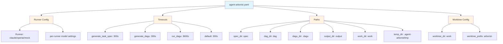

# Timeouts and Paths Configuration

This section covers configuration options for controlling execution timeouts and file paths in Agent Arborist.

## Overview

Agent Arborist provides configuration options to:
- Control timeout durations for various operations
- Specify default paths for specs, DAGs, and other artifacts
- Configure Git worktree settings

See [`src/agent_arborist/config.py:AgentArboristConfig`](../../src/agent_arborist/config.py#L40) for the complete configuration structure.

## Timeouts Configuration

### Timeout Settings

You can configure timeouts for different operations:

```yaml
# agent-arborist.yaml
timeouts:
  generate_task_spec: 300  # seconds
  generate_dagu: 300       # seconds
  run_dagu: 3600           # seconds
  default: 300             # seconds (fallback)
```

### Timeout Fields

| Field | Type | Default | Description |
|-------|------|---------|-------------|
| `generate_task_spec` | int | 300 | Timeout for generating task specifications |
| `generate_dagu` | int | 300 | Timeout for generating DAGU configurations |
| `run_dagu` | int | 3600 | Timeout for running DAGU workflows |
| `default` | int | 300 | Default timeout for unspecified operations |

### Timeout Best Practices

1. **generate_task_spec**: Keep at 300 seconds (5 minutes) for most use cases. Complex specs may need more time.

2. **generate_dagu**: 300 seconds is typically sufficient. Increase only for very complex workflows.

3. **run_dagu**: Set based on your actual workflow duration:
   - Quick workflows: 600-1800 seconds (10-30 minutes)
   - Standard workflows: 3600 seconds (1 hour)
   - Long-running workflows: 7200+ seconds (2+ hours)

### Example: Long-Running Workflow

```yaml
timeouts:
  generate_task_spec: 300
  generate_dagu: 300
  run_dagu: 7200  # 2 hours for long-running workflows
  default: 300
```

## Paths Configuration

### Path Settings

Configure default paths for various artifacts:

```yaml
# agent-arborist.yaml
paths:
  spec_dir: spec
  dag_dir: dag
  dagu_dir: .dagu
  output_dir: output
  work_dir: work
  temp_dir: .agent-arborist/tmp
```

### Path Fields

| Field | Type | Default | Description |
|-------|------|---------|-------------|
| `spec_dir` | string | `spec` | Directory for task specification files |
| `dag_dir` | string | `dag` | Directory for DAG configuration files |
| `dagu_dir` | string | `.dagu` | Directory for DAGU runtime files |
| `output_dir` | string | `output` | Directory for workflow outputs |
| `work_dir` | string | `work` | Directory for worktrees and temporary clones |
| `temp_dir` | string | `.agent-arborist/tmp` | Temporary files directory |

### Path Behavior

- Paths are **relative to the project root** unless specified as absolute
- Paths are created automatically if they don't exist
- The `work_dir` is used for Git worktrees and temporary clones
- The `temp_dir` is cleaned up after operations complete

### Example: Custom Paths

```yaml
paths:
  spec_dir: specs           # Use "specs" instead of "spec"
  dag_dir: dags             # Use "dags" instead of "dag"
  dagu_dir: .dagu/runtime   # Nested DAGU directory
  output_dir: results       # Use "results" instead of "output"
  work_dir: .worktrees      # Use ".worktrees" instead of "work"
  temp_dir: /tmp/arborist   # Absolute path for temp files
```

## Git Worktree Configuration

### Worktree Settings

Configure Git worktree behavior:

```yaml
# agent-arborist.yaml
git:
  worktree_dir: work
  worktree_prefix: arborist-
```

### Worktree Fields

| Field | Type | Default | Description |
|-------|------|---------|-------------|
| `worktree_dir` | string | `work` | Base directory for worktrees |
| `worktree_prefix` | string | `arborist-` | Prefix for worktree directory names |

### Worktree Behavior

- Worktrees are created in `{worktree_dir}/{worktree_prefix}{task-name}`
- Each task gets its own isolated worktree
- Worktrees are automatically cleaned up after completion
- Worktrees prevent conflicts when running tasks in parallel

### Example: Custom Worktree Configuration

```yaml
git:
  worktree_dir: .git/worktrees
  worktree_prefix: task-
```

This creates worktrees like `.git/worktrees/task-my-awesome-task`.

## Complete Configuration Example

```yaml
# agent-arborist.yaml
runner: claude
claude:
  models:
    task_spec: claude-3-5-sonnet-20240620
    dagu: claude-3-5-sonnet-20240620
openai:
  models:
    task_spec: gpt-4
    dagu: gpt-3.5-turbo

# Timeouts
timeouts:
  generate_task_spec: 300
  generate_dagu: 300
  run_dagu: 3600
  default: 300

# Paths
paths:
  spec_dir: spec
  dag_dir: dag
  dagu_dir: .dagu
  output_dir: output
  work_dir: work
  temp_dir: .agent-arborist/tmp

# Git worktree
git:
  worktree_dir: work
  worktree_prefix: arborist-
```

## Configuration Diagram



## Code References

- Full configuration structure: [`src/agent_arborist/config.py:AgentArboristConfig`](../../src/agent_arborist/config.py#L40)
- Timeouts field: [`src/agent_arborist/config.py:timeouts`](../../src/agent_arborist/config.py#L47)
- Paths field: [`src/agent_arborist/config.py:paths`](../../src/agent_arborist/config.py#L48)
- Worktree configuration: [`src/agent_arborist/config.py:git`](../../src/agent_arborist/config.py#L49)