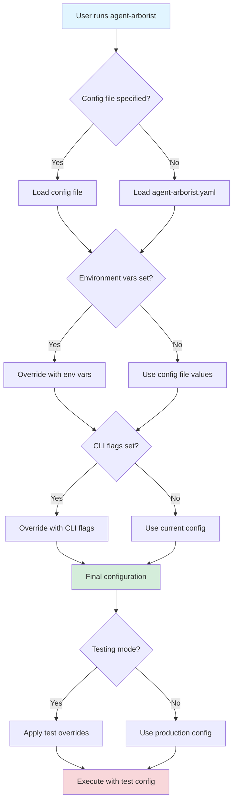

# Test Configuration

Agent Arborist supports configuration specific to testing scenarios, including automated tests, CI/CD pipelines, and development environments.

## Overview

Test configuration allows you to:
- Use mock runners to avoid API calls
- Set shorter timeouts for faster test execution
- Configure test-specific paths to avoid conflicts
- Control test behavior and output

See the test fixtures in [`tests/fixtures/config/`](../../tests/fixtures/config/) for examples.

## Test Configuration Strategy

### Recommended Approach

Instead of a separate test configuration file, use environment variables and CLI flags to override defaults for testing:

```bash
# Use mock runner for testing
AGENT_ARBORIST_RUNNER=mock agent-arborist ...

# Use test-specific paths
AGENT_ARBORIST_SPEC_DIR=test/spec agent-arborist ...

# Override timeouts via CLI
agent-arborist --timeout 60 ...
```

### When to Use Test Configuration Files

Consider a test configuration file when:
- You have complex test setups with multiple tasks
- You need reproducible test environments
- You're running integration tests that need specific settings

## Mock Runner Configuration

For testing without API calls, use the mock runner:

```yaml
# test-config.yaml
runner: mock
```

The mock runner returns predefined responses suitable for testing.

### Benefits of Mock Runner

- **No API costs**: Test without spending credits
- **Fast execution**: No network latency
- **Deterministic**: Returns consistent responses
- **Isolated**: No dependencies on external services

### Example

```yaml
# test-config.yaml
runner: mock
paths:
  spec_dir: test/specs
  dag_dir: test/dags
  dagu_dir: test/.dagu
  output_dir: test/output
  work_dir: test/work
  temp_dir: test/.tmp
timeouts:
  generate_task_spec: 10
  generate_dagu: 10
  run_dagu: 30
  default: 10
```

## Test Paths Configuration

Configure separate paths for testing to avoid conflicts with production files:

```yaml
# test-config.yaml
paths:
  spec_dir: test/specs
  dag_dir: test/dags
  dagu_dir: test/.dagu
  output_dir: test/output
  work_dir: test/work
  temp_dir: test/.tmp
```

### Path Organization

```
project/
├── agent-arborist.yaml    # Production config
├── test-config.yaml       # Test config
├── spec/                  # Production specs
├── test/
│   ├── specs/            # Test specs
│   ├── dags/             # Test DAGs
│   ├── .dagu/            # Test DAGU runtime
│   ├── output/           # Test outputs
│   └── work/             # Test worktrees
└── tests/                # Test code
```

## Test Timeouts Configuration

Use shorter timeouts for faster test execution:

```yaml
# test-config.yaml
timeouts:
  generate_task_spec: 10   # Quick mock responses
  generate_dagu: 10        # Quick mock responses
  run_dagu: 30             # Short test run
  default: 10              # Fallback timeout
```

### Timeout Guidelines

| Operation | Production | Test | Rationale |
|-----------|------------|------|-----------|
| generate_task_spec | 300s | 10s | Mock responses are instant |
| generate_dagu | 300s | 10s | Mock responses are instant |
| run_dagu | 3600s | 30s | Test workflows are minimal |
| default | 300s | 10s | Quick fallback for tests |

## CI/CD Configuration

### GitHub Actions Example

```yaml
# .github/workflows/test.yml
name: Test

on: [push, pull_request]

jobs:
  test:
    runs-on: ubuntu-latest
    steps:
      - uses: actions/checkout@v4
      
      - name: Install Python
        uses: actions/setup-python@v5
        with:
          python-version: '3.11'
      
      - name: Install dependencies
        run: |
          pip install -e ".[dev]"
      
      - name: Run tests with mock runner
        env:
          AGENT_ARBORIST_RUNNER: mock
          AGENT_ARBORIST_SPEC_DIR: test/specs
        run: |
          pytest tests/
```

### GitLab CI Example

```yaml
# .gitlab-ci.yml
test:
  image: python:3.11
  script:
    - pip install -e ".[dev]"
    - export AGENT_ARBORIST_RUNNER=mock
    - export AGENT_ARBORIST_SPEC_DIR=test/specs
    - pytest tests/
```

## Environment Variables

Agent Arborist supports environment variables for configuration:

| Variable | Description | Example |
|----------|-------------|---------|
| `AGENT_ARBORIST_RUNNER` | Override runner | `mock` |
| `AGENT_ARBORIST_SPEC_DIR` | Spec directory | `test/specs` |
| `AGENT_ARBORIST_DAG_DIR` | DAG directory | `test/dags` |
| `AGENT_ARBORIST_DAGU_DIR` | DAGU directory | `test/.dagu` |
| `AGENT_ARBORIST_OUTPUT_DIR` | Output directory | `test/output` |
| `AGENT_ARBORIST_WORK_DIR` | Work tree directory | `test/work` |

### Example Usage

```bash
# Set multiple variables
export AGENT_ARBORIST_RUNNER=mock
export AGENT_ARBORIST_SPEC_DIR=test/specs
export AGENT_ARBORIST_DAG_DIR=test/dags

# Run with test configuration
agent-arborist --config test-config.yaml
```

## Test Configuration Examples

### Minimal Test Config

```yaml
# test-config.yaml
runner: mock
```

### Full Test Config

```yaml
# test-config.yaml
runner: mock
paths:
  spec_dir: test/specs
  dag_dir: test/dags
  dagu_dir: test/.dagu
  output_dir: test/output
  work_dir: test/work
  temp_dir: test/.tmp
timeouts:
  generate_task_spec: 10
  generate_dagu: 10
  run_dagu: 30
  default: 10
git:
  worktree_dir: test/work
  worktree_prefix: test-
```

### Integration Test Config

```yaml
# integration-test-config.yaml
runner: claude
claude:
  models:
    task_spec: claude-3-haiku-20240307  # Faster, cheaper
    dagu: claude-3-haiku-20240307
paths:
  spec_dir: test/integration/specs
  dag_dir: test/integration/dags
  dagu_dir: test/integration/.dagu
  output_dir: test/integration/output
  work_dir: test/integration/work
  temp_dir: test/integration/.tmp
timeouts:
  generate_task_spec: 60
  generate_dagu: 60
  run_dagu: 300
  default: 60
git:
  worktree_dir: test/integration/work
  worktree_prefix: int-
```

## Configuration Flow Diagram



## Best Practices

### 1. Separate Test and Production

- Use separate directories (`test/` vs production paths)
- Use separate config files (`test-config.yaml` vs `agent-arborist.yaml`)
- never commit production API keys

### 2. Use Mock Runner for Unit Tests

```yaml
runner: mock
```

### 3. Use Fast Models for Integration Tests

```yaml
runner: claude
claude:
  models:
    task_spec: claude-3-haiku-20240307
    dagu: claude-3-haiku-20240307
```

### 4. Set Short Timeouts

```yaml
timeouts:
  generate_task_spec: 10
  generate_dagu: 10
  run_dagu: 30
  default: 10
```

### 5. Clean Up Test Artifacts

```bash
# Clean test directories after tests
rm -rf test/specs test/dags test/.dagu test/output test/work test/.tmp
```

## Code References

- Test fixtures: [`tests/fixtures/config/`](../../tests/fixtures/config/)
- Configuration loading: [`src/agent_arborist/config.py`](../../src/agent_arborist/config.py)
- Environment variable handling: [`src/agent_arborist/config.py`](../../src/agent_arborist/config.py)