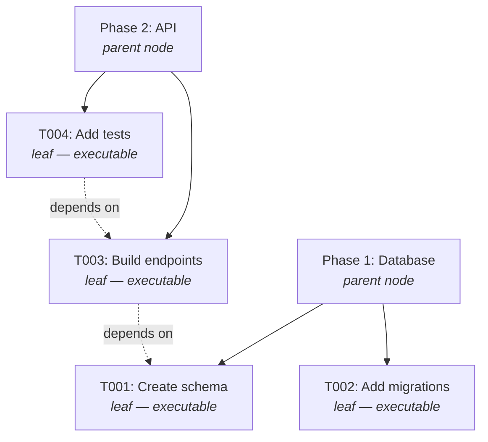
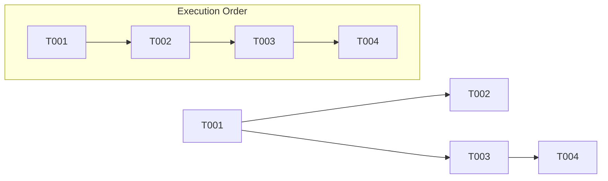

# Task Trees

The task tree is the central data structure in Arborist. It represents your project as a hierarchy of tasks with dependency edges and a computed execution order.

## Structure

A task tree consists of **TaskNodes** organized in a parent-child hierarchy:



### Node Types

- **Parent nodes** — organizational groupings (phases, stories, epics). They are never executed directly.
- **Leaf nodes** — actual work items. These are what Arborist sends to AI runners.

### TaskNode Fields

| Field | Description |
|-------|-------------|
| `id` | Unique identifier (e.g., `T001`, `phase1`) |
| `name` | Human-readable name |
| `description` | Detailed description (used as the AI prompt) |
| `parent` | ID of the parent node (`null` for root nodes) |
| `children` | List of child node IDs |
| `depends_on` | List of dependency node IDs |
| `source_file` | Spec file this was extracted from |
| `source_line` | Line number in the source file |
| `test_commands` | List of test commands for this node (see below) |

### Test Commands

Each node can have per-node test commands generated by the AI planner:

```json
"test_commands": [
  {
    "type": "unit",
    "command": "python -m pytest tests/ -x",
    "framework": "pytest",
    "timeout": 120
  }
]
```

| Field | Description |
|-------|-------------|
| `type` | `"unit"`, `"integration"`, or `"e2e"` |
| `command` | Shell command to execute |
| `framework` | Optional: `"pytest"`, `"jest"`, `"vitest"`, `"go"` — enables output parsing |
| `timeout` | Optional: override timeout in seconds |

**Rules:**
- Leaf tasks typically have `unit` tests
- Parent nodes can have `integration` or `e2e` tests that run before the phase branch merges
- If a node has no `test_commands`, the fallback is `"true"` (no-op)
- The AI planner generates test commands automatically based on project context

## Execution Order

Arborist computes a **topological sort** over leaf tasks using Kahn's algorithm. This ensures every task's dependencies are satisfied before it runs.



Only leaf nodes appear in the execution order. Parent nodes are organizational — they determine branch naming but aren't executed.

## Phase Branching

All leaf tasks under the same **root phase** (top-level parent) share a single git branch:

```
arborist/<spec-id>/<root-phase-id>
```

For example, if `T001` and `T002` are both under `phase1`:

```
arborist/my-project/phase1    ← branch for T001 and T002
arborist/my-project/phase2    ← branch for T003 and T004
```

When all leaves under a phase are complete, the phase branch is merged back to the base branch.

## The task-tree.json File

The `build` command produces a JSON file:

```json
{
  "spec_id": "my-project",
  "nodes": {
    "phase1": {
      "id": "phase1",
      "name": "Database Layer",
      "parent": null,
      "children": ["T001", "T002"],
      "depends_on": [],
      "is_leaf": false
    },
    "T001": {
      "id": "T001",
      "name": "Create schema",
      "description": "Design and create the database schema...",
      "parent": "phase1",
      "children": [],
      "depends_on": [],
      "is_leaf": true,
      "test_commands": [
        {"type": "unit", "command": "python -m pytest tests/ -x", "framework": "pytest"}
      ]
    }
  },
  "root_ids": ["phase1", "phase2"],
  "execution_order": ["T001", "T002", "T003", "T004"],
  "spec_files": ["spec/tasks.md"]
}
```

This file is the input to `garden` and `gardener` commands. You can inspect and even hand-edit it if the AI planner didn't get the structure right.
