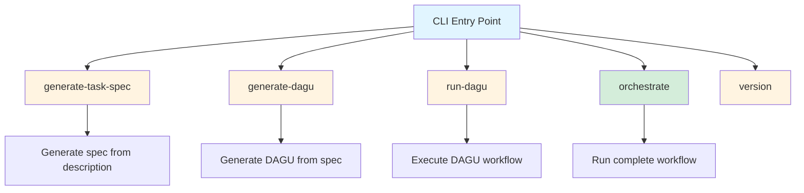
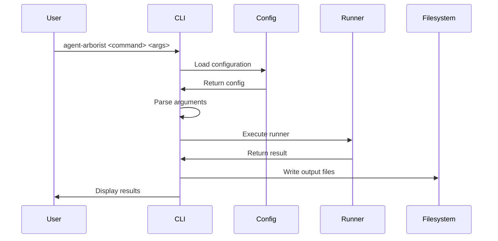
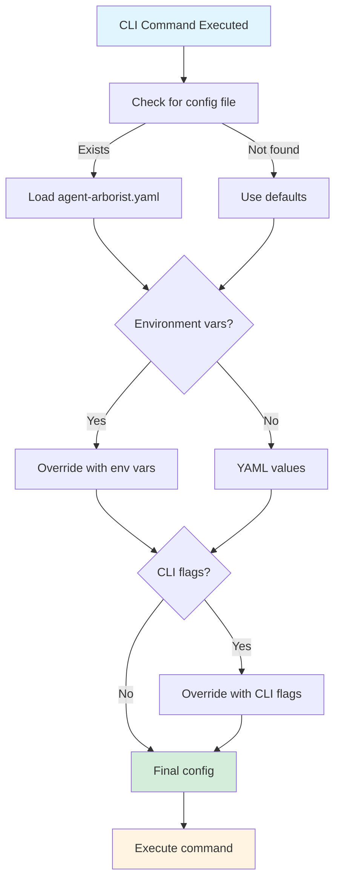

# CLI Overview

The Agent Arborist command-line interface is built using the [Click](https://click.palletsprojects.com/) framework and provides a structured way to interact with all functionality.

## Architecture

### Entry Point

The CLI entry point is defined in [`src/agent_arborist/cli.py`](../../src/agent_arborist/cli.py):

```python
@click.group()
@click.version_option()
def cli():
    """Agent Arborist CLI for managing AI-generated task specifications."""
    pass
```

### Command Group Structure

The CLI uses Click's command group pattern:



## Core Components

### 1. Click Framework

Agent Arborist uses Click for:
- **Command definition**: Decorator-based command creation
- **Argument parsing**: Automatic type conversion and validation
- **Help generation**: Built-in `--help` support
- **Error handling**: Structured error messages

### 2. Configuration Loading

Commands load configuration from multiple sources:

**Priority order (highest to lowest):**
1. CLI flags/options
2. Environment variables
3. Configuration file (`agent-arborist.yaml`)
4. Default values

See [`src/agent_arborist/config.py`](../../src/agent_arborist/config.py) for configuration handling.

### 3. Command Dispatch

Each command is registered with the CLI group:

```python
@cli.command()
@click.argument("description")
def generate_task_spec(description):
    """Generate a task specification from a description."""
    pass
```

## Command Flow

### Typical Command Execution Flow



### Configuration Loading Flow



## CLI Features

### Interactive Mode

Some commands support interactive prompts for missing required arguments:

```bash
agent-arborist generate-task-spec
# Prompts for description interactively
```

### Output Formatting

Commands provide structured output:
- **Success**: Clear success messages with file paths
- **Errors**: Descriptive error messages with suggestions
- **Progress**: Progress indicators for long-running operations

### Verbose Mode

Use `--verbose` flag for detailed logging:

```bash
agent-arborist orchestrate "My task" --verbose
```

### Dry Run Mode

Use `--dry-run` to see what would happen without executing:

```bash
agent-arborist orchestrate "My task" --dry-run
```

## Error Handling

The CLI provides structured error handling:

### Common Error Types

1. **Configuration Errors**: Invalid or missing configuration
2. **Argument Errors**: Invalid command-line arguments
3. **Filesystem Errors**: Permission issues, missing files
4. **Runner Errors**: API failures, timeouts

### Error Display Format

```bash
Error: Invalid configuration

  Path: agent-arborist.yaml
  Issue: runner must be one of: claude, openai, mock
  
  Fix: Update the runner field in your configuration file
```

## CLI Patterns

### 1. Command Chaining

Commands can be chained using shell pipes:

```bash
agent-arborist generate-task-spec "My task" | \
agent-arborist generate-dagu - | \
agent-arborist run-dagu -
```

### 2. Configuration Override

Override configuration per command:

```bash
agent-arborist --runner claude generate-task-spec "My task"
```

### 3. Output Redirection

Redirect output to files:

```bash
agent-arborist generate-task-spec "My task" > output.json
```

## Extension Points

### Adding New Commands

To add a new command:

1. Define the command function in [`src/agent_arborist/cli.py`](../../src/agent_arborist/cli.py):

```python
@cli.command()
@click.argument("input")
def new_command(input):
    """Description of the new command."""
    pass
```

2. Register with the CLI group:
```python
cli.add_command(new_command)
```

### Custom Flags

Add custom flags using Click decorators:

```python
@click.option("--custom-flag", help="Custom flag description")
def my_command(custom_flag):
    pass
```

## Code References

### CLI Definition
- Main CLI group: [`src/agent_arborist/cli.py:cli()`](../../src/agent_arborist/cli.py#L12)
- Command registration: [`src/agent_arborist/cli.py`](../../src/agent_arborist/cli.py)

### Commands
- generate-task-spec: [`src/agent_arborist/cli.py:generate_task_spec()`](../../src/agent_arborist/cli.py#L18)
- generate-dagu: [`src/agent_arborist/cli.py:generate_dagu()`](../../src/agent_arborist/cli.py#L45)
- run-dagu: [`src/agent_arborist/cli.py:run_dagu()`](../../src/agent_arborist/cli.py#L72)
- orchestrate: [`src/agent_arborist/cli.py:orchestrate()`](../../src/agent_arborist/cli.py#L99)

### Configuration
- Configuration loading: [`src/agent_arborist/config.py:load_config()`](../../src/agent_arborist/config.py#L100)
- Configuration validation: [`src/agent_arborist/config.py`](../../src/agent_arborist/config.py)

## Next Steps

- Learn about [Generate Task Spec](./02-generate-task-spec.md) command
- Explore [Generate DAGU](./03-generate-dagu.md) command
- See [Run DAGU](./04-run-dagu.md) command