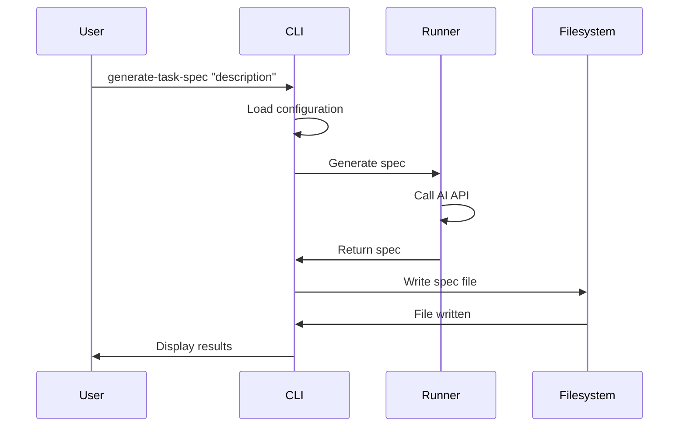

# Generate Task Spec

The `generate-task-spec` command generates a task specification from a natural language description.

## Command Syntax

```bash
agent-arborist generate-task-spec [OPTIONS] DESCRIPTION
```

## Arguments

| Argument | Type | Required | Description |
|----------|------|----------|-------------|
| `DESCRIPTION` | string | Yes | Natural language description of the task |

## Options

| Option | Type | Default | Description |
|--------|------|---------|-------------|
| `--spec-name` | string | Generated | Name for the task spec file |
| `--runner` | string | Config | Override the AI runner |
| `--output-dir` | string | Config | Override output directory |
| `--timeout` | int | Config | Timeout in seconds |
| `--dry-run` | flag | false | Show what would happen without executing |
| `--verbose` | flag | false | Show detailed logs |

## Usage Examples

### Basic Usage

```bash
agent-arborist generate-task-spec "Build a data pipeline that processes user events"
```

This generates a task specification and saves it to `spec/data-pipeline.yaml`.

### Custom Spec Name

```bash
agent-arborist generate-task-spec "Build a data pipeline" \
  --spec-name user-event-pipeline
```

Saves to `spec/user-event-pipeline.yaml`.

### Override Runner

```bash
agent-arborist generate-task-spec "Build a data pipeline" \
  --runner claude
```

Uses Claude runner instead of the default configured runner.

### Verbose Output

```bash
agent-arborist generate-task-spec "Build a data pipeline" \
  --verbose
```

Shows detailed logs during generation.

### Dry Run

```bash
agent-arborist generate-task-spec "Build a data pipeline" \
  --dry-run
```

Shows what would happen without actually generating the spec.

## Output

### Success

On success, the command:
1. Creates a task specification file in the `spec/` directory
2. Displays the file path
3. Shows a summary

```bash
✓ Generated task specification: spec/user-event-pipeline.yaml

Summary:
  - Name: user-event-pipeline
  - Steps: 5
  - Estimated time: 30 minutes
```

### File Format

The generated spec file is in YAML format:

```yaml
# spec/user-event-pipeline.yaml
name: user-event-pipeline
description: Build a data pipeline that processes user events
 runner: claude
steps:
  - name: "data-ingestion"
    description: "Ingest user events from Kafka"
    command: "python scripts/ingest.py"
  - name: "data-validation"
    description: "Validate event data"
    command: "python scripts/validate.py"
```

## Command Flow



## Common Use Cases

### 1. Starting a New Project

```bash
agent-arborist generate-task-spec \
  "Create a web scraper that extracts product prices from Amazon"
```

### 2. Breaking Down Complex Tasks

```bash
agent-arborist generate-task-spec \
  "Design and implement a machine learning pipeline for fraud detection"
```

### 3. Creating Reusable Workflows

```bash
agent-arborist generate-task-spec \
  "Build a CI/CD pipeline that tests, builds, and deploys code"
```

## Tips and Best Practices

### 1. Be Specific

Provide clear, detailed descriptions:

**Good:**
```bash
agent-arborist generate-task-spec \
  "Build a data pipeline that ingests user events from Kafka, validates the data, transforms it, and stores it in PostgreSQL"
```

**Less effective:**
```bash
agent-arborist generate-task-spec "Build a data pipeline"
```

### 2. Specify Requirements

Include technical requirements:

```bash
agent-arborist generate-task-spec \
  "Build a data pipeline using Python, Apache Airflow, and PostgreSQL. Must handle 1M events per hour with 99.9% uptime"
```

### 3. Define Constraints

Mention constraints:

```bash
agent-arborist generate-task-spec \
  "Build a data pipeline that processes user events. Must be cost-effective, use serverless services, and run in AWS"
```

### 4. Use Custom Names

Give your specs meaningful names:

```bash
agent-arborist generate-task-spec \
  "Build a data pipeline" \
  --spec-name production-event-pipeline
```

## Troubleshooting

### Issue: "Configuration not found"

**Solution:** Ensure `agent-arborist.yaml` exists in the current directory or specify `--config` flag.

### Issue: "Invalid runner"

**Solution:** Check that the runner is one of: `claude`, `openai`, `mock`.

### Issue: "Timeout"

**Solution:** Increase timeout with `--timeout` flag or simplify the task description.

### Issue: "API error"

**Solution:** Check API credentials and ensure the runner service is available.

## Code References

- Command definition: [`src/agent_arborist/cli.py:generate_task_spec()`](../../src/agent_arborist/cli.py#L18)
- Configuration loading: [`src/agent_arborist/config.py:load_config()`](../../src/agent_arborist/config.py#L100)
- Runner interface: [`src/agent_arborist/runner.py`](../../src/agent_arborist/runner.py)

## Next Steps

- [Generate DAGU](./03-generate-dagu.md) from your task spec
- [Orchestrate](./05-orchestrate.md) the complete workflow
- Learn about [CLI Flags](./06-cli-flags-and-options.md)