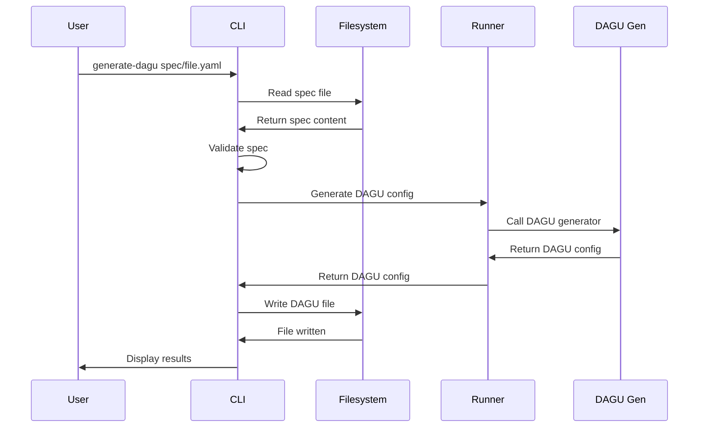

# Generate DAGU

The `generate-dagu` command generates a DAGU workflow configuration from a task specification.

## Command Syntax

```bash
agent-arborist generate-dagu [OPTIONS] SPEC_FILE
```

## Arguments

| Argument | Type | Required | Description |
|----------|------|----------|-------------|
| `SPEC_FILE` | path | Yes | Path to the task specification file |

## Options

| Option | Type | Default | Description |
|--------|------|---------|-------------|
| `--dag-name` | string | Generated | Name for the DAGU config file |
| `--output-dir` | string | Config | Override output directory |
| `--timeout` | int | Config | Timeout in seconds |
| `--dry-run` | flag | false | Show what would happen without executing |
| `--verbose` | flag | false | Show detailed logs |

## Usage Examples

### Basic Usage

```bash
agent-arborist generate-dagu spec/user-event-pipeline.yaml
```

This generates a DAGU configuration and saves it to `dag/user-event-pipeline.yaml`.

### Custom DAG Name

```bash
agent-arborist generate-dagu spec/user-event-pipeline.yaml \
  --dag-name production-pipeline
```

Saves to `dag/production-pipeline.yaml`.

### Verbose Output

```bash
agent-arborist generate-dagu spec/user-event-pipeline.yaml \
  --verbose
```

Shows detailed logs during generation.

### Dry Run

```bash
agent-arborist generate-dagu spec/user-event-pipeline.yaml \
  --dry-run
```

Shows what would happen without actually generating the DAGU config.

## Input Specification Format

The command expects a task specification file in YAML format:

```yaml
# spec/user-event-pipeline.yaml
name: user-event-pipeline
description: Build a data pipeline that processes user events
runner: claude
steps:
  - name: "data-ingestion"
    description: "Ingest user events from Kafka"
    command: "python scripts/ingest.py"
  - name: "data-validation"
    description: "Validate event data"
    command: "python scripts/validate.py"
```

## Output

### Success

On success, the command:
1. Reads the task specification
2. Generates a DAGU configuration
3. Saves the DAGU config to the `dag/` directory
4. Displays the file path
5. Shows a summary

```bash
✓ Generated DAGU configuration: dag/user-event-pipeline.yaml

Summary:
  - DAG name: user-event-pipeline
  - Tasks: 5
  - Schedule: None (manual trigger)
```

### DAGU Configuration Format

The generated DAGU config is in YAML format:

```yaml
# dag/user-event-pipeline.yaml
name: user-event-pipeline
description: Build a data pipeline that processes user events
schedule:
  type: manual
tasks:
  - name: data-ingestion
    description: Ingest user events from Kafka
    command: python scripts/ingest.py
    depends_on: []
  - name: data-validation
    description: Validate event data
    command: python scripts/validate.py
    depends_on:
      - data-ingestion
```

## Command Flow



## DAGU Configuration Features

### 1. Task Dependencies

The generator automatically creates task dependencies based on the order in your spec:

```yaml
steps:
  - name: "step1"
    command: "cmd1"
  - name: "step2"
    command: "cmd2"
```

Generates:

```yaml
tasks:
  - name: step1
    depends_on: []
  - name: step2
    depends_on:
      - step1
```

### 2. Parallel Tasks

Specify independent tasks:

```yaml
steps:
  - name: "parallel1"
    command: "cmd1"
    parallel: true
  - name: "parallel2"
    command: "cmd2"
    parallel: true
```

### 3. Retry Configuration

Add retry settings:

```yaml
steps:
  - name: "data-ingestion"
    command: "python scripts/ingest.py"
    retry:
      count: 3
      delay_seconds: 60
```

## Common Use Cases

### 1. Convert Spec to DAGU

```bash
agent-arborist generate-dagu spec/my-task.yaml
```

### 2. Create Multiple DAG Configs

```bash
# Generate for different environments
agent-arborist generate-dagu spec/pipeline.yaml --dag-name dev-pipeline
agent-arborist generate-dagu spec/pipeline.yaml --dag-name prod-pipeline
```

### 3. Update Existing DAG

```bash
# Regenerate DAG with updated spec
agent-arborist generate-dagu spec/pipeline.yaml
```

## Tips and Best Practices

### 1. Validate Spec First

Ensure your spec is valid before generating DAGU:

```bash
# Check spec content
cat spec/my-task.yaml

# Then generate DAGU
agent-arborist generate-dagu spec/my-task.yaml
```

### 2. Use Descriptive Names

```bash
agent-arborist generate-dagu spec/pipeline.yaml \
  --dag-name production-payment-pipeline
```

### 3. Review Generated DAGU

Always review the generated DAGU config before running:

```bash
agent-arborist generate-dagu spec/pipeline.yaml
cat dag/pipeline.yaml
```

### 4. Test with Dry Run

```bash
agent-arborist generate-dagu spec/pipeline.yaml --dry-run
```

## Troubleshooting

### Issue: "Spec file not found"

**Solution:** Ensure the spec file path is correct and the file exists.

### Issue: "Invalid spec format"

**Solution:** Check that your spec is valid YAML with required fields (name, description, steps).

### Issue: "DAGU generation failed"

**Solution:** Check the spec structure and ensure all steps have valid commands.

### Issue: "Timeout"

**Solution:** Increase timeout with `--timeout` flag or simplify the task spec.

## Integration with Other Commands

### Full Workflow

```bash
# 1. Generate spec
agent-arborist generate-task-spec "Build a data pipeline"

# 2. Generate DAGU
agent-arborist generate-dagu spec/data-pipeline.yaml

# 3. Run DAGU
agent-arborist run-dagu dag/data-pipeline.yaml
```

### Orchestrate (All-in-One)

```bash
# Equivalent to all three commands above
agent-arborist orchestrate "Build a data pipeline"
```

## Code References

- Command definition: [`src/agent_arborist/cli.py:generate_dagu()`](../../src/agent_arborist/cli.py#L45)
- Configuration loading: [`src/agent_arborist/config.py:load_config()`](../../src/agent_arborist/config.py#L100)
- DAGU generation logic: [`src/agent_arborist/dagu.py`](../../src/agent_arborist/dagu.py)

## Next Steps

- [Run DAGU](./04-run-dagu.md) to execute the workflow
- [Orchestrate](./05-orchestrate.md) for end-to-end workflow
- Learn about [CLI Flags](./06-cli-flags-and-options.md)