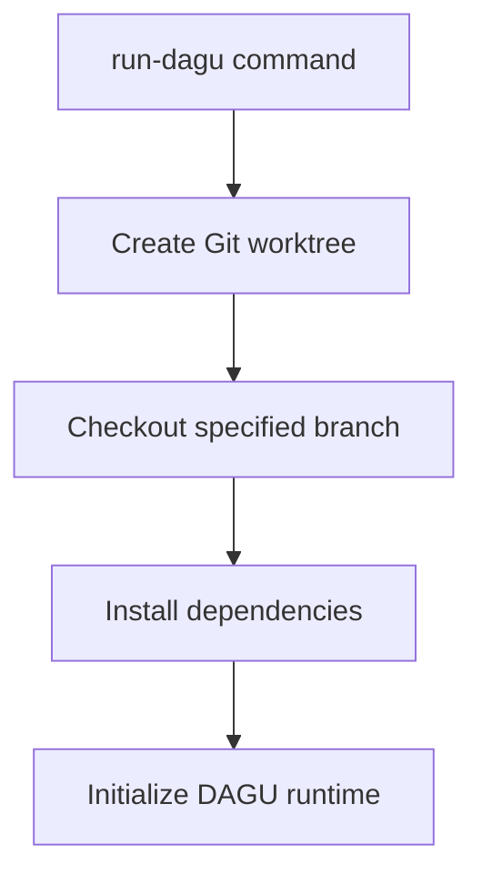
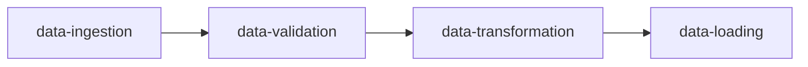
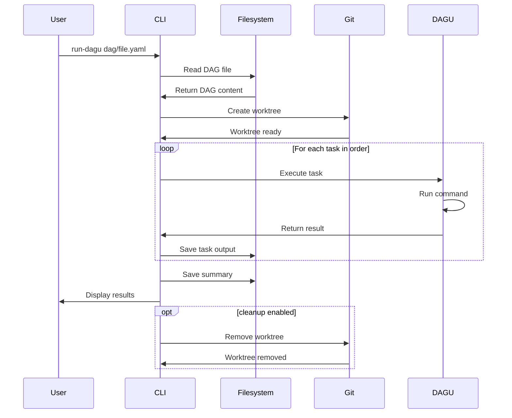

# Run DAGU

The `run-dagu` command executes a DAGU workflow configuration and manages the execution lifecycle.

## Command Syntax

```bash
agent-arborist run-dagu [OPTIONS] DAG_FILE
```

## Arguments

| Argument | Type | Required | Description |
|----------|------|----------|-------------|
| `DAG_FILE` | path | Yes | Path to the DAGU configuration file |

## Options

| Option | Type | Default | Description |
|--------|------|---------|-------------|
| `--output-dir` | string | Config | Override output directory |
| `--timeout` | int | Config | Timeout in seconds |
| `--dry-run` | flag | false | Show what would happen without executing |
| `--verbose` | flag | false | Show detailed logs |
| `--watch` | flag | false | Watch execution in real-time |
| `--cleanup` | flag | false | Clean up worktree after completion |

## Usage Examples

### Basic Usage

```bash
agent-arborist run-dagu dag/user-event-pipeline.yaml
```

Runs the DAGU workflow and outputs results to `output/`.

### Verbose Output

```bash
agent-arborist run-dagu dag/user-event-pipeline.yaml \
  --verbose
```

Shows detailed logs during execution.

### Watch Execution

```bash
agent-arborist run-dagu dag/user-event-pipeline.yaml \
  --watch
```

Monitors execution in real-time.

### With Cleanup

```bash
agent-arborist run-dagu dag/user-event-pipeline.yaml \
  --cleanup
```

Automatically cleans up the worktree after completion.

### Dry Run

```bash
agent-arborist run-dagu dag/user-event-pipeline.yaml \
  --dry-run
```

Shows what would happen without actually running the workflow.

## Input Format

The command expects a DAGU configuration file in YAML format:

```yaml
# dag/user-event-pipeline.yaml
name: user-event-pipeline
description: Build a data pipeline that processes user events
schedule:
  type: manual
tasks:
  - name: data-ingestion
    description: Ingest user events from Kafka
    command: python scripts/ingest.py
    depends_on: []
  - name: data-validation
    description: Validate event data
    command: python scripts/validate.py
    depends_on:
      - data-ingestion
```

## Execution Process

### 1. Git Worktree Creation

The command creates a Git worktree for isolated execution:



### 2. DAGU Initialization

DAGU runtime is initialized in the `.dagu/` directory:

```bash
work/arborist-user-event-pipeline/
├── .dagu/
│   ├── home.yaml
│   ├── configs/
│   └── logs/
└── dag/
    └── user-event-pipeline.yaml
```

### 3. Task Execution

Tasks are executed in dependency order:



### 4. Output Collection

Results are collected and saved to the output directory:

```bash
output/
├── user-event-pipeline/
│   ├── logs/
│   ├── results/
│   └── summary.json
```

## Command Flow



## Output

### Execution Summary

On success, the command displays:

```bash
✓ DAGU workflow completed: user-event-pipeline

Execution Summary:
  - Tasks executed: 5
  - Successful: 5
  - Failed: 0
  - Duration: 12m 34s
  
Output:
  - Results: output/user-event-pipeline/
  - Logs: output/user-event-pipeline/logs/
  - Summary: output/user-event-pipeline/summary.json
```

### Summary JSON

A summary file is created with execution details:

```json
{
  "dag_name": "user-event-pipeline",
  "execution_time": "2024-01-15T10:30:00Z",
  "duration_seconds": 754,
  "tasks": [
    {
      "name": "data-ingestion",
      "status": "success",
      "duration_seconds": 120,
      "output": "output/user-event-pipeline/data-ingestion.json"
    }
  ]
}
```

### Log Files

Each task generates a log file:

```bash
output/user-event-pipeline/logs/
├── data-ingestion.log
├── data-validation.log
├── data-transformation.log
└── data-loading.log
```

## Monitoring Options

### Watch Mode

Use `--watch` to monitor execution in real-time:

```bash
agent-arborist run-dagu dag/pipeline.yaml --watch
```

This shows:
- Current task being executed
- Progress indicators
- Real-time log output
- Completion status

### Verbose Mode

Use `--verbose` for detailed logging:

```bash
agent-arborist run-dagu dag/pipeline.yaml --verbose
```

This includes:
- Detailed task execution logs
- Git worktree operations
- DAGU initialization steps
- Error stack traces

## Cleanup

### Automatic Cleanup

Use `--cleanup` to automatically remove the worktree:

```bash
agent-arborist run-dagu dag/pipeline.yaml --cleanup
```

This removes the `work/arborist-pipeline/` directory after completion.

### Manual Cleanup

If you don't use `--cleanup`, clean up manually:

```bash
# Remove worktree
cd work
git worktree remove arborist-pipeline
```

## Common Use Cases

### 1. Run Production Workflow

```bash
agent-arborist run-dagu dag/production-pipeline.yaml --watch --cleanup
```

### 2. Debug Workflow

```bash
agent-arborist run-dagu dag/pipeline.yaml --verbose
```

### 3. Test Workflow

```bash
agent-arborist run-dagu dag/pipeline.yaml --dry-run
```

### 4. Run with Specific Output

```bash
agent-arborist run-dagu dag/pipeline.yaml \
  --output-dir custom/output
```

## Error Handling

### Task Failure

If a task fails, execution stops and the error is displayed:

```bash
✗ Task failed: data-validation

Error:
  ValidationError: Invalid event data format
  
Logs: output/user-event-pipeline/logs/data-validation.log
```

### Timeout

If the workflow times out:

```bash
✗ Timeout exceeded: 3600 seconds
  
Partial results saved to: output/user-event-pipeline/
```

### Recovery

You can:
1. Fix the issue
2. Rerun the workflow
3. DAGU will skip completed tasks

## Best Practices

### 1. Always Review DAG First

```bash
cat dag/pipeline.yaml
agent-arborist run-dagu dag/pipeline.yaml
```

### 2. Use Watch Mode for Long-Running Workflows

```bash
agent-arborist run-dagu dag/pipeline.yaml --watch
```

### 3. Enable Cleanup for Production

```bash
agent-arborist run-dagu dag/pipeline.yaml --cleanup
```

### 4. Save Logs for Debugging

```bash
agent-arborist run-dagu dag/pipeline.yaml --verbose
```

## Troubleshooting

### Issue: "DAG file not found"

**Solution:** Ensure the DAG file path is correct and the file exists.

### Issue: "Worktree creation failed"

**Solution:** Check Git status and ensure you have commit permissions.

### Issue: "DAGU initialization failed"

**Solution:** Ensure DAGU is installed and the `.dagu/` directory is writable.

### Issue: "Task execution failed"

**Solution:** Check task logs in `output/<pipeline>/logs/` for detailed error messages.

## Integration

### Full Workflow

```bash
# 1. Generate spec
agent-arborist generate-task-spec "Build a data pipeline"

# 2. Generate DAGU
agent-arborist generate-dagu spec/data-pipeline.yaml

# 3. Run DAGU
agent-arborist run-dagu dag/data-pipeline.yaml --watch --cleanup
```

### Orchestrate (All-in-One)

```bash
# Equivalent to all three commands
agent-arborist orchestrate "Build a data pipeline"
```

## Code References

- Command definition: [`src/agent_arborist/cli.py:run_dagu()`](../../src/agent_arborist/cli.py#L72)
- Configuration loading: [`src/agent_arborist/config.py:load_config()`](../../src/agent_arborist/config.py#L100)
- DAGU execution logic: [`src/agent_arborist/dagu.py`](../../src/agent_arborist/dagu.py)
- Worktree management: [`src/agent_arborist/worktree.py`](../../src/agent_arborist/worktree.py)

## Next Steps

- [Orchestrate](./05-orchestrate.md) for end-to-end workflow
- Learn about [CLI Flags](./06-cli-flags-and-options.md)