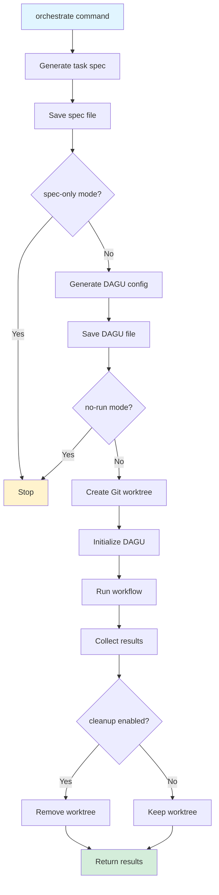
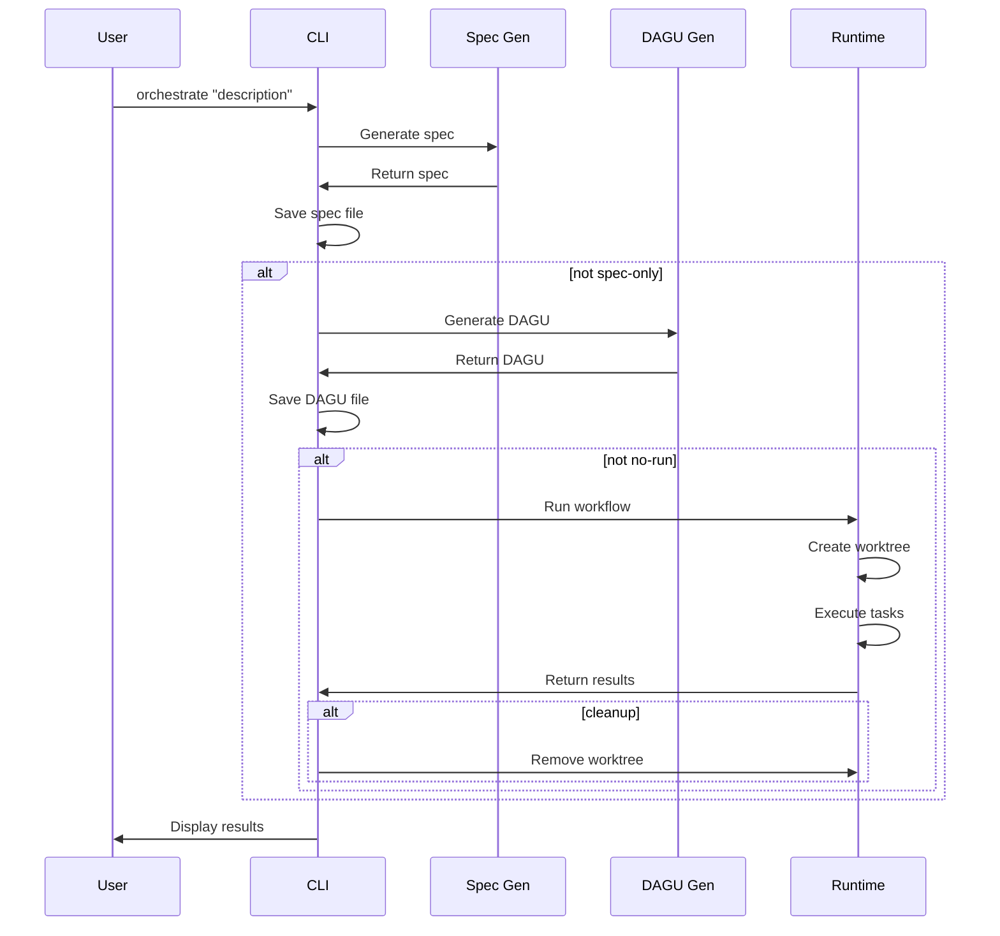

# Orchestrate

The `orchestrate` command orchestrates the complete workflow from start to finish: generating a task specification, creating a DAGU configuration, and running the workflow.

## Command Syntax

```bash
agent-arborist orchestrate [OPTIONS] DESCRIPTION
```

## Arguments

| Argument | Type | Required | Description |
|----------|------|----------|-------------|
| `DESCRIPTION` | string | Yes | Natural language description of the task |

## Options

| Option | Type | Default | Description |
|--------|------|---------|-------------|
| `--spec-name` | string | Generated | Name for the task spec file |
| `--dag-name` | string | Generated | Name for the DAGU config file |
| `--runner` | string | Config | Override the AI runner |
| `--output-dir` | string | Config | Override output directory |
| `--timeout` | int | Config | Timeout in seconds |
| `--dry-run` | flag | false | Show what would happen without executing |
| `--verbose` | flag | false | Show detailed logs |
| `--watch` | flag | false | Watch execution in real-time |
| `--cleanup` | flag | false | Clean up worktree after completion |
| `--spec-only` | flag | false | Only generate spec, stop before DAGU |
| `--no-run` | flag | false | Generate spec and DAGU, but don't run |

## Usage Examples

### Basic Usage

```bash
agent-arborist orchestrate "Build a data pipeline that processes user events"
```

This command:
1. Generates a task specification
2. Creates a DAGU configuration
3. Runs the workflow
4. Returns the results

### Custom Names

```bash
agent-arborist orchestrate "Build a data pipeline" \
  --spec-name prod-pipeline \
  --dag-name production-pipeline
```

### Override Runner

```bash
agent-arborist orchestrate "Build a data pipeline" \
  --runner claude
```

### Watch Execution

```bash
agent-arborist orchestrate "Build a data pipeline" \
  --watch
```

### Generate Spec Only

```bash
agent-arborist orchestrate "Build a data pipeline" \
  --spec-only
```

Generates only the task specification, stops before creating DAGU.

### Generate Spec and DAGU Only

```bash
agent-arborist orchestrate "Build a data pipeline" \
  --no-run
```

Generates spec and DAGU, but doesn't run the workflow.

### Dry Run

```bash
agent-arborist orchestrate "Build a data pipeline" \
  --dry-run
```

Shows what would happen without executing any steps.

## Orchestration Workflow

The `orchestrate` command executes the following steps:



## Command Flow



## Output

### Progress Indicators

During execution, progress is shown:

```bash
→ Generating task specification...
  Step 1/4: Analyzing requirements
  Step 2/4: Identifying components
  Step 3/4: Defining workflow steps
  Step 4/4: Creating specification
✓ Task specification generated: spec/user-event-pipeline.yaml

→ Generating DAGU configuration...
  Step 1/3: Parsing specification
  Step 2/3: Creating DAG structure
  Step 3/3: Writing configuration
✓ DAGU configuration generated: dag/user-event-pipeline.yaml

→ Running workflow...
  Task 1/5: data-ingestion ✓ (2m 10s)
  Task 2/5: data-validation ✓ (45s)
  Task 3/5: data-transformation ✓ (5m 30s)
  Task 4/5: data-loading ✓ (3m 15s)
  Task 5/5: data-enrichment ✓ (1m 05s)
✓ Workflow completed

→ Cleanup complete
```

### Final Summary

```bash
✓ Orchestration complete: user-event-pipeline

Summary:
  - Tasks executed: 5
  - Successful: 5
  - Failed: 0
  - Duration: 12m 45s
  
Artifacts:
  - Spec: spec/user-event-pipeline.yaml
  - DAGU: dag/user-event-pipeline.yaml
  - Output: output/user-event-pipeline/
```

## Workflow Modes

### Full Orchestration (Default)

Executes all steps: spec → DAGU → run

```bash
agent-arborist orchestrate "Build a data pipeline"
```

### Spec-Only Mode

Generates only the task specification:

```bash
agent-arborist orchestrate "Build a data pipeline" --spec-only
```

**Use case:** Review and edit the spec before proceeding.

### No-Run Mode

Generates spec and DAGU, but doesn't run:

```bash
agent-arborist orchestrate "Build a data pipeline" --no-run
```

**Use case:** Review the DAGU config before execution.

### Watch Mode

Monitors execution in real-time:

```bash
agent-arborist orchestrate "Build a data pipeline" --watch
```

**Use case:** Long-running workflows where you want to see progress.

## Common Use Cases

### 1. Quick Start

```bash
agent-arborist orchestrate "Create a web scraper for product prices"
```

### 2. Production Workflow

```bash
agent-arborist orchestrate "Build production data pipeline" \
  --watch --cleanup
```

### 3. Development Workflow

```bash
# Generate spec and DAGU, review them
agent-arborist orchestrate "Build prototype" --no-run

# Review files
cat spec/prototype.yaml
cat dag/prototype.yaml

# Then run
agent-arborist run-dagu dag/prototype.yaml --watch
```

### 4. Testing Workflow

```bash
agent-arborist orchestrate "Build test pipeline" \
  --runner mock \
  --spec-only
```

## Best Practices

### 1. Be Specific with Descriptions

```bash
agent-arborist orchestrate \
  "Build a data pipeline using Python, Apache Airflow, and PostgreSQL. \
   Ingest user events from Kafka, validate data, transform it, \
   and store it in PostgreSQL. Handle 1M events per hour with 99.9% uptime"
```

### 2. Use Custom Names

```bash
agent-arborist orchestrate "Build a data pipeline" \
  --spec-name prod-pipeline \
  --dag-name production-pipeline
```

### 3. Enable Watch for Long Workflows

```bash
agent-arborist orchestrate "Build ETL pipeline" --watch
```

### 4. Enable Cleanup for Production

```bash
agent-arborist orchestrate "Build production pipeline" --cleanup
```

### 5. Use No-Run for Review

```bash
agent-arborist orchestrate "Build pipeline" --no-run
# Review files
agent-arborist run-dagu dag/pipeline.yaml
```

## Troubleshooting

### Issue: "Spec generation failed"

**Solution:** Check the description is clear and detailed. Try simplifying or breaking into multiple orchestrations.

### Issue: "DAGU generation failed"

**Solution:** Review the generated spec for issues. The spec may have invalid steps or commands.

### Issue: "Workflow execution failed"

**Solution:** Check output logs for specific task failures. Fix issues in your code or data.

### Issue: "Timeout"

**Solution:** Increase timeout with `--timeout` flag or simplify the workflow.

### Issue: "Worktree creation failed"

**Solution:** Check Git status and ensure you have commit permissions.

## Comparison: Orchestrate vs Individual Commands

| Feature | Orchestrate | Individual Commands |
|---------|------------|---------------------|
| Convenience | ✅ Single command | ❌ Multiple commands |
| Control | ❌ Less granular control | ✅ Granular control |
| Review | ⚠️ Can review after execution | ✅ Can review at each stage |
| Debugging | ⚠️ Harder to debug | ✅ Easier to debug |
| Best For | Quick workflows | Complex/production workflows |

## Code References

- Command definition: [`src/agent_arborist/cli.py:orchestrate()`](../../src/agent_arborist/cli.py#L99)
- Configuration loading: [`src/agent_arborist/config.py:load_config()`](../../src/agent_arborist/config.py#L100)
- Orchestration logic: [`src/agent_arborist/orchestrate.py`](../../src/agent_arborist/orchestrate.py)

## Next Steps

- Learn about [CLI Flags](./06-cli-flags-and-options.md)
- Explore [Hooks System](../05-hooks-system/01-hooks-overview.md)
- See [Container Support](../06-container-support/01-container-overview.md)