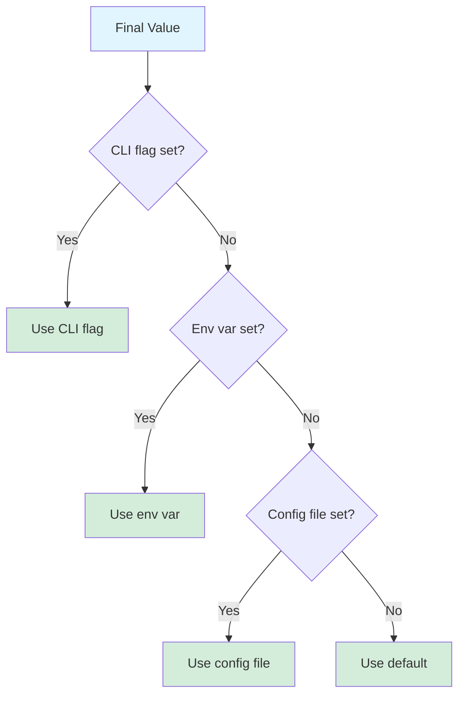

# CLI Flags and Options

This section describes the common CLI flags and options available across all Agent Arborist commands.

## Flag Categories

### 1. Configuration Flags

These flags override configuration settings from `agent-arborist.yaml`.

| Flag | Type | Description | Default |
|------|------|-------------|---------|
| `--runner` | string | Override the AI runner (claude, openai, mock) | Config |
| `--config` | path | Path to configuration file | `agent-arborist.yaml` |

### 2. Output Flags

These flags control output locations and formats.

| Flag | Type | Description | Default |
|------|------|-------------|---------|
| `--output-dir` | path | Override output directory | Config |
| `--spec-name` | string | Name for task spec file | Generated |
| `--dag-name` | string | Name for DAGU config file | Generated |

### 3. Execution Flags

These flags control execution behavior.

| Flag | Type | Description | Default |
|------|------|-------------|---------|
| `--timeout` | int | Timeout in seconds | Config |
| `--dry-run` | flag | Show what would happen without executing | false |
| `--watch` | flag | Watch execution in real-time | false |
| `--cleanup` | flag | Clean up worktree after completion | false |

### 4. Logging Flags

These flags control logging verbosity.

| Flag | Type | Description | Default |
|------|------|-------------|---------|
| `--verbose` | flag | Show detailed logs | false |
| `--quiet` | flag | Suppress non-error output | false |

### 5. Orchestration-Specific Flags

These flags are specific to the `orchestrate` command.

| Flag | Type | Description | Default |
|------|------|-------------|---------|
| `--spec-only` | flag | Only generate spec, stop before DAGU | false |
| `--no-run` | flag | Generate spec and DAGU, but don't run | false |

## Flag Behavior

### Precedence Order

Flags override values in this order (highest to lowest):

1. **CLI flags**: Command-line arguments
2. **Environment variables**: `AGENT_ARBORIST_*`
3. **Configuration file**: `agent-arborist.yaml`
4. **Default values**: Built-in defaults



### Boolean Flags

Boolean flags don't require values:

```bash
# Enable verbose mode
agent-arborist --verbose

# Enable dry-run mode
agent-arborist --dry-run

# Enable cleanup
agent-arborist --cleanup
```

### String Flags

String flags require values:

```bash
# Set runner
agent-arborist --runner claude

# Set spec name
agent-arborist --spec-name my-task

# Set output directory
agent-arborist --output-dir custom/output
```

### Integer Flags

Integer flags require integer values:

```bash
# Set timeout
agent-arborist --timeout 600

# Set retry count
agent-arborist --retry-count 3
```

## Common Flag Combinations

### Development Mode

```bash
agent-arborist orchestrate "My task" \
  --verbose \
  --no-run
```

**What it does:**
- Generates spec and DAGU
- Shows detailed logs
- Doesn't execute

### Production Mode

```bash
agent-arborist orchestrate "My task" \
  --watch \
  --cleanup
```

**What it does:**
- Executes full workflow
- Monitors in real-time
- Cleans up after completion

### Debug Mode

```bash
agent-arborist orchestrate "My task" \
  --verbose \
  --retries 3
```

**What it does:**
- Shows detailed logs
- Retries failed tasks

### Test Mode

```bash
agent-arborist orchestrate "My task" \
  --runner mock \
  --spec-only
```

**What it does:**
- Uses mock runner (no API calls)
- Only generates spec

## Environment Variables

Environment variables provide an alternative to CLI flags:

| Variable | Description | Example |
|----------|-------------|---------|
| `AGENT_ARBORIST_RUNNER` | AI runner | `claude` |
| `AGENT_ARBORIST_CONFIG` | Config file path | `/path/to/config.yaml` |
| `AGENT_ARBORIST_OUTPUT_DIR` | Output directory | `/path/to/output` |
| `AGENT_ARBORIST_SPEC_DIR` | Spec directory | `/path/to/spec` |
| `AGENT_ARBORIST_DAG_DIR` | DAG directory | `/path/to/dag` |

### Using Environment Variables

```bash
# Set environment variables
export AGENT_ARBORIST_RUNNER=claude
export AGENT_ARBORIST_OUTPUT_DIR=custom/output

# Run command (uses env vars)
agent-arborist orchestrate "My task"
```

### Environment Variables vs CLI Flags

CLI flags take precedence over environment variables:

```bash
# Env var sets runner to claude
export AGENT_ARBORIST_RUNNER=claude

# But CLI flag overrides it
agent-arborist --runner openai orchestrate "My task"
# Uses openai, not claude
```

## Flag Availability by Command

| Flag | generate-task-spec | generate-dagu | run-dagu | orchestrate |
|------|-------------------|---------------|----------|-------------|
| `--runner` | ✅ | ✅ | ✅ | ✅ |
| `--config` | ✅ | ✅ | ✅ | ✅ |
| `--output-dir` | ✅ | ✅ | ✅ | ✅ |
| `--spec-name` | ✅ | ✅ | ✅ | ✅ |
| `--dag-name` | ❌ | ✅ | ✅ | ✅ |
| `--timeout` | ✅ | ✅ | ✅ | ✅ |
| `--dry-run` | ✅ | ✅ | ✅ | ✅ |
| `--watch` | ❌ | ❌ | ✅ | ✅ |
| `--cleanup` | ❌ | ❌ | ✅ | ✅ |
| `--verbose` | ✅ | ✅ | ✅ | ✅ |
| `--quiet` | ✅ | ✅ | ✅ | ✅ |
| `--spec-only` | ❌ | ❌ | ❌ | ✅ |
| `--no-run` | ❌ | ❌ | ❌ | ✅ |

## Flag Examples

### Example 1: Quick Test

```bash
agent-arborist orchestrate "Test task" \
  --runner mock
```

### Example 2: Development

```bash
agent-arborist orchestrate "Dev task" \
  --verbose \
  --no-run \
  --output-dir dev/output
```

### Example 3: Production

```bash
agent-arborist orchestrate "Prod task" \
  --runner claude \
  --watch \
  --cleanup \
  --output-dir prod/output \
  --timeout 7200
```

### Example 4: Debug

```bash
agent-arborist orchestrate "Debug task" \
  --verbose \
  --dry-run
```

### Example 5: Custom Paths

```bash
agent-arborist orchestrate "Custom paths task" \
  --spec-name custom-spec \
  --dag-name custom-dag \
  --output-dir custom/output
```

## Best Practices

### 1. Use Descriptive Names

```bash
agent-arborist orchestrate "My task" \
  --spec-name prod-user-event-pipeline \
  --dag-name production-pipeline-v2
```

### 2. Set Appropriate Timeouts

```bash
# Quick task: 5 minutes
agent-arborist orchestrate "Quick task" --timeout 300

# Long task: 2 hours
agent-arborist orchestrate "Long task" --timeout 7200
```

### 3. Use Verbose for Development

```bash
agent-arborist orchestrate "Dev task" --verbose
```

### 4. Use Cleanup for Production

```bash
agent-arborist orchestrate "Prod task" --cleanup
```

### 5. Use Watch for Long Workflows

```bash
agent-arborist orchestrate "Long task" --watch
```

## Code References

- CLI flag definitions: [`src/agent_arborist/cli.py`](../../src/agent_arborist/cli.py)
- Configuration loading: [`src/agent_arborist/config.py:load_config()`](../../src/agent_arborist/config.py#L100)
- Environment variable handling: [`src/agent_arborist/config.py`](../../src/agent_arborist/config.py)

## Previous Sections

- [CLI Overview](./01-cli-overview.md)
- [Generate Task Spec](./02-generate-task-spec.md)
- [Generate DAGU](./03-generate-dagu.md)
- [Run DAGU](./04-run-dagu.md)
- [Orchestrate](./05-orchestrate.md)