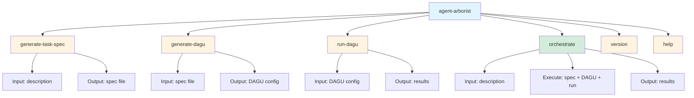

# Using the CLI

Agent Arborist provides a comprehensive command-line interface for managing AI-generated task specifications and workflows.

## Overview

The CLI enables you to:
- Generate task specifications from natural language descriptions
- Create DAGU workflow configurations from task specs
- Run and monitor DAGU workflows
- Orchestrate complete workflows from start to finish

## Commands

| Command | Description |
|---------|-------------|
| `generate-task-spec` | Generate a task specification from a description |
| `generate-dagu` | Generate a DAGU configuration from a task spec |
| `run-dagu` | Run a DAGU workflow |
| `orchestrate` | Orchestrate the complete workflow (spec → DAGU → run) |
| `version` | Show version information |
| `help` | Show help information |

## Common Workflows

### Quick Start: Full Orchestration

```bash
agent-arborist orchestrate "Build a data pipeline that processes user events"
```

This command:
1. Generates a task specification
2. Creates a DAGU configuration
3. Runs the workflow
4. Returns the results

### Step-by-Step: Generate Task Spec Only

```bash
agent-arborist generate-task-spec "Build a data pipeline"
```

This creates a task specification file in `spec/` directory.

### Step-by-Step: Generate DAGU from Spec

```bash
agent-arborist generate-dagu spec/my-pipeline.yaml
```

This creates a DAGU configuration in `dag/` directory.

### Step-by-Step: Run DAGU

```bash
agent-arborist run-dagu dag/my-pipeline.yaml
```

This runs the DAGU workflow and outputs results to `output/`.

## CLI Structure



## Sections in This Part

1. [CLI Overview](./01-cli-overview.md) - Detailed overview of the CLI architecture
2. [Generate Task Spec](./02-generate-task-spec.md) - Using `generate-task-spec` command
3. [Generate DAGU](./03-generate-dagu.md) - Using `generate-dagu` command
4. [Run DAGU](./04-run-dagu.md) - Using `run-dagu` command
5. [Orchestrate](./05-orchestrate.md) - Using `orchestrate` command
6. [CLI Flags and Options](./06-cli-flags-and-options.md) - Common CLI flags and options

## Getting Help

All commands support the `--help` flag:

```bash
agent-arborist --help
agent-arborist generate-task-spec --help
agent-arborist generate-dagu --help
agent-arborist run-dagu --help
agent-arborist orchestrate --help
```

## Next Steps

- Learn about the [CLI Overview](./01-cli-overview.md)
- Try generating your first [Task Specification](./02-generate-task-spec.md)