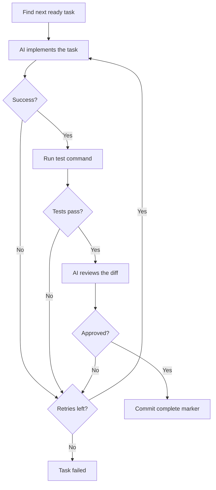

# Execution

Arborist executes tasks through a three-phase pipeline: **implement → test → review**. There are two commands: `garden` (one task) and `gardener` (all tasks in a loop).

## The Pipeline



### 1. Implement

Arborist sends a prompt to the AI runner:

```
Implement task T001: Create database schema

Description: Design and create the database schema with users, posts, and comments tables.

Work in the current directory. Make all necessary file changes.
```

The runner executes in the working directory and makes file changes directly.

### 2. Test

After implementation, Arborist runs tests for the task. Tests are specified per-node in the task tree:

1. **Per-node test commands** — defined in `test_commands` on each TaskNode (generated by the AI planner)
2. **Default** — `true` (no-op) when no test commands are defined

```bash
# Per-node (from task tree JSON, generated by AI planner)
{"type": "unit", "command": "pytest tests/ -x", "framework": "pytest"}
```

Arborist parses test output for known frameworks (pytest, jest, vitest, go) and records counts in git trailers:
- `Arborist-Test-Type`: unit, integration, or e2e
- `Arborist-Test-Passed`, `Arborist-Test-Failed`, `Arborist-Test-Skipped`: counts
- `Arborist-Test-Runtime`: execution time in seconds

If tests fail, the stdout/stderr are captured and committed as a trailer for the next retry attempt.

### 3. Review

On passing tests, Arborist sends the diff of only the current task's changes to the review runner:

```
Review the changes for task T001: Create database schema

Diff:
<diff output, up to 8000 chars>

Reply APPROVED if the code is correct, or REJECTED with reasons.
```

If the reviewer says `APPROVED`, the task is marked complete. Otherwise, it retries.

## Retry Logic

When any step fails, Arborist retries the full implement → test → review cycle (up to `max_retries`, default 5).

On retries, Arborist collects **feedback from previous failures** by reading git commit history:

- Previous review rejections (the reviewer's reasons)
- Previous test failures (stderr output)

This feedback is appended to the implement prompt, so the AI can learn from its mistakes:

```
Previous feedback from failed attempts:

--- Previous review (rejected) ---
The schema is missing foreign key constraints on the posts table.

--- Previous test failure ---
FAILED test_user_model.py::test_create_user - IntegrityError: NOT NULL constraint
```

## garden: Single Task

```bash
arborist garden --tree task-tree.json
```

Finds the next ready task (dependencies satisfied, not yet complete) and runs it through the pipeline once. Useful for step-by-step execution or debugging.

## gardener: Full Loop

```bash
arborist gardener --tree task-tree.json
```

Loops continuously:
1. Scan git history for completed tasks (scoped by branch name in commit prefix)
2. If all done → success
3. Find next ready task
4. Run `garden` for that task
5. If it fails → stop with error
6. If it succeeds → continue to next task

The gardener is idempotent — if interrupted, just run it again. It reads completion state from git trailers and picks up where it left off. Queries are scoped by the branch name embedded in each commit prefix, so commits from other branches or previous runs don't cause false positives (see [Git Integration](06-git-integration.md#branch-scoped-commits)).

> **Future work: pre-merge cleanup (prune)**
>
> During execution, Arborist generates intermediate artifacts — report JSON files (`spec/reports/T001_run_*.json`), test log files (`.arborist/logs/T001_test_*.log`), etc. Arborist itself is always append-only and never rewrites history. A future `prune` step would remove these generated files from the working tree and commit the deletion, preparing the branch for a clean squash-merge PR through your normal workflow.
