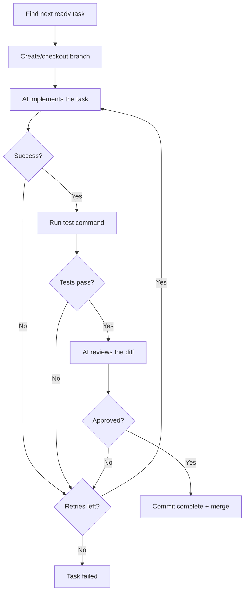
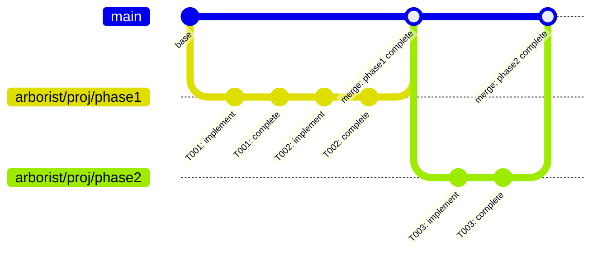

# Execution

Arborist executes tasks through a three-phase pipeline: **implement → test → review**. There are two commands: `garden` (one task) and `gardener` (all tasks in a loop).

## The Pipeline



### 1. Implement

Arborist sends a prompt to the AI runner:

```
Implement task T001: Create database schema

Description: Design and create the database schema with users, posts, and comments tables.

Work in the current directory. Make all necessary file changes.
```

The runner executes in the task's branch working directory and makes file changes directly.

### 2. Test

After implementation, Arborist runs tests for the task. Tests can be specified at three levels:

1. **Per-node test commands** — defined in `test_commands` on each TaskNode (highest priority)
2. **Global test command** — via `--test-command` flag or config (fallback)
3. **Default** — `true` (no-op)

```bash
# Per-node (from task tree JSON, generated by AI planner)
{"type": "unit", "command": "pytest tests/ -x", "framework": "pytest"}

# Global via CLI
arborist garden --tree tree.json --test-command "pytest -x"
```

Arborist parses test output for known frameworks (pytest, jest, vitest, go) and records counts in git trailers:
- `Arborist-Test-Type`: unit, integration, or e2e
- `Arborist-Test-Passed`, `Arborist-Test-Failed`, `Arborist-Test-Skipped`: counts
- `Arborist-Test-Runtime`: execution time in seconds

If tests fail, the stdout/stderr are captured and committed as a trailer for the next retry attempt.

### 3. Review

On passing tests, Arborist sends the full diff (base branch → HEAD) to the review runner:

```
Review the changes for task T001: Create database schema

Diff:
<diff output, up to 8000 chars>

Reply APPROVED if the code is correct, or REJECTED with reasons.
```

If the reviewer says `APPROVED`, the task is marked complete. Otherwise, it retries.

## Retry Logic

When any step fails, Arborist retries the full implement → test → review cycle (up to `max_retries`, default 5).

On retries, Arborist collects **feedback from previous failures** by reading git commit history:

- Previous review rejections (the reviewer's reasons)
- Previous test failures (stderr output)

This feedback is appended to the implement prompt, so the AI can learn from its mistakes:

```
Previous feedback from failed attempts:

--- Previous review (rejected) ---
The schema is missing foreign key constraints on the posts table.

--- Previous test failure ---
FAILED test_user_model.py::test_create_user - IntegrityError: NOT NULL constraint
```

## garden: Single Task

```bash
arborist garden --tree task-tree.json
```

Finds the next ready task (dependencies satisfied, not yet complete) and runs it through the pipeline once. Useful for step-by-step execution or debugging.

## gardener: Full Loop

```bash
arborist gardener --tree task-tree.json
```

Loops continuously:
1. Scan git history for completed tasks
2. If all done → success
3. Find next ready task
4. Run `garden` for that task
5. If it fails → stop with error
6. If it succeeds → continue to next task

The gardener is idempotent — if interrupted, just run it again. It reads completion state from git trailers and picks up where it left off.

## Phase Merging

Tasks under the same root phase share a git branch. When the **last leaf task** under a phase completes, Arborist checks for phase-level tests before merging:

1. If the parent node has `integration` or `e2e` test commands, run them first
2. If phase tests fail, the merge is blocked and the garden run fails
3. If phase tests pass (or there are none), merge the phase branch back to the base branch


