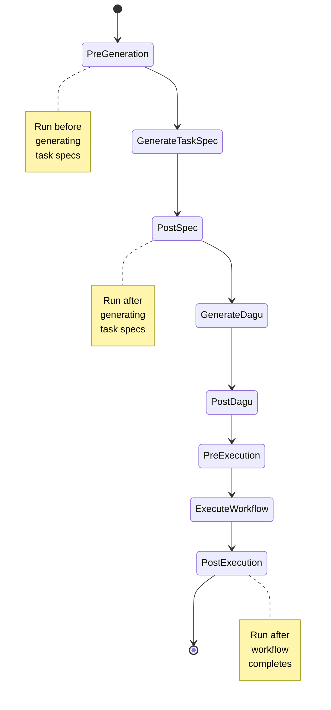
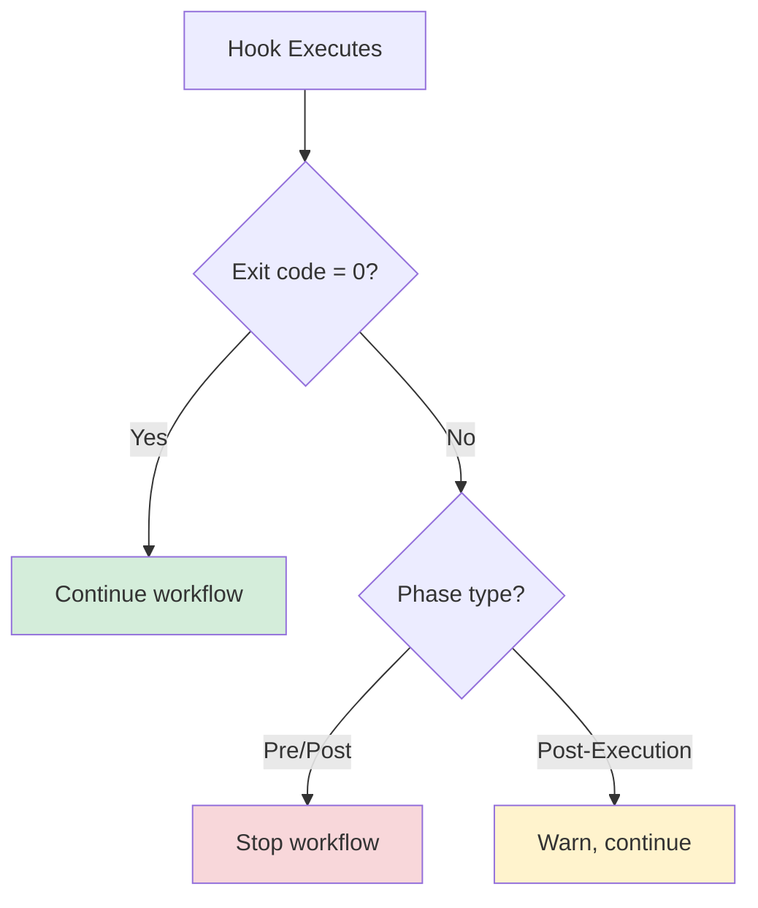

# Hooks Lifecycle

Understanding the hook lifecycle helps you determine when to hook into the workflow and how your hooks will execute.

## Lifecycle Overview

Hooks execute at specific points during the orchestration workflow:



## Detailed Hook Sequence

### 1. Pre-Generation Hook

**Timing:** Before generating task specifications

**Purpose:** Validate and prepare input

**Input:**
```json
{
  "description": "Build a data pipeline",
  "config": { ... }
}
```

**Use cases:**
- Validate description format
- Check for forbidden terms or patterns
- Fetch additional context from external sources
- Modify description before generation

**Output:** Modify description (optional) or validate and continue

### 2. Post-Spec Hook

**Timing:** After generating task specifications but before generating DAGU

**Purpose:** Review and modify generated specifications

**Input:**
```json
{
  "phase": "post_spec",
  "spec_file": "spec/my-task.yaml",
  "spec_content": "---\nname: my-task\n...",
  "config": { ... }
}
```

**Use cases:**
- Review generated specs for compliance
- Add company-specific metadata
- Modify task ordering
- Add additional fields to specs
- Archive specifications

**Output:** Modified spec content

### 3. Post-DAGU Hook

**Timing:** After generating DAGU configuration but before execution

**Purpose:** Review and modify DAGU configuration

**Input:**
```json
{
  "phase": "post_dagu",
  "spec_file": "spec/my-task.yaml",
  "dag_file": "dag/my-task.yaml",
  "dag_content": "---\nname: my-task\n...",
  "config": { ... }
}
```

**Use cases:**
- Apply environment-specific settings
- Add resource limits
- Modify task parameters
- Validate DAGU syntax
- Inject secrets or environment variables

**Output:** Modified DAGU content

### 4. Pre-Execution Hook

**Timing:** Before executing the workflow

**Purpose:** Validate execution environment

**Input:**
```json
{
  "phase": "pre_execution",
  "spec_file": "spec/my-task.yaml",
  "dag_file": "dag/my-task.yaml",
  "worktree": "work/arborist-my-task",
  "config": { ... }
}
```

**Use cases:**
- Check system dependencies
- Verify available resources
- Validate required tools are installed
- Prepare execution environment
- Check availability of external services

**Output:** Validation result (continue or stop)

### 5. Post-Execution Hook

**Timing:** After workflow execution completes

**Purpose:** Process results and notifications

**Input:**
```json
{
  "phase": "post_execution",
  "spec_file": "spec/my-task.yaml",
  "dag_file": "dag/my-task.yaml",
  "output_dir": "output/my-task",
  "status": "success",
  "duration_seconds": 754,
  "tasks": [ ... ],
  "config": { ... }
}
```

**Use cases:**
- Send notifications (Slack, email, etc.)
- Archive results to storage
- Update ticketing systems
- Post-process output data
- Cleanup temporary files
- Update dashboards or metrics

**Output:** Post-processing result

## Execution Order Within a Phase

When multiple hooks are defined for the same phase, they execute in order:

```yaml
hooks:
  post_spec:
    - name: review-spec
      command: scripts/review-spec.py
      enabled: true
    - name: add-metadata
      command: scripts/add-metadata.sh
      enabled: true
```

**Execution order:**
1. `review-spec.py` runs first
2. Output from `review-spec.py` is passed to `add-metadata.sh`
3. `add-metadata.sh` runs with modified spec

## Hook Failure Handling

### Hook Failure Behavior

When a hook fails (exit code != 0):

- **Pre-Generation Hook**: Stops workflow, error reported
- **Post-Spec Hook**: Stops workflow, can't proceed to DAGU generation
- **Post-DAGU Hook**: Stops workflow, can't proceed to execution
- **Pre-Execution Hook**: Stops workflow, can't execute
- **Post-Execution Hook**: Warns but workflow marked as complete



### Continuing on Failure

Configure hooks to continue on failure:

```yaml
hooks:
  post_spec:
    - name: optional-review
      command: scripts/optional-review.sh
      enabled: true
      continue_on_failure: true
```

## Hook Timeout

Hooks have a default timeout of 60 seconds, configurable per hook:

```yaml
hooks:
  post_spec:
    - name: heavy-processing
      command: scripts/heavy-process.py
      enabled: true
      timeout: 300  # 5 minutes
```

## Hook Context

### Global Context

All hooks receive a global context object:

```json
{
  "workflow_id": "arborist-abc123",
  "timestamp": "2024-01-15T10:30:00Z",
  "config": { ... },
  "environment": {
    "runner": "claude",
    "mode": "production"
  }
}
```

### Phase-Specific Context

Each phase adds context:

```json
{
  "phase": "post_execution",
  "spec_file": "spec/my-task.yaml",
  "dag_file": "dag/my-task.yaml",
  "output_dir": "output/my-task",
  "results": { ... }
}
```

## Hook Logging

Hook stdout is captured and logged:

```bash
# Hook output
echo "Processing spec..."
echo "Found 5 tasks"
echo "Validation passed"

# Appears in logs
→ Processing spec...
→ Found 5 tasks
→ Validation passed
```

Hook stderr is captured as errors:

```bash
# Hook error output
echo "Error: Invalid field" >&2

# Appears in logs as error
✗ Error: Invalid field
```

## Best Practices

### 1. Keep Hooks Fast

Hooks should complete quickly:

```bash
# Good: Fast validation
scripts/validate.sh

# Bad: Long-running processing
scripts/heavy-process.py
```

### 2. Handle Dependencies Gracefully

```bash
#!/bin/bash
# Check if Python is available
if ! command -v python3 &> /dev/null; then
  echo "Python3 not found, skipping hook" >&2
  exit 0  # Continue even if tool not found
fi
```

### 3. Use Meaningful Names

```yaml
hooks:
  post_execution:
    - name: slack-notification
      command: scripts/notify-slack.sh
```

### 4. Document Hook Purpose

```bash
#!/bin/bash
# This hook validates that task specs don't contain
# disallowed commands or patterns.
# Exit 0 to continue, exit 1 to stop workflow.
```

### 5. Test Hooks Independently

```bash
# Test hook with sample input
echo '{"phase": "post_spec", "spec_file": "test.yaml"}' | \
  scripts/my-hook.sh
```

## Troubleshooting

### Issue: Hook not executing

**Solution:** Check:
- Hook is enabled (`enabled: true`)
- Command path is correct
- Hook file has execute permissions

### Issue: Hook timing out

**Solution:** Increase timeout:

```yaml
hooks:
  post_spec:
    - name: slow-hook
      command: scripts/slow.py
      timeout: 300  # Increase from 60s
```

### Issue: Workflow stopping unexpectedly

**Solution:** Set `continue_on_failure: true` for non-critical hooks.

### Issue: Hook output not visible

**Solution:** Use `--verbose` flag to see hook output:

```bash
agent-arborist orchestrate "My task" --verbose
```

## Code References

- Hook definitions: [`src/agent_arborist/hooks.py`](../../src/agent_arborist/hooks.py)
- Hook execution: [`src/agent_arborist/hooks.py:execute_hooks()`](../../src/agent_arborist/hooks.py)
- Configuration loading: [`src/agent_arborist/config.py`](../../src/agent_arborist/config.py)

## Next Steps

- Learn about [Hooks Configuration](./03-hooks-configuration.md)
- See practical [Hooks Examples](./04-hooks-examples.md)