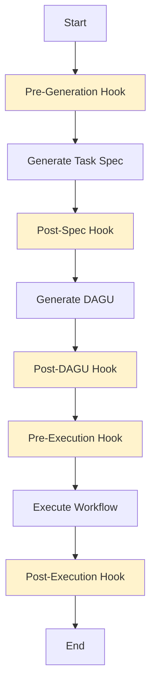

# Hooks System

Agent Arborist provides a flexible hooks system that allows you to customize execution at specific points in the workflow lifecycle.

## Overview

Hooks enable you to:
- Execute custom scripts before or after workflow generation
- Modify generated specifications before execution
- Post-process results after workflow completion
- Integrate with external systems and services
- Implement custom validation and notification logic

## When to Use Hooks

### Use hooks when you need to:
- Modify generated task specifications
- Validate content before execution
- Send notifications on completion
- Integrate with external APIs
- Apply custom transformations
- Archive or replicate outputs

### Don't use hooks for:
- Task execution (use task commands instead)
- Workflow scheduling (use DAGU schedules)
- Basic configuration (use config file instead)

## Hook Types

### 1. Pre-Generation Hooks
Run before generating task specifications.

**Use cases:**
- Validate input descriptions
- Fetch additional context
- Modify description before generation

### 2. Post-Spec Hooks
Run after generating task specifications.

**Use cases:**
- Review and modify generated specs
- Validate spec structure
- Archive copies of specs

### 3. Post-DAGU Hooks
Run after generating DAGU configurations.

**Use cases:**
- Review DAGU configs
- Apply environment-specific modifications
- Validate DAGU syntax

### 4. Pre-Execution Hooks
Run before executing workflows.

**Use cases:**
- Validate execution environment
- Check dependencies
- Prepare execution context

### 5. Post-Execution Hooks
Run after workflow execution.

**Use cases:**
- Send notifications
- Archive results
- Post-process outputs
- Update external systems

## Hook Execution Flow



## Hook Configuration

Hooks are configured in `agent-arborist.yaml`:

```yaml
hooks:
  pre_generation:
    - name: validate-input
      command: scripts/validate-input.sh
      enabled: true
  
  post_spec:
    - name: review-spec
      command: scripts/review-spec.py
      enabled: true
  
  post_dagu:
    - name: modify-dagu
      command: scripts/modify-dagu.sh
      enabled: true
  
  pre_execution:
    - name: check-dependencies
      command: scripts/check-deps.sh
      enabled: true
  
  post_execution:
    - name: send-notification
      command: scripts/notify.py
      enabled: true
```

## Hook Interface

### Input/Output

Hooks receive input via stdin and can modify the workflow:

```bash
# Hook receives workflow state as JSON
{
  "phase": "post_spec",
  "spec_file": "spec/my-task.yaml",
  "spec_content": "...",
  "dag_file": null,
  "results": null
}
```

### Return Values

Hooks should return:
- **Exit code 0**: Success, continue workflow
- **Exit code 1**: Failure, stop workflow
- **Modified state**: If hook modifies files, workflow continues with modified state

## Sections in This Part

1. [Hooks Lifecycle](./02-hooks-lifecycle.md) - Detailed hook lifecycle and execution order
2. [Hooks Configuration](./03-hooks-configuration.md) - How to configure hooks
3. [Hooks Examples](./04-hooks-examples.md) - Practical hook examples

## Next Steps

- Learn about the [Hooks Lifecycle](./02-hooks-lifecycle.md)
- See [Configuration Details](./03-hooks-configuration.md)
- Explore [Examples](./04-hooks-examples.md)