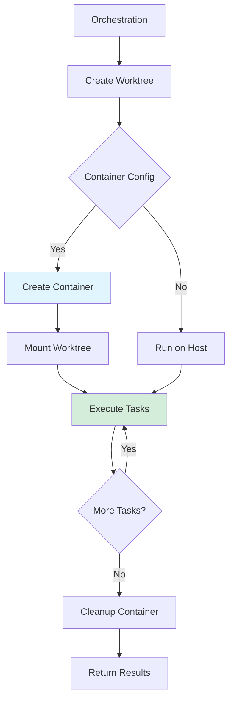

# Container Support

Agent Arborist provides first-class support for running workflows in containerized environments, including Docker and podman.

## Overview

Container support enables you to:
- Run workflows in isolated, reproducible environments
- Specify custom container images for task execution
- Control container resources and security settings
- Run workflows across different environments consistently

## Benefits

### Reproducibility

Define exact execution environments:

```yaml
container:
  image: python:3.11-slim
```

### Isolation

Isolate task execution from host system:

```yaml
container:
  image: python:3.11-slim
  network: none
  read_only: true
```

### Portability

Run workflows anywhere:

```bash
# Local development
agent-arborist orchestrate "My task"

# CI/CD pipeline
docker run agent-arborist orchestrate "My task"

# Cloud execution
kubectl run arborist --image=agent-arborist
```

## Container Runtimes

### Docker

Default and recommended runtime:

```yaml
runtime: docker
```

### Podman

Alternative for systems without Docker:

```yaml
runtime: podman
```

### Auto Detect

Automatically detect available runtime:

```yaml
runtime: auto
```

## Workflow in Containers



## When to Use Containers

### Use containers when:
- Task execution requires specific dependencies
- You need reproducible execution environments
- Running workflows in CI/CD pipelines
- Executing tasks on remote hosts
- Isolating potentially destructive operations

### Don't use containers when:
- Tasks use host-specific resources
- Performance overhead is critical
- Simplicity is preferred over isolation

## Container Configuration

Container settings are defined in `agent-arborist.yaml`:

```yaml
# agent-arborist.yaml
container:
  enabled: true
  runtime: docker
  image: python:3.11-slim
  
  resources:
    cpu: "2"
    memory: "4Gi"
  
  mounts:
    - type: bind
      source: ./data
      target: /data
  
  environment:
    PYTHONPATH: /app
    LOG_LEVEL: info
  
  security:
    read_only: true
    network: bridge
```

## Task-Specific Container Configuration

Override container settings per task:

```yaml
# spec/my-task.yaml
name: my-task
steps:
  - name: data-processing
    container:
      image: python:3.11-slim
      resources:
        memory: "8Gi"
  
  - name: ml-training
    container:
      image: tensorflow/tensorflow:latest
      gpu: true
```

## Sections in This Part

1. [Container Configuration](./02-container-configuration.md) - Detailed container settings and options

## Code References

- Container support: [`src/agent_arborist/container.py`](../../src/agent_arborist/container.py)
- Configuration: [`src/agent_arborist/config.py:container`](../../src/agent_arborist/config.py)

## Next Steps

- Learn about [Container Configuration](./02-container-configuration.md)
- Explore [Hooks System](../05-hooks-system/01-hooks-overview.md)