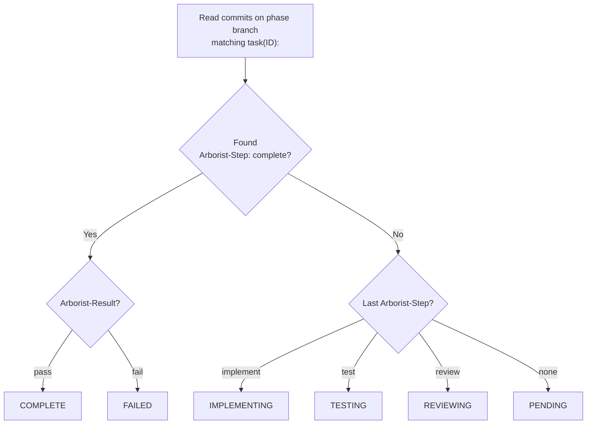

# Git Integration

Arborist is **git-native** — all task state lives in the repository itself. No database, no state files, no daemon. Everything is recoverable from git history.

## Branching Strategy

Each root phase gets one branch:

```
<namespace>/<spec-id>/<root-phase-id>
```

Examples:
```
arborist/my-project/phase1
arborist/my-project/phase2
arborist/my-project/setup
```

All leaf tasks under a phase are implemented sequentially on that branch. When the last leaf completes, the branch is merged back to the base branch.

## Commit Convention

Every commit Arborist creates follows this format:

```
task(<task-id>): <subject>

<optional body with runner output or test results>

Arborist-Step: implement
Arborist-Result: pass
Arborist-Retry: 0
```

The `task(<id>):` prefix allows Arborist to find commits for a specific task using `git log --grep`.

## Git Trailers

Trailers are structured key-value metadata appended to commit messages. Arborist uses them to track task state:

| Trailer | Values | Description |
|---------|--------|-------------|
| `Arborist-Step` | `implement`, `test`, `review`, `complete` | Which pipeline phase this commit represents |
| `Arborist-Result` | `pass`, `fail` | Whether the step succeeded |
| `Arborist-Test` | `pass`, `fail` | Test command result |
| `Arborist-Review` | `approved`, `rejected` | Code review result |
| `Arborist-Retry` | `0`, `1`, `2`, ... | Which attempt number (0-indexed) |
| `Arborist-Report` | `<path>` | Path to the JSON report file |
| `Arborist-Test-Log` | `<path>` | Path to test output log |
| `Arborist-Review-Log` | `<path>` | Path to review output log |

## State Recovery

Arborist determines task state by reading trailers from git history:



Task states:
- **pending** — no commits found for this task
- **implementing** — last commit was an implement step
- **testing** — last commit was a test step
- **reviewing** — last commit was a review step
- **complete** — `Arborist-Step: complete` with `Arborist-Result: pass`
- **failed** — `Arborist-Step: complete` with `Arborist-Result: fail`

## Crash Recovery

Because state is in git, recovery is automatic:

1. Process crashes mid-task → branch has partial commits
2. Run `arborist gardener` again
3. Arborist scans git for completed tasks
4. Skips completed tasks, finds the next ready one
5. Creates or checks out the phase branch
6. Continues from the next task (the partial task's branch may have incomplete work, but a fresh implement pass will overwrite it)

## Merging

When all leaf tasks under a root phase complete:

1. Arborist checks out the base branch
2. Merges the phase branch with `--no-ff` (preserves branch history)
3. Merge commit message: `merge: <phase-branch> complete`

This keeps the git history clean — each phase is a discrete merge commit on the base branch.
