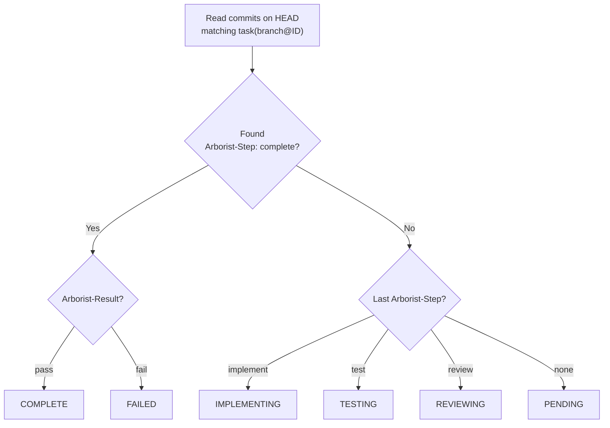
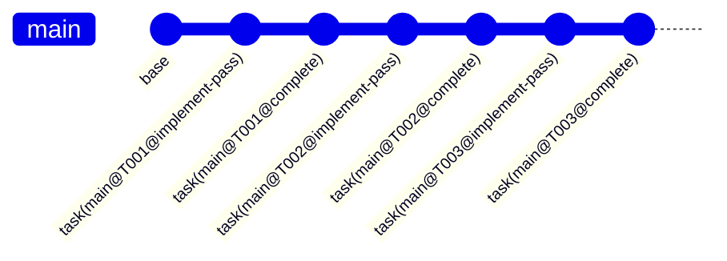

# Git Integration

Arborist is **git-native** — all task state lives in the repository itself. No database, no state files, no daemon. Everything is recoverable from git history.

## Linear Commit History

All task commits land directly on the current (initiating) branch. There are no per-phase branches — execution is sequential and the commit history is linear.

## Branch-Scoped Commits

Every commit Arborist creates embeds the **current branch name** in the commit prefix:

```
task(feature/my-branch@T001@implement-pass): implement "Create file"
task(feature/my-branch@T001@test-pass): tests pass for "Create file"
task(feature/my-branch@T001@review-approved): review approved for "Create file"
task(feature/my-branch@T001@complete): complete "Create file"
```

Format: `task({branch}@{task_id}@{status}): {subject}`

The branch name in the prefix means `git log --grep` is naturally scoped to the current branch's run — commits from other branches or previous runs on different branches are invisible.

### Grep examples

```bash
# All commits for task T001 on this branch
git log --grep='task(feature/my-branch@T001' --fixed-strings --oneline

# All arborist commits on this branch
git log --grep='task(feature/my-branch@' --fixed-strings --oneline
```

### Status values

| Status | Meaning |
|--------|---------|
| `implement-pass` | Implementation succeeded |
| `implement-fail` | Implementation failed |
| `test-pass` | Tests passed |
| `test-fail` | Tests failed |
| `review-approved` | Code review approved |
| `review-rejected` | Code review rejected |
| `complete` | Task fully complete |
| `failed` | Task exhausted all retries |

## Git Trailers

Trailers are structured key-value metadata appended to commit messages. Arborist uses them to track task state:

| Trailer | Values | Description |
|---------|--------|-------------|
| `Arborist-Step` | `implement`, `test`, `review`, `complete` | Which pipeline phase this commit represents |
| `Arborist-Result` | `pass`, `fail` | Whether the step succeeded |
| `Arborist-Test` | `pass`, `fail` | Test command result |
| `Arborist-Review` | `approved`, `rejected` | Code review result |
| `Arborist-Retry` | `0`, `1`, `2`, ... | Which attempt number (0-indexed) |
| `Arborist-Report` | `<path>` | Path to the JSON report file |
| `Arborist-Test-Log` | `<path>` | Path to test output log |
| `Arborist-Review-Log` | `<path>` | Path to review output log |

## Append-Only State Model

Unlike tools that use `git commit --amend` or force-pushes to "clean up" work, Arborist is strictly append-only.

- **No Rewrites:** Failed implementation attempts and rejected reviews stay in the Git history.
- **Latest Wins:** The current status of a task is always derived from the *most recent* commit matching the `task({branch}@{task_id}` pattern.
- **Failures as Context:** When a task retries, Arborist reads the immutable body of previous failure commits to provide "lessons learned" to the next AI implementation pass.

## State Recovery

Arborist determines task state by reading trailers from git history on the current branch:



Task states:
- **pending** — no commits found for this task
- **implementing** — last commit was an implement step
- **testing** — last commit was a test step
- **reviewing** — last commit was a review step
- **complete** — `Arborist-Step: complete` with `Arborist-Result: pass`
- **failed** — `Arborist-Step: complete` with `Arborist-Result: fail`

## Crash Recovery

Because state is in git, recovery is automatic:

1. Process crashes mid-task — branch has partial commits
2. Run `arborist gardener` again
3. Arborist scans git for completed tasks on the current branch (scoped by branch name in commit prefix)
4. Skips completed tasks, finds the next ready one
5. Continues from the next task (partial work from the crashed task stays in history, but a fresh implement pass will overwrite the files)


