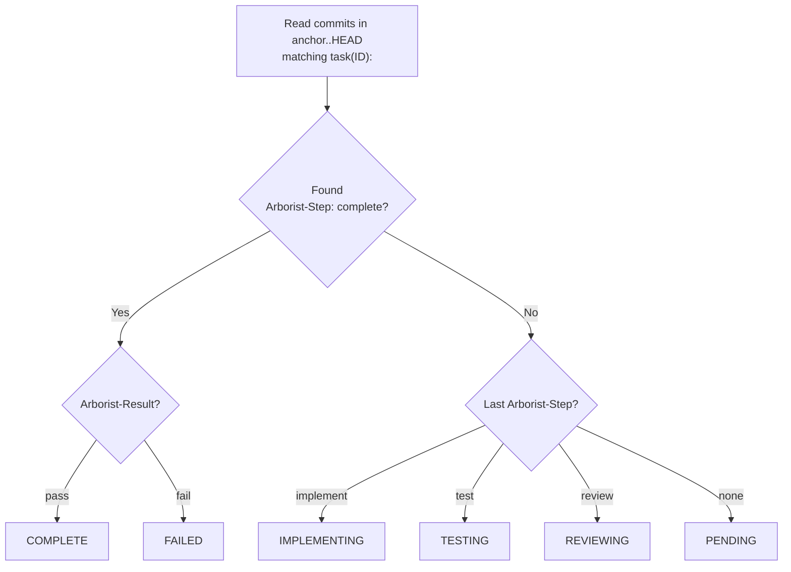
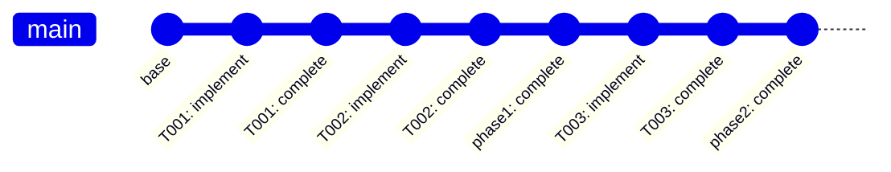

# Git Integration

Arborist is **git-native** — all task state lives in the repository itself. No database, no state files, no daemon. Everything is recoverable from git history.

## Linear Commit History

All task commits land directly on the current (initiating) branch. There are no per-phase branches — execution is sequential and the commit history is linear.

## Commit Convention

Every commit Arborist creates follows this format:

```
task(<task-id>): <subject>

<optional body with runner output or test results>

Arborist-Step: implement
Arborist-Result: pass
Arborist-Retry: 0
```

The `task(<id>):` prefix allows Arborist to find commits for a specific task using `git log --grep`.

## Git Trailers

Trailers are structured key-value metadata appended to commit messages. Arborist uses them to track task state:

| Trailer | Values | Description |
|---------|--------|-------------|
| `Arborist-Step` | `implement`, `test`, `review`, `complete`, `phase-complete` | Which pipeline phase this commit represents |
| `Arborist-Result` | `pass`, `fail` | Whether the step succeeded |
| `Arborist-Test` | `pass`, `fail` | Test command result |
| `Arborist-Review` | `approved`, `rejected` | Code review result |
| `Arborist-Retry` | `0`, `1`, `2`, ... | Which attempt number (0-indexed) |
| `Arborist-Report` | `<path>` | Path to the JSON report file |
| `Arborist-Test-Log` | `<path>` | Path to test output log |
| `Arborist-Review-Log` | `<path>` | Path to review output log |

## Append-Only State Model

Unlike tools that use `git commit --amend` or force-pushes to "clean up" work, Arborist is strictly append-only.

- **No Rewrites:** Failed implementation attempts and rejected reviews stay in the Git history.
- **Latest Wins:** The current status of a task is always derived from the *most recent* commit matching the `task(ID):` pattern.
- **Failures as Context:** When a task retries, Arborist reads the immutable body of previous failure commits to provide "lessons learned" to the next AI implementation pass.

## State Recovery

Arborist determines task state by reading trailers from git history on the current branch:



Task states:
- **pending** — no commits found for this task
- **implementing** — last commit was an implement step
- **testing** — last commit was a test step
- **reviewing** — last commit was a review step
- **complete** — `Arborist-Step: complete` with `Arborist-Result: pass`
- **failed** — `Arborist-Step: complete` with `Arborist-Result: fail`

## Anchor-SHA Scoping

When querying git history, Arborist only considers commits from the **current run**. It finds the SHA of the commit that last modified the `task-tree.json` file (the "anchor") and scopes all trailer queries to `anchor..HEAD`.

This prevents false positives when a branch has old arborist commits from a previous run that used the same task IDs. Without scoping, `git log --grep="task(T001):"` would match stale commits and incorrectly report tasks as complete.

If no anchor commit is found (e.g., the tree file hasn't been committed yet), Arborist falls back to scanning all of `HEAD`.

## Crash Recovery

Because state is in git, recovery is automatic:

1. Process crashes mid-task — branch has partial commits
2. Run `arborist gardener` again
3. Arborist scans git for completed tasks on the current branch
4. Skips completed tasks, finds the next ready one
5. Continues from the next task (partial work from the crashed task stays in history, but a fresh implement pass will overwrite the files)

## Phase Completion

When all leaf tasks under a root phase complete, Arborist:

1. Runs any phase-level tests (`integration` or `e2e` test commands on the parent node)
2. If phase tests fail, the gardener run fails
3. If phase tests pass (or there are none), commits a `phase(<id>): complete` marker with `Arborist-Step: phase-complete`


