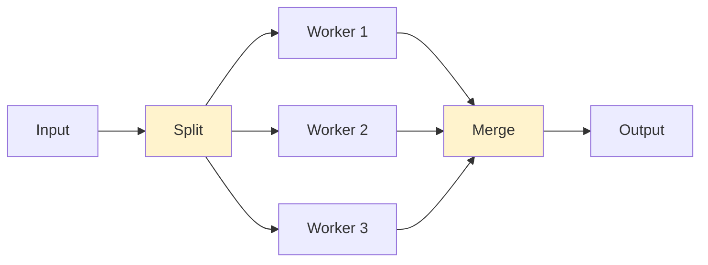
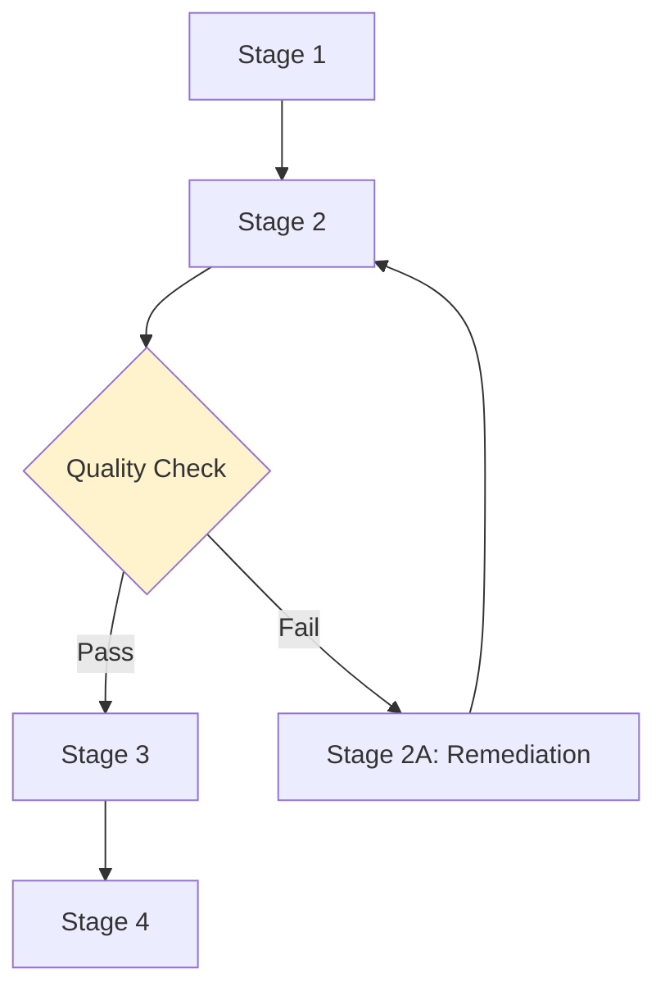

# Workflows and Dependencies

This section covers advanced workflow patterns and dependency management in Agent Arborist.

## Workflow Pattern Overview

Agent Arborist supports various workflow patterns beyond linear execution:

```mermaid
graph TD
    A[Linear] --> A1[Step 1 → Step 2 → Step 3]
    B[Parallel] --> B1[Step 1, Step 2, Step 3 (concurrent)]
    C[Conditional] --> C1{Condition} → C2[Path A] | C3[Path B]
    D[Fan-in/Fan-out] --> D1[Split → Process → Merge]
    
    style A fill:#e1f5ff
    style B fill:#e1f5ff
    style C fill:#e1f5ff
    style D fill:#e1f5ff
```

## Linear Workflows

Simple linear workflows execute steps sequentially:

```yaml
# spec/linear-workflow.yaml
name: etl-pipeline
steps:
  - name: extract
    command: python scripts/extract.py
  
  - name: transform
    command: python scripts/transform.py
    depends_on:
      - extract
  
  - name: load
    command: python scripts/load.py
    depends_on:
      - transform
```

**Use case:** Traditional ETL pipelines, sequential data processing.

## Parallel Workflows

Execute multiple steps concurrently:

```yaml
# spec/parallel-workflow.yaml
name: parallel-processing
steps:
  - name: process-region-1
    command: python scripts/process.py --region us-east-1
    parallel: true
  
  - name: process-region-2
    command: python scripts/process.py --region us-west-2
    parallel: true
  
  - name: process-region-3
    command: python scripts/process.py --region eu-west-1
    parallel: true
  
  - name: aggregate
    command: python scripts/aggregate.py
    parallel: false
    depends_on:
      - process-region-1
      - process-region-2
      - process-region-3
```

**Use case:** Multi-region data processing, parallel batch jobs.

## Conditional Workflows

Execute different paths based on conditions:

```yaml
# spec/conditional-workflow.yaml
name: conditional-execution
steps:
  - name: check-condition
    command: python scripts/check.py --output condition.json
    outputs:
      - condition.json
  
  - name: path-a
    command: python scripts/path-a.py
    condition: "condition.json.status == 'success'"
    depends_on:
      - check-condition
  
  - name: path-b
    command: python scripts/path-b.py
    condition: "condition.json.status == 'failure'"
    depends_on:
      - check-condition
```

**Use case:** A/B testing, error handling paths, environment-specific logic.

## Fan-in/Fan-out Workflows

Split processing and merge results:



```yaml
# spec/fanin-fanout-workflow.yaml
name: distributed-processing
steps:
  - name: split-tasks
    command: python scripts/split.py --output tasks.json
    outputs:
      - tasks.json
  
  - name: process-task-1
    command: python scripts/process.py --task-id 1
    depends_on:
      - split-tasks
    parallel: true
  
  - name: process-task-2
    command: python scripts/process.py --task-id 2
    depends_on:
      - split-tasks
    parallel: true
  
  - name: process-task-3
    command: python scripts/process.py --task-id 3
    depends_on:
      - split-tasks
    parallel: true
  
  - name: merge-results
    command: python scripts/merge.py --input results/*.json
    depends_on:
      - process-task-1
      - process-task-2
      - process-task-3
```

**Use case:** Map-reduce patterns, distributed processing, batch jobs.

## Multi-Stage Pipelines

Orchestrate complex multi-stage workflows:



```yaml
# spec/multi-stage-workflow.yaml
name: multi-stage-pipeline
stages:
  - name: ingestion
    steps:
      - name: fetch-data
        command: python scripts/fetch.py
      - name: validate-data
        command: python scripts/validate.py
        depends_on:
          - fetch-data
  
  - name: processing
    DependsOn: ingestion
    steps:
      - name: transform
        command: python scripts/transform.py
      - name: enrich
        command: python scripts/enrich.py
        depends_on:
          - transform
  
  - name: quality-check
    DependsOn: processing
    steps:
      - name: check-quality
        command: python scripts/quality.py
      - name: remediate
        command: python scripts/remediate.py
        condition: "quality.score < 0.9"
        depends_on:
          - check-quality
  
  - name: output
    DependsOn: processing
    steps:
      - name: publish
        command: python scripts/publish.py
```

**Use case:** Production data pipelines with quality controls.

## Dependency Types

### Direct Dependencies

Simple sequential dependencies:

```yaml
steps:
  - name: step1
    command: python step1.py
  
  - name: step2
    command: python step2.py
    depends_on:
      - step1
```

### Multiple Dependencies

Wait for multiple upstream tasks:

```yaml
steps:
  - name: task-a
    command: python task_a.py
  
  - name: task-b
    command: python task_b.py
  
  - name: task-c
    command: python task_c.py
    depends_on:
      - task-a
      - task-b
```

### Conditional Dependencies

Condition-based dependencies:

```yaml
steps:
  - name: branch-decision
    command: python decide.py --output branch.json
  
  - name: branch-a
    command: python branch_a.py
    condition: "branch.json.choice == 'A'"
    depends_on:
      - branch-decision
  
  - name: branch-b
    command: python branch_b.py
    condition: "branch.json.choice == 'B'"
    depends_on:
      - branch-decision
```

## Resource Dependencies

Manage resource constraints:

```yaml
# spec/resource-workflow.yaml
name: resource-constrained-workflow
steps:
  - name: heavy-task-a
    command: python heavy.py --task a
    resources:
      cpu: "4"
      memory: "8Gi"
  
  - name: heavy-task-b
    command: python heavy.py --task b
    resources:
      cpu: "4"
      memory: "8Gi"
  
  - name: light-task
    command: python light.py
    resources:
      cpu: "0.5"
      memory: "512Mi"
```

## Workflow Orchestration Patterns

### 1. Pipeline Pattern

Sequential data processing:

```yaml
name: pipeline-pattern
steps:
  - name: stage1
    command: python stage1.py
  
  - name: stage2
    command: python stage2.py
    depends_on:
      - stage1
  
  - name: stage3
    command: python stage3.py
    depends_on:
      - stage2
```

### 2. Fan-out/Fan-in Pattern

Distribute work and collect results:

```yaml
name: fanout-fanin
steps:
  - name: distribute
    command: python distribute.py
  
  - name: worker-1
    command: python worker.py --id 1
    depends_on:
      - distribute
    parallel: true
  
  - name: worker-2
    command: python worker.py --id 2
    depends_on:
      - distribute
    parallel: true
  
  - name: collect
    command: python collect.py
    depends_on:
      - worker-1
      - worker-2
```

### 3. Map-Reduce Pattern

Process data in parallel and aggregate:

```yaml
name: map-reduce
steps:
  - name: map
    command: python map.py --output mapped.json
  
  - name: process-1
    command: python process.py --input mapped.json --slice 1
    depends_on:
      - map
    parallel: true
  
  - name: process-2
    command: python process.py --input mapped.json --slice 2
    depends_on:
      - map
    parallel: true
  
  - name: reduce
    command: python reduce.py --inputs processed/*.json
    depends_on:
      - process-1
      - process-2
```

### 4. Retry Pattern

Retry failed tasks:

```yaml
name: retry-pattern
steps:
  - name: main-task
    command: python main.py
    retry:
      count: 3
      delay_seconds: 60
      backoff: exponential
  
  - name: fallback-task
    command: python fallback.py
    condition: "main-task.status == 'failed'"
    depends_on:
      - main-task
```

### 5. Checkpoint Pattern

Save state and resume:

```yaml
name: checkpoint-pattern
steps:
  - name: load-checkpoint
    command: python load_checkpoint.py
  
  - name: process-batch
    command: python process.py
  
  - name: save-checkpoint
    command: python save_checkpoint.py
    depends_on:
      - process-batch
```

## Handling Failures

### Retry Logic

```yaml
steps:
  - name: unreliable-task
    command: python task.py
    retry:
      count: 3
      delay_seconds: 30
```

### Fallback Logic

```yaml
steps:
  - name: primary-task
    command: python primary.py
  
  - name: fallback-task
    command: python fallback.py
    condition: "primary-task.status == 'failed'"
    depends_on:
      - primary-task
```

### Error Notifications

```yaml
hooks:
  post_execution:
    - name: notify-on-failure
      command: scripts/notify.sh
      condition: "status == 'failed'"
      enabled: true
```

## Workflow Dependencies

### External Dependencies

Wait for external conditions:

```yaml
steps:
  - name: wait-for-api
    command: python wait_for_service.py --url https://api.example.com/health
  
  - name: call-api
    command: python call_api.py
    depends_on:
      - wait-for-api
```

### Data Dependencies

Wait for data availability:

```yaml
steps:
  - name: wait-for-data
    command: python wait_for_data.py --pattern s3://bucket/data/*.json
  
  - name: process-data
    command: python process.py
    depends_on:
      - wait-for-data
```

## Best Practices

### 1. Keep Workflows Simple

```yaml
# Good: Clear dependencies
steps:
  - name: step1
    command: python step1.py
  
  - name: step2
    command: python step2.py
    depends_on:
      - step1

# Avoid: Complex nested conditions
steps:
  - name: complex-step
    command: python complex.py
    condition: "a.b.c.d.e == 'value'"
```

### 2. Use Parallelism Appropriately

```yaml
# Good: Independent parallel tasks
steps:
  - name: task-a
    command: python task_a.py
    parallel: true
  
  - name: task-b
    command: python task_b.py
    parallel: true
```

### 3. Define Clear Dependencies

```yaml
# Good: Explicit dependencies
steps:
  - name: finalize
    command: python finalize.py
    depends_on:
      - process-a
      - process-b
      - process-c
```

### 4. Add Metadata

```yaml
steps:
  - name: important-task
    command: python important.py
    metadata:
      critical: true
      sla: "5m"
      owner: "data-team"
```

### 5. Monitor and Alert

```yaml
hooks:
  post_execution:
    - name: monitoring
      command: scripts/monitor.sh
      enabled: true
```

## Code References

- Workflow execution: [`src/agent_arborist/workflow.py`](../../src/agent_arborist/workflow.py)
- DAGU integration: [`src/agent_arborist/dagu.py`](../../src/agent_arborist/dagu.py)
- Test workflows: [`tests/fixtures/workflows/`](../../tests/fixtures/workflows/)

## Next Steps

- Review [Best Practices](./04-best-practices.md)
- Explore [Reference](../08-reference/01-cli-reference.md)