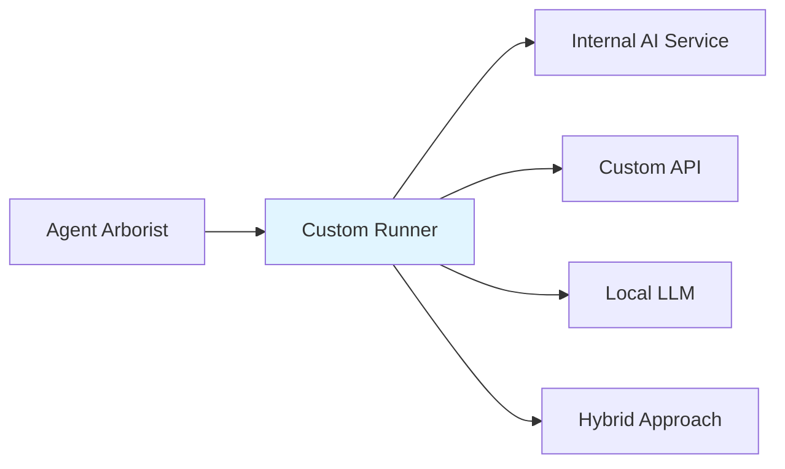
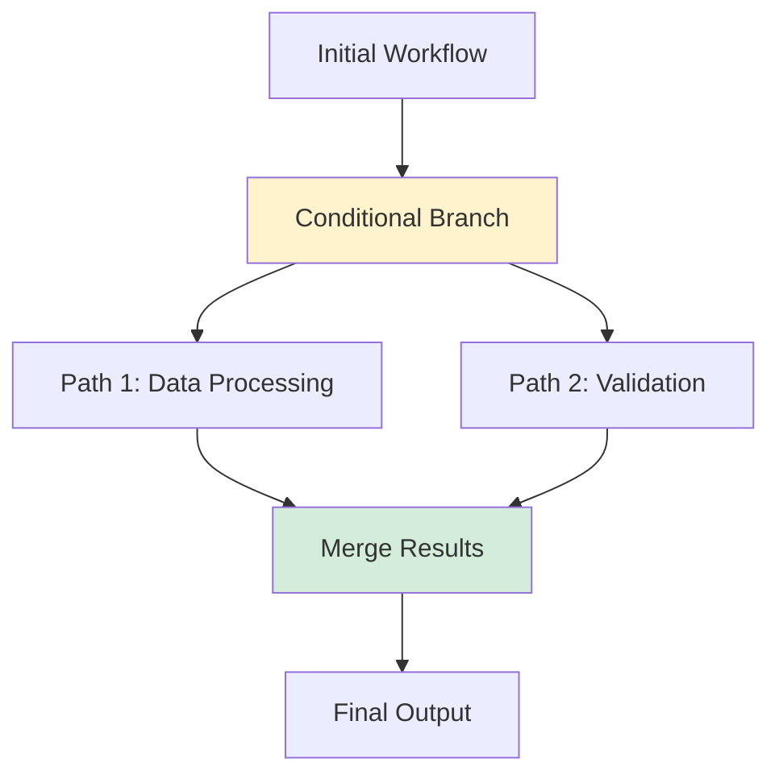

# Advanced Topics

This section covers advanced usage patterns, custom integrations, and best practices for experienced users of Agent Arborist.

## Overview

Advanced topics include:
- Custom runner implementations
- Workflow orchestration patterns
- Dependency management
- Performance optimization
- Integration with external systems
- Security considerations

## When to Use Advanced Features

### Use advanced features when:
- You have complex workflow requirements
- Need custom integrations with external services
- Require fine-grained control over execution
- Need to scale beyond basic use cases
- Want to optimize performance or成本

### Stay with basic features when:
- Workflows are straightforward
- You're just getting started
- Simple configuration suffices

## Advanced Capabilities

### 1. Custom Runners

Implement custom AI runners for specialized use cases:

### 2. Complex Workflows

Orchestrate multi-stage workflows with dependencies:

### 3. Integration Patterns

Integrate with external systems:
- Ticketing systems (Jira, Linear)
- Monitoring (Prometheus, Datadog)
- Storage (S3, GCS, Azure Blob)
- Secrets management (Vault, AWS Secrets Manager)

### 4. Performance Optimization

Optimize for scale:
- Parallel execution strategies
- Resource pooling
- Caching mechanisms
- Batch processing

## Sections in This Part

1. [Custom Runners](./02-custom-runners.md) - Implementing custom AI runners
2. [Workflows and Dependencies](./03-workflows-and-dependencies.md) - Advanced workflow patterns
3. [Best Practices](./04-best-practices.md) - Production-grade practices

## Prerequisites

Advanced topics require:
- Solid understanding of basic Agent Arborist concepts
- Familiarity with Python (for custom runners)
- Experience with containerization (for advanced deployment)
- Knowledge of workflow orchestration patterns

## Up Next

- Learn about [Custom Runners](./02-custom-runners.md)
- Explore [Workflows and Dependencies](./03-workflows-and-dependencies.md)
- Review [Best Practices](./04-best-practices.md)