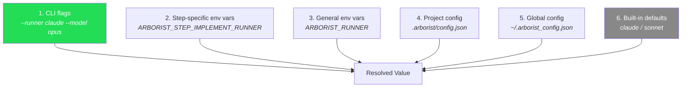

# Configuration

Arborist uses a layered configuration system where more specific sources override less specific ones.

## Precedence



Higher sources win. If a CLI flag is set, it overrides everything below it.

## Project Config

Created by `arborist init` at `.arborist/config.json`:

```json
{
  "version": "1",
  "defaults": {
    "runner": "claude",
    "model": "sonnet",
    "output_format": "json",
    "container_mode": "auto",
    "quiet": false,
    "max_retries": 5
  },
  "timeouts": {
    "task_run": 1800,
    "task_post_merge": 300,
    "test_command": null,
    "runner_timeout": 600
  },
  "steps": {
    "run": { "runner": null, "model": null },
    "implement": { "runner": null, "model": null },
    "review": { "runner": null, "model": null },
    "post-merge": { "runner": null, "model": null }
  },
  "test": {
    "timeout": null
  },
  "paths": {
    "worktrees": "worktrees",
    "dags": "dagu"
  },
  "hooks": {
    "enabled": false,
    "prompts_dir": "prompts",
    "step_definitions": {},
    "injections": {}
  }
}
```

### Section Reference

#### `defaults`

| Key | Type | Default | Description |
|-----|------|---------|-------------|
| `runner` | string | `"claude"` | Default AI runner (`claude`, `gemini`, `opencode`) |
| `model` | string | `"sonnet"` | Default model name or alias |
| `output_format` | string | `"json"` | Output format (`json` or `text`) |
| `container_mode` | string | `"auto"` | Container execution mode |
| `quiet` | bool | `false` | Suppress non-essential output |
| `max_retries` | int | `5` | Max retries per task before marking failed |

#### `timeouts`

| Key | Type | Default | Description |
|-----|------|---------|-------------|
| `task_run` | int | `1800` | Overall task timeout in seconds (30 min) |
| `task_post_merge` | int | `300` | Post-merge step timeout in seconds |
| `test_command` | int\|null | `null` | Test command timeout (null = 300s default) |
| `runner_timeout` | int | `600` | Per-runner-invocation timeout (10 min) |

#### `steps`

Per-step runner/model overrides. Each step can specify its own runner and model. If `null`, falls back to the `run` step, then to `defaults`.

Valid steps: `run`, `implement`, `review`, `post-merge`.

```json
{
  "steps": {
    "implement": { "runner": "claude", "model": "opus" },
    "review": { "runner": "claude", "model": "haiku" }
  }
}
```

The resolution chain for a step like `implement`:
1. `steps.implement.runner` → if null:
2. `steps.run.runner` → if null:
3. `defaults.runner` → if null:
4. `"claude"` (built-in default)

#### `test`

| Key | Type | Default | Description |
|-----|------|---------|-------------|
| `timeout` | int\|null | `null` | Test command timeout in seconds |

Per-task test commands are generated by the AI planner at build time. When a task has no per-task test commands, the fallback is `"true"` (no-op).

## Global Config

Optional file at `~/.arborist_config.json`. Same format as project config. Useful for setting your preferred runner across all projects.

## Environment Variables

### General

| Variable | Overrides | Example |
|----------|-----------|---------|
| `ARBORIST_RUNNER` | `defaults.runner` | `gemini` |
| `ARBORIST_MODEL` | `defaults.model` | `opus` |
| `ARBORIST_MAX_RETRIES` | `defaults.max_retries` | `10` |
| `ARBORIST_OUTPUT_FORMAT` | `defaults.output_format` | `text` |
| `ARBORIST_CONTAINER_MODE` | `defaults.container_mode` | `disabled` |
| `ARBORIST_QUIET` | `defaults.quiet` | `1` |
| `ARBORIST_RUNNER_TIMEOUT` | `timeouts.runner_timeout` | `900` |
| `ARBORIST_TEST_TIMEOUT` | `test.timeout` | `120` |
| `ARBORIST_TIMEOUT_TASK_RUN` | `timeouts.task_run` | `3600` |
| `ARBORIST_TIMEOUT_POST_MERGE` | `timeouts.task_post_merge` | `600` |

### Step-Specific

Override runner/model for individual pipeline steps:

| Variable | Example |
|----------|---------|
| `ARBORIST_STEP_IMPLEMENT_RUNNER` | `claude` |
| `ARBORIST_STEP_IMPLEMENT_MODEL` | `opus` |
| `ARBORIST_STEP_REVIEW_RUNNER` | `claude` |
| `ARBORIST_STEP_REVIEW_MODEL` | `haiku` |
| `ARBORIST_STEP_RUN_RUNNER` | `gemini` |
| `ARBORIST_STEP_RUN_MODEL` | `gemini-2.5-pro` |

The pattern is `ARBORIST_STEP_{STEP}_RUNNER` and `ARBORIST_STEP_{STEP}_MODEL` where `{STEP}` is uppercased (`IMPLEMENT`, `REVIEW`, `RUN`, `POST-MERGE` → `POST_MERGE`).

## Example Configurations

### Fast iteration (cheap models, many retries)

```json
{
  "defaults": { "runner": "gemini", "model": "gemini-2.5-flash", "max_retries": 10 },
  "timeouts": { "runner_timeout": 300 }
}
```

### High-quality output (powerful models, thorough review)

```json
{
  "defaults": { "runner": "claude", "model": "sonnet" },
  "steps": {
    "implement": { "runner": "claude", "model": "opus" },
    "review": { "runner": "claude", "model": "opus" }
  }
}
```

### Mixed runners

```bash
export ARBORIST_STEP_IMPLEMENT_RUNNER=claude
export ARBORIST_STEP_IMPLEMENT_MODEL=opus
export ARBORIST_STEP_REVIEW_RUNNER=gemini
export ARBORIST_STEP_REVIEW_MODEL=gemini-2.5-pro
arborist gardener --tree task-tree.json
```
