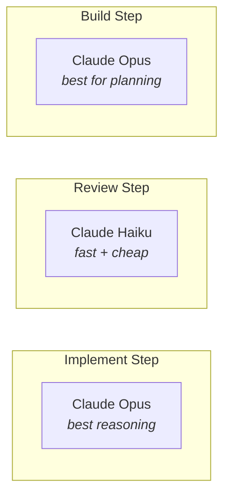

# Runners

Runners are AI coding agents that Arborist calls to implement tasks and review code. Each runner wraps a CLI tool that accepts a prompt and makes file changes.

## Supported Runners

### Claude Code

- **Runner name:** `claude`
- **CLI tool:** `claude`
- **Command:** `claude --dangerously-skip-permissions -p "<prompt>" --model <model>`
- **Models:** `opus`, `sonnet`, `haiku` (aliases) or full model names
- **Default for planning:** `opus` (best reasoning for task tree extraction)
- **Default for execution:** `sonnet` (good balance of speed and quality)

Requires Claude Code CLI installed and authenticated (via `CLAUDE_CODE_OAUTH_TOKEN` or interactive login).

### Gemini CLI

- **Runner name:** `gemini`
- **CLI tool:** `gemini`
- **Command:** `gemini --yolo -m <model> "<prompt>"`
- **Models:** `gemini-2.5-flash`, `gemini-2.5-pro`

Requires Gemini CLI installed and `GOOGLE_API_KEY` set.

### OpenCode

- **Runner name:** `opencode`
- **CLI tool:** `opencode`
- **Command:** `opencode run -m <model> "<prompt>"`
- **Models:** `cerebras/zai-glm-4.7`, `provider/model` format

Requires OpenCode CLI installed and appropriate API keys configured.

## How Runners Work

1. Arborist constructs a prompt describing the task
2. The runner CLI is invoked as a subprocess with the prompt
3. The runner operates in the task's working directory (`cwd`)
4. The runner makes file changes directly on disk
5. Arborist captures stdout/stderr and checks the exit code
6. Exit code 0 = success, non-zero = failure

All runner invocations have a configurable timeout (default: 600 seconds / 10 minutes). See [Configuration](07-configuration.md).

## Per-Step Runner Selection

You can use different runners (or models) for different pipeline steps:



Configure via `.arborist/config.json`:

```json
{
  "steps": {
    "implement": { "runner": "claude", "model": "opus" },
    "review": { "runner": "claude", "model": "haiku" }
  }
}
```

Or via environment variables:

```bash
export ARBORIST_STEP_IMPLEMENT_RUNNER=claude
export ARBORIST_STEP_IMPLEMENT_MODEL=opus
export ARBORIST_STEP_REVIEW_RUNNER=gemini
export ARBORIST_STEP_REVIEW_MODEL=gemini-2.5-flash
```

## Runner Resolution

For each pipeline step, Arborist resolves the runner/model through this chain:

1. CLI flag (`--runner-type`, `--model`)
2. Step-specific env var (`ARBORIST_STEP_IMPLEMENT_RUNNER`)
3. Step config in `.arborist/config.json` (`steps.implement.runner`)
4. Fallback step config (`steps.run.runner`)
5. General env var (`ARBORIST_RUNNER`)
6. Defaults config (`defaults.runner`)
7. Built-in default (`claude` / `sonnet`)

## Checking Availability

Arborist checks if a runner's CLI tool is on your `$PATH` using `shutil.which()`. If the tool isn't found, you'll get an error at runtime. Make sure the CLI for your chosen runner is installed and accessible.

## Logs

Runner stdout/stderr are saved to `.arborist/logs/`:

```
.arborist/logs/
├── T001_implement_20250215T143022.log
├── T001_review_20250215T143122.log
├── T002_implement_20250215T143222.log
└── T002_test_20250215T143322.log
```

Log files are gitignored by default (added during `arborist init`).
